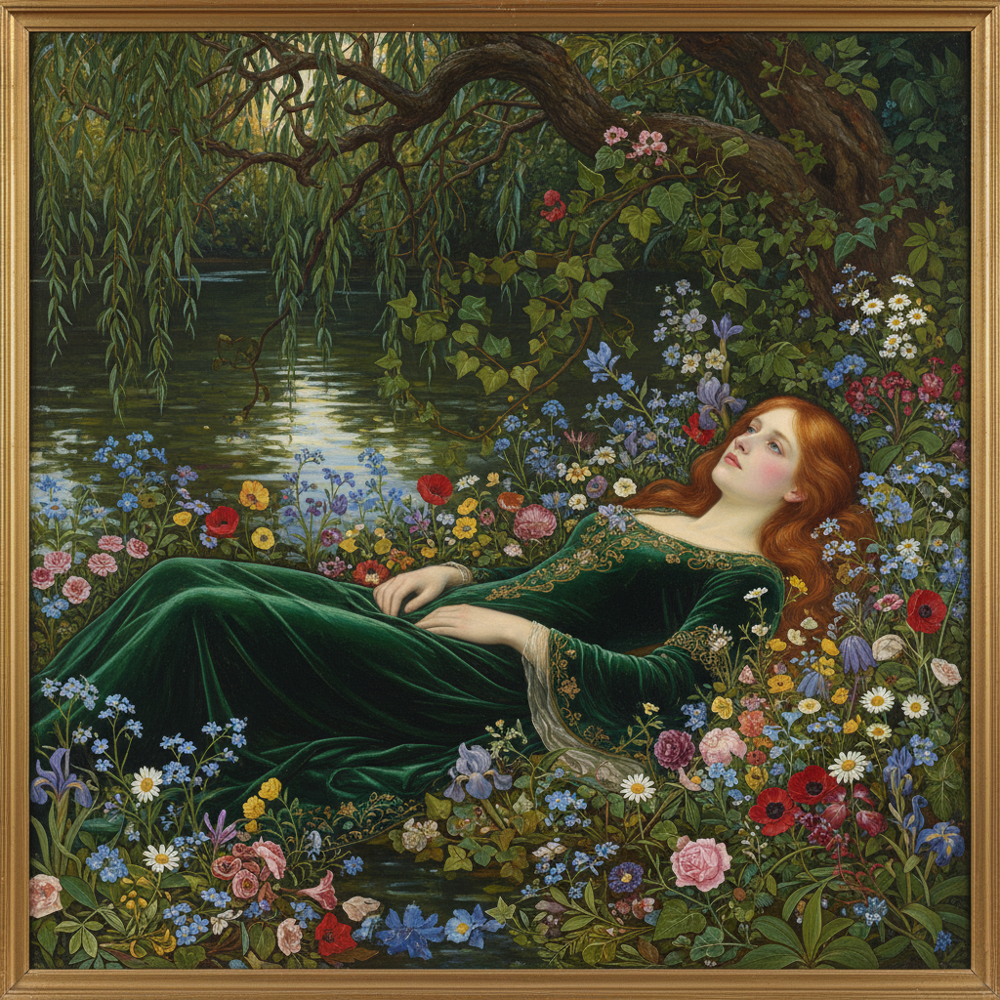

# Pre-Raphaelite 拉斐尔前派



> **"回到拉斐尔之前——回到中世纪的纯真、自然的色彩、和不妥协的细节。"**

## 概述

| 维度 | 描述 |
|------|------|
| 时期 | 1848–1870s/影响至今 |
| 别名 | Pre-Raphaelite Brotherhood, PRB, 拉斐尔前派 |
| 核心色彩 | 宝石色——深红、翡翠绿、宝蓝、金色、象牙白 |
| 关键元素 | 极致细节、鲜艳色彩、中世纪/文学题材、红发女性、自然主义 |
| 代表人物 | Dante Gabriel Rossetti, John Everett Millais, William Holman Hunt, Edward Burne-Jones |
| 关联风格 | Art Nouveau, Arts & Crafts, Symbolism, Golden Age Illustration, Fairycore |

---

## 历史脉络

| 年份 | 事件 |
|------|------|
| 1848 | Pre-Raphaelite Brotherhood 成立——反对学院派 |
| 1851 | Millais《奥菲利亚》——拉斐尔前派经典 |
| 1860s | Rossetti 的"Stunner"系列——红发女性图像 |
| 1870s | Burne-Jones——走向装饰性和象征主义 |
| 1880s | Arts & Crafts 运动——William Morris 继承精神 |
| 2020s | "Pre-Raphaelite aesthetic" 在社交媒体复兴 |

### 核心哲学

拉斐尔前派的精神是**"在工业时代选择手工——在学院规则中选择自然"**：
- 自然 = 真理（"不要画'理想化'的自然——画真正的自然"）
- 细节 = 虔诚（"每一片叶子都值得被认真画"）
- 中世纪 = 纯真（"拉斐尔之前的艺术更诚实"）
- 文学 = 灵魂（"莎士比亚、但丁、亚瑟王——这些故事值得最美的画面"）
- Rossetti: "我们要回到艺术还没有被'规则'污染的时代"

---

## 视觉语法

### 色彩系统

```
主色：
  深红 (#8B0000) — 玫瑰、嘴唇、激情
  翡翠绿 (#50C878) — 自然、中世纪
  宝蓝 (#0F52BA) — 天空、圣母
  金色 (#DAA520) — 光环、装饰

辅色：
  象牙白 (#FFFFF0) — 皮肤、纯洁
  铜红 (#B87333) — 头发（标志性红发）
  紫色 (#4B0082) — 皇室、神秘

规则：
  - 鲜艳但不刺眼
  - 宝石般的饱和度
  - 白色底层让色彩发光
  - 自然光下的真实色彩

质感：
  精细 — 每一根头发可见
  光泽 — 丝绸、金属
  自然 — 真实植物细节
  湿润 — 水面、露珠
```

### 标志性元素

| 类别 | 元素 |
|------|------|
| 人物 | 红发女性、苍白皮肤、忧郁表情、中世纪服装 |
| 自然 | 极致细节的花卉、水面、森林 |
| 题材 | 莎士比亚、但丁、亚瑟王、圣经、神话 |
| 构图 | 叙事性、戏剧化、装饰性边框 |
| 细节 | 每一片叶子、每一根发丝、每一颗珠宝 |
| 态度 | 浪漫、忧郁、精细、文学、反工业 |

---

## 与千禧怀旧的关系

### "Pre-Raphaelite Aesthetic" 的社交媒体复兴
- Tumblr/Instagram 上的 "Pre-Raphaelite aesthetic" 标签
- 红发+花冠+中世纪裙 = 当代"仙女"美学
- Fairycore, Cottagecore 的视觉DNA来自拉斐尔前派
- "150年前的画——今天看依然是最美的'滤镜'"

### 对Fantasy/Gothic美学的影响
- 拉斐尔前派 → Tolkien的视觉想象 → 所有奇幻视觉
- → Gothic Romance 的视觉语言
- → 当代"Dark Academia"美学
- "拉斐尔前派是所有'美丽忧伤'美学的源头"

---

## 中国语境

- 中国美术教育中拉斐尔前派的位置
- 与中国工笔画精细度的对比
- 中国古风/仙侠视觉中的拉斐尔前派影响
- 中国社交媒体上的"拉斐尔前派"摄影风格

---

## 设计应用

| 场景 | 应用方式 |
|------|----------|
| 时尚 | 浪漫+中世纪+花卉+精细+面料 |
| 品牌 | 高端+艺术+自然+文学+精致 |
| 游戏 | 奇幻+中世纪+角色设计+世界观 |
| 摄影 | 人像+自然光+花卉+忧郁+叙事 |

---

## 相关风格

← [Art Nouveau 新艺术运动](art-nouveau.md) | [Golden Age Illustration 黄金时代插画](golden-age-illustration.md) →

↑ [返回千禧怀旧目录](README.md) | [返回总目录](../README.md)
