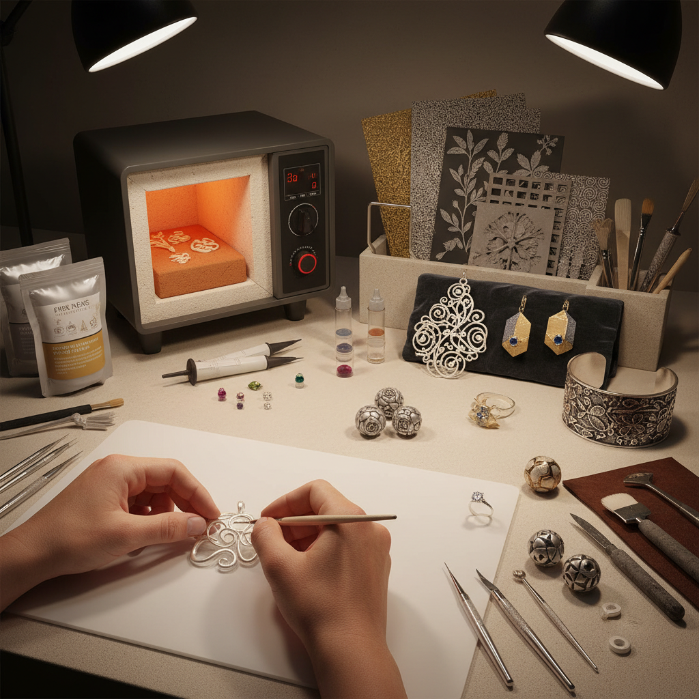

# Precious Metal Clay 贵金属粘土

> "Precious metal clay is the jeweler's shortcut to the impossible — forms that would take hours of sawing, filing, and soldering emerge fully realized from a lump of paste and the heat of a kiln." — Unknown

## 概述

贵金属粘土（Precious Metal Clay，简称PMC）是金属粘土（Metal Clay）中专指使用贵金属（金、银、铂）粉末制成的可塑性材料的品牌和类别。PMC由日本三菱材料公司于1990年发明，是第一个商业化的金属粘土品牌。PMC的核心成分是极细的贵金属粉末（通常为纯银或纯金）、有机粘合剂和水。

PMC与普通金属粘土（如铜粘土、青铜粘土）的区别在于：PMC使用贵金属，烧结后得到的是纯度极高的贵金属（如PMC3烧结后为99.9%纯银）。PMC的烧结温度相对较低（银粘土约650-900°C），可以使用小型窑炉甚至丁烷喷枪烧结。PMC特别适合制作精美的银饰和金饰——成品可以像传统贵金属首饰一样打磨、氧化、镶嵌宝石。

## 核心特征

| 特征 | 描述 |
|------|------|
| 贵金属 | 使用金、银、铂粉末 |
| 高纯度 | 烧结后99.9%纯度 |
| 可塑 | 像粘土一样塑形 |
| 低温 | 相对低温烧结 |
| 精细 | 极精细的细节 |
| 首饰 | 专注于贵金属首饰 |

## 视觉特征

- **光泽**：贵金属的光泽
- **精细**：极精细的纹理和细节
- **有机**：有机的自然形态
- **质感**：丰富的表面质感
- **氧化**：可做氧化处理
- **宝石**：可镶嵌天然宝石

## 代表作品

| 作品 | 艺术家 | 年代 | 意义 |
|------|--------|------|------|
| *PMC Guild works* | Various | 2000s | PMC协会作品 |
| *Fine silver PMC jewelry* | Various | 当代 | 纯银PMC首饰 |
| *Gold PMC pieces* | Various | 当代 | 金PMC作品 |
| *PMC with gemstones* | Various | 当代 | PMC镶嵌宝石 |
| *PMC sculptural art* | Various | 当代 | PMC雕塑艺术 |

## 历史时间线

| 时期 | 事件 |
|------|------|
| 1990 | 三菱材料发明PMC |
| 1991 | PMC在日本商业化 |
| 1996 | PMC进入美国市场 |
| 2000 | PMC+（改良配方）推出 |
| 2003 | PMC3（低温烧结）推出 |
| 当代 | PMC Flex等新配方持续开发 |

## 中国语境

贵金属粘土在中国的高端手工首饰领域有一定的市场。中国的一些首饰设计工作室和高端手工体验店提供PMC银粘土课程——作为"自己动手做银饰"的体验项目非常受欢迎。中国的电商平台上可以购买到PMC和Art Clay Silver等品牌的贵金属粘土。一些中国的独立首饰设计师使用PMC作为创作媒介，制作限量版银饰和金饰。中国的珠宝设计教育中也开始引入PMC课程。

## AI生成概念图

## 与其他风格的关系

- **Metal Clay** → 金属粘土
- **Silversmithing** → 银器制作
- **Goldsmithing** → 金器制作
- **Jewelry Making** → 首饰制作
- **Lost Wax Casting** → 失蜡铸造
- **Ceramics** → 陶瓷（烧结工艺）

---

*浮光艺志 | Chronicle of Artistry*
