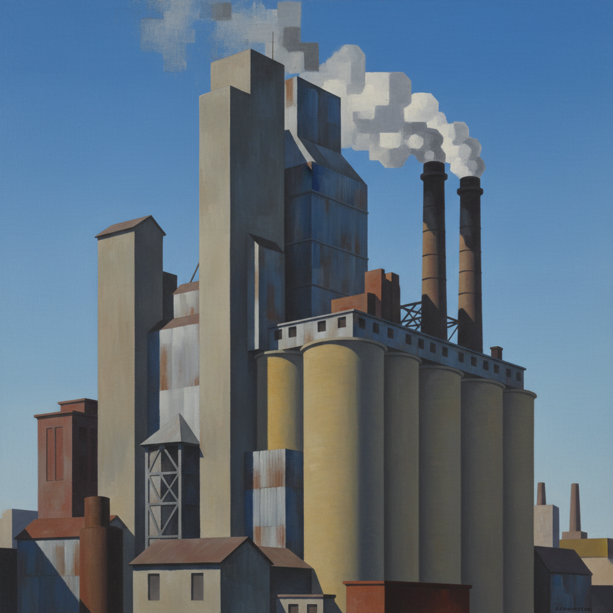

# Precisionism 精确主义



> **"工厂烟囱是新时代的大教堂——用几何的纯净歌颂机器文明。"**

## 概述

| 维度 | 描述 |
|------|------|
| 时期 | 1920s–1930s |
| 别名 | Precisionism, 精确主义, Cubist Realism, Immaculates |
| 核心色彩 | 清晰纯色、工业灰蓝、干净白色——无大气模糊 |
| 关键元素 | 工业建筑几何化、锐利边缘、无人风景、机器美学 |
| 代表人物 | Charles Sheeler, Charles Demuth, Georgia O'Keeffe, Ralston Crawford |
| 关联风格 | Cubism, Futurism, Art Deco, Hard-Edge Painting, Photorealism |

---

## 历史脉络

| 年份 | 事件 |
|------|------|
| 1920s | 美国工业化高峰——精确主义兴起 |
| 1921 | Charles Demuth《我看到数字5的金色》 |
| 1927 | Charles Sheeler拍摄福特工厂 |
| 1930s | 精确主义与美国场景画融合 |
| 1940s | 精确主义影响减弱，但影响Hard-Edge |

### 核心哲学

精确主义的精神是**"美国的美在工厂、谷仓和摩天楼——不在欧洲的教堂"**：
- "工业建筑的几何 = 自然的几何——都是美"
- "清晰、锐利、干净——没有印象派的模糊"
- "机器不丑——机器是新时代的美"
- "美国不需要模仿欧洲——我们有自己的风景"
- "精确不是冷——是尊重"

---

## 视觉语法

### 色彩系统

```
主色：
  工业灰 (#708090) — 钢铁、混凝土
  天空蓝 (#4682B4) — 清澈、无云
  白色 (#FFFFFF) — 干净、纯粹
  砖红 (#B22222) — 工厂、谷仓

规则：
  - 边缘锐利——无模糊
  - 色彩平涂——无笔触
  - 几何简化——但可识别
  - 无人——建筑是主角
  - 光线清晰——无大气效果
```

### 标志性元素

| 类别 | 元素 |
|------|------|
| 建筑 | 工厂、烟囱、谷仓、摩天楼、桥梁 |
| 几何 | 圆柱、锥体、长方体——建筑的几何 |
| 光线 | 清晰、硬、无大气散射 |
| 人物 | 无人——纯粹的建筑/机器 |
| 态度 | 乐观、现代、美国、工业崇拜 |

---

## 与千禧怀旧/当代的关系

### 建筑摄影
- 极简建筑摄影 = 精确主义的当代版本
- "Instagram上的几何建筑照——都是精确主义的后代"
- 无人、几何、清晰 = 精确主义的三要素

### 对设计的影响
- Art Deco的几何 + 精确主义的清晰 = 美国现代设计
- 工业设计的"诚实"美学 = 精确主义精神

---

## 设计应用

| 场景 | 应用方式 |
|------|----------|
| 建筑 | 几何摄影+极简表现 |
| 品牌 | 工业感+精确+美国 |
| 插画 | 建筑插画+几何风格 |
| 产品 | 工业设计+功能美学 |

---

## 相关风格

← [Art Deco 装饰艺术](art-deco.md) | [Hard-Edge Painting 硬边绘画](hard-edge-painting.md) →

↑ [返回千禧怀旧目录](README.md) | [返回总目录](../README.md)
