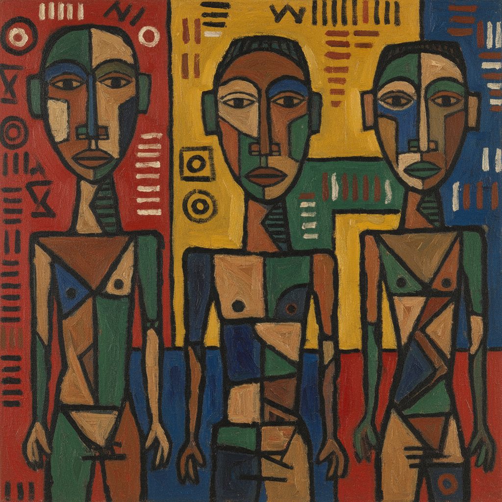

# Primitivism Art 原始主义艺术

> **时期：** 1890年代–1940年代  
> **关键词：** 非西方影响、简化形式、原始力量、反学院、部落美学

## 概述

Primitivism（原始主义）是19世纪末至20世纪初西方艺术家对非洲、大洋洲和美洲原住民艺术的借鉴运动。高更前往塔希提、毕加索受非洲面具启发创作《亚维农少女》——他们在"原始"艺术中发现了学院派所缺失的直接性、力量感和精神深度，由此推动了现代艺术的形式革命。

## 风格特征

- **简化形式**：几何化和图案化的人体表现
- **面具影响**：非洲和大洋洲面具的造型借鉴
- **平面构图**：拒绝透视的装饰性画面
- **原始力量**：追求未经"文明"驯化的表达力
- **精神性**：对仪式和神秘力量的向往

## 代表人物与作品

- 保罗·高更《我们从哪里来？》
- 巴勃罗·毕加索《亚维农少女》
- 恩斯特·路德维希·基希纳（桥社）
- 阿梅代奥·莫迪利亚尼（面具化肖像）

## 概念图

