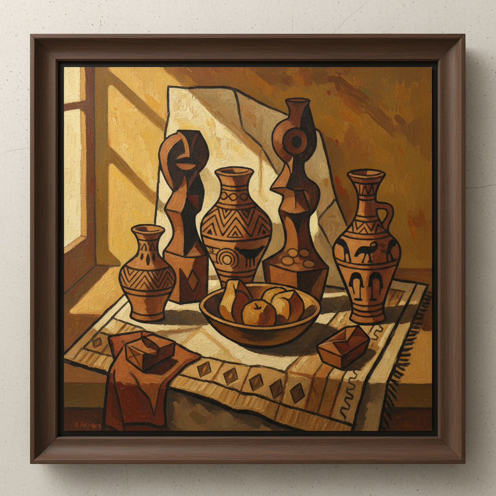

# Primitivism 原始主义

> "I have tried to do what is true and not ideal." — Paul Gauguin

## 概述

原始主义（Primitivism）是19世纪末至20世纪初西方艺术中的一种倾向，艺术家从非西方文化（非洲、大洋洲、美洲原住民）和"原始"艺术中汲取灵感，以此反抗西方学院派传统的僵化和工业文明的异化。

原始主义不是一个统一的运动，而是一种跨越多个运动的态度——从高更的塔希提到毕加索的非洲面具，从表现主义的"桥社"到超现实主义的图腾崇拜。

## 核心特征

| 特征 | 描述 |
|------|------|
| 非西方灵感 | 从非洲、大洋洲、美洲原住民艺术中借鉴 |
| 简化形式 | 追求"原始"的直接性和力量 |
| 反学院 | 拒绝西方古典美的标准 |
| 精神性 | 追求艺术的仪式性和精神力量 |
| 反文明 | 对工业文明的厌倦和逃离 |
| 身体性 | 强调身体的直接表达 |

## 视觉特征

- **形态**：简化的、几何化的人体和面具
- **色彩**：大胆的原色对比，或大地色调
- **线条**：粗犷的、有力的轮廓
- **空间**：平面化，拒绝西方透视
- **图案**：部落纹样、图腾、仪式符号
- **质感**：粗糙的、手工的、未经打磨的

## 代表作品

| 作品 | 艺术家 | 年代 | 意义 |
|------|--------|------|------|
| *Les Demoiselles d'Avignon* | Pablo Picasso | 1907 | 非洲面具影响——立体主义的起点 |
| *Where Do We Come From?* | Paul Gauguin | 1897 | 塔希提的精神追问 |
| *Bathers at Moritzburg* | Ernst Ludwig Kirchner | 1909 | 桥社的原始身体 |
| *The Dance* | Henri Matisse | 1910 | 原始舞蹈的生命力 |
| *Bird in Space* | Constantin Brancusi | 1923 | 原始形式的现代纯化 |
| *Totem Lessons* | Max Ernst | 1945 | 超现实主义的图腾 |

## 历史时间线

| 时期 | 事件 |
|------|------|
| 1891 | 高更前往塔希提——原始主义的标志性出走 |
| 1905 | 野兽派和桥社发现非洲雕塑 |
| 1907 | 毕加索的《亚维农少女》——非洲面具的冲击 |
| 1910s | 表现主义大量借鉴"原始"艺术 |
| 1920s-30s | 超现实主义收集部落艺术品 |
| 1984 | MoMA"Primitivism in 20th Century Art"展览引发争议 |
| 1990s-至今 | 后殖民批评重新审视原始主义 |

## 子类型

| 子类型 | 特征 |
|--------|------|
| 高更式逃离 | 离开西方文明，寻找"纯真"社会 |
| 形式借鉴 | 毕加索——借用非洲面具的形式语言 |
| 表现主义原始 | 桥社——追求"原始"的情感直接性 |
| 超现实图腾 | Ernst、Giacometti——部落艺术的潜意识维度 |
| 当代原始 | Basquiat——街头的新原始主义 |

## 中国语境

原始主义在中国有独特的回响。1980年代"85新潮"中，许多中国艺术家从本土少数民族艺术和远古岩画中寻找灵感（如丁方的黄土高原系列）。这既是对西方现代主义的学习，也是对中国自身"原始"文化资源的重新发现。当代中国的"原生艺术"（素人艺术）收藏和展览也延续了这一传统。

## 争议与遗产

- **后殖民批评**：原始主义被批评为文化掠夺和种族主义——将非西方文化浪漫化为"原始"
- **1984年MoMA展览**：被批评为将非西方艺术降格为西方艺术的"灵感来源"
- **权力不对等**：谁有权定义什么是"原始"？
- **遗产**：尽管有争议，原始主义确实打破了西方艺术的封闭性
- **当代回响**：全球南方艺术的崛起、去殖民化运动、原住民艺术的自主权

## AI生成概念图

## 与其他风格的关系

- **Fauvism** → 野兽派从非洲雕塑中获得色彩和形式的解放
- **Cubism** → 立体主义直接受非洲面具影响
- **Expressionism** → 表现主义追求"原始"的情感直接性
- **Surrealism** → 超现实主义收集部落艺术品作为潜意识的证据
- **Art Brut** → 原生艺术继承了对"未经训练"创造力的崇拜
- **Neo-Expressionism** → 新表现主义的Basquiat是当代原始主义

---

*浮光艺志 | Chronicle of Artistry*
