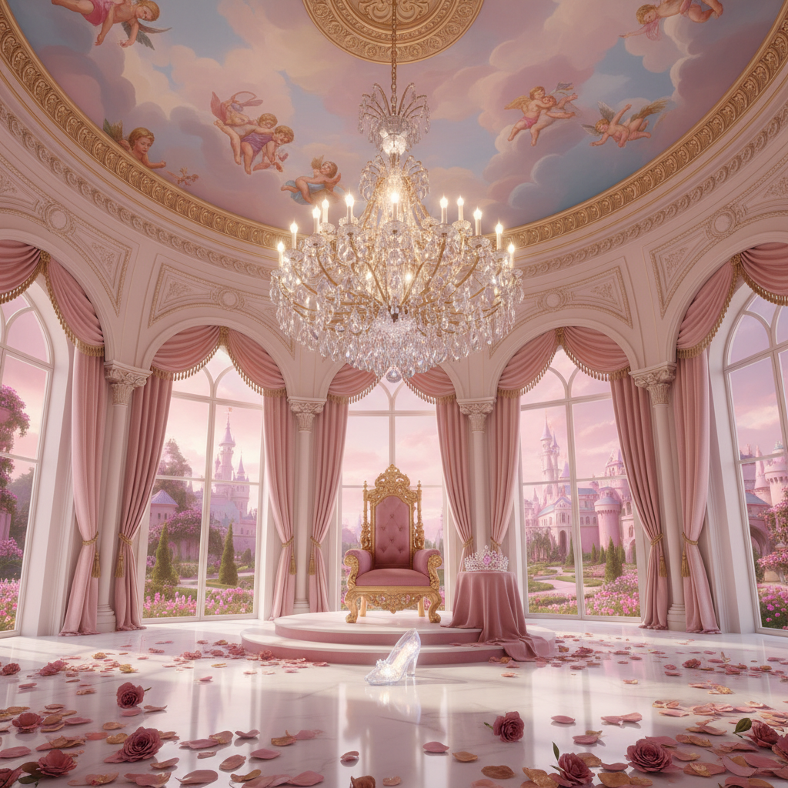

# Princesscore 公主核



> **"粉色城堡、水晶皇冠、蓬蓬裙——每个人都值得拥有自己的童话。"**

## 概述

| 维度 | 描述 |
|------|------|
| 时期 | 2020–至今 |
| 别名 | Princesscore, Princess Aesthetic, Royal Pink |
| 核心色彩 | 粉色、金色、白色、淡紫、水晶蓝 |
| 关键元素 | 皇冠、城堡、蓬蓬裙、水晶吊灯、玫瑰 |
| 代表人物 | 迪士尼公主、Marie Antoinette、Barbie |
| 关联风格 | Royalcore, Coquette, Barbiecore, Fairycore |

---

## 历史脉络

### 2020：公主的回归

Princesscore 在 2020 年作为一种美学标签出现，是对**公主幻想的无歉意拥抱**：

- 在"女性不需要被拯救"的时代，选择"我就是想当公主"
- 不是等待王子，而是自己给自己加冕
- 将"公主"从被动变为主动的身份选择

### 文化基因

| 来源 | 贡献 |
|------|------|
| 迪士尼公主 | 粉色城堡、水晶鞋的视觉原型 |
| Marie Antoinette | 洛可可的极致奢华 |
| Barbie | 粉色帝国的美学 |
| 童话故事 | 城堡、魔法、happily ever after |
| K-pop | 公主概念的现代演绎 |

### 与 Barbiecore 的区别

| 维度 | Princesscore | Barbiecore |
|------|-------------|------------|
| 时代感 | 古典/童话 | 现代/流行 |
| 色调 | 淡粉+金+白 | 热粉(Barbie Pink) |
| 参考 | 迪士尼/洛可可 | Barbie 品牌 |
| 情绪 | 梦幻/浪漫 | 自信/有力 |

---

## 视觉语法

### 色彩系统

```
主色：
  公主粉 (#FFB7C5) — 核心色
  金色 (#FFD700) — 皇冠、装饰
  白色 (#FFFFFF) — 纯洁、婚纱
  淡紫 (#E6E6FA) — 魔法
  水晶蓝 (#B0E0E6) — 灰姑娘

辅色：
  玫瑰红 (#FF007F) — 玫瑰花
  珍珠色 (#F0EAD6) — 珍珠
  银色 (#C0C0C0) — 水晶

质感：
  丝绸/缎面 — 礼服
  水晶/钻石 — 皇冠、吊灯
  蕾丝 — 裙摆、面纱
  天鹅绒 — 王座、窗帘
  金箔 — 装饰
```

### 标志性元素

| 类别 | 元素 |
|------|------|
| 配饰 | 皇冠/头冠、水晶项链、长手套 |
| 服装 | 蓬蓬裙、舞会礼服、水晶鞋 |
| 空间 | 城堡、舞厅、花园、镜厅 |
| 装饰 | 水晶吊灯、金色相框、玫瑰花 |
| 食物 | 马卡龙、粉色蛋糕、香槟 |
| 动物 | 天鹅、白马、蝴蝶 |

---

## 与千禧怀旧的关系

### 迪士尼公主的童年记忆
- 90s/2000s 的迪士尼公主电影是很多人的童年
- 公主裙、公主生日派对、公主文具
- Princesscore 是对这些童年幻想的成年回归

### 与 Y2K 的交叉
- 2000s 的 Paris Hilton "公主"形象
- 粉色翻盖手机+水钻装饰
- "It Girl"文化中的公主元素

---

## 中国语境

- "公主风"穿搭/装修
- 迪士尼乐园的公主体验
- 婚纱摄影中的城堡/公主主题
- 小红书上的"公主日记"标签
- 与"甜美风"/"名媛风"的交叉

---

## 设计应用

| 场景 | 应用方式 |
|------|----------|
| 品牌 | 粉色+金色+花体字+皇冠元素 |
| 包装 | 粉色+金箔+蝴蝶结+水晶装饰 |
| 空间 | 粉色+水晶吊灯+天鹅绒+鲜花 |
| 数字 | 粉色渐变+闪光效果+花体字 |

---

## 相关风格

← [Royalcore 皇室核](royalcore.md) | [Barbiecore 芭比核](barbiecore.md) →

↑ [返回千禧怀旧目录](README.md) | [返回总目录](../README.md)
