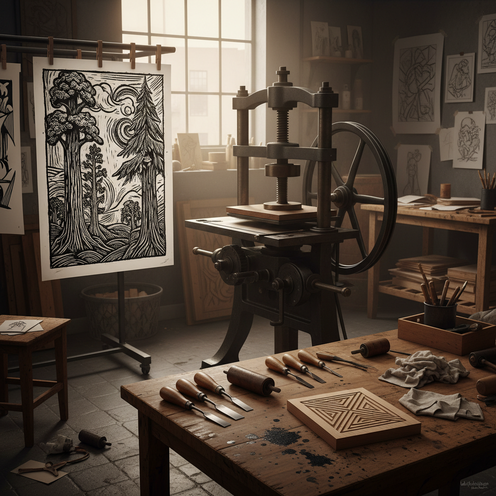

# Printmaking 版画艺术

> "The print is a democratic art form." — Andy Warhol

## 概述

版画艺术（Printmaking）是通过在版面上制作图像、再转印到纸张或其他材料上的艺术形式。版画的核心特征是"可复制性"——同一块版可以印出多张相同的作品，这使艺术品的传播和民主化成为可能。

从中国唐代的雕版印刷到丢勒的铜版画、从浮世绘到安迪·沃霍尔的丝网印刷，版画既是技术也是艺术，既是复制也是创造。

## 核心特征

| 特征 | 描述 |
|------|------|
| 间接性 | 图像通过版面间接转印 |
| 可复制 | 同一版可印出多张——版数（edition） |
| 技术性 | 需要专门的工具、材料和技术 |
| 民主性 | 复制使艺术品可以广泛传播 |
| 反转性 | 版面图像是最终印品的镜像 |
| 物质性 | 纸张、油墨、压力的物理痕迹 |

## 视觉特征

- **线条**：刻线的精确性和力度感
- **黑白**：木刻和铜版画的经典黑白对比
- **层次**：石版和丝网的丰富色彩层次
- **肌理**：纸张纹理和油墨的物理质感
- **边缘**：版画特有的压痕（plate mark）
- **签名**：铅笔签名和版数标注

## 代表作品

| 作品 | 艺术家 | 年代 | 意义 |
|------|--------|------|------|
| *金刚经* | 佚名 | 868年 | 现存最早的有日期的印刷品 |
| *忧郁 I (Melencolia I)* | Albrecht Dürer | 1514 | 铜版画的最高成就 |
| *神奈川冲浪里* | 葛饰北斋 | 1831 | 浮世绘木版画的标志 |
| *Marilyn Diptych* | Andy Warhol | 1962 | 丝网印刷的波普革命 |
| *Disasters of War* | Francisco Goya | 1810-20 | 蚀刻版画的政治力量 |
| *Thirty-Six Views of Mt. Fuji* | 葛饰北斋 | 1830-32 | 套色木版画的巅峰 |

## 历史时间线

| 时期 | 事件 |
|------|------|
| 7世纪 | 中国发明雕版印刷 |
| 868 | 《金刚经》——最早有日期的印刷品 |
| 15世纪 | 欧洲木刻和铜版画兴起 |
| 1514 | 丢勒的*Melencolia I*——铜版画巅峰 |
| 17-19世纪 | 浮世绘——日本木版画的黄金时代 |
| 1798 | 石版术发明——新的版画可能 |
| 1960s | 丝网印刷——波普艺术的核心技术 |
| 1980s | 数字版画技术出现 |
| 2000s-至今 | 传统版画的手工复兴 |

## 子类型

| 子类型 | 特征 |
|--------|------|
| 木刻/木版画 | 凸版——在木板上刻去不需要的部分 |
| 铜版画 | 凹版——在金属板上刻线或蚀刻 |
| 石版画 | 平版——利用油水不相容原理 |
| 丝网印刷 | 孔版——通过网版漏印 |
| 单版画 | 只能印一张的独特版画 |
| 数字版画 | 数字技术辅助的版画创作 |

## 中国语境

中国是版画的发源地——雕版印刷术是中国的伟大发明。从唐代佛经插图到明代的《十竹斋画谱》、从鲁迅推动的新兴木刻运动到当代版画，中国版画有完整的历史脉络。中国的版画教育体系完善，中央美术学院、中国美术学院等都有专门的版画系。当代中国版画在保持传统技法的同时积极探索新的表达可能。

## AI生成概念图

## 与其他风格的关系

- **Pop Art** → 波普艺术以丝网印刷为核心技术
- **Expressionism** → 表现主义木刻是版画的重要传统
- **Ukiyo-e** → 浮世绘是版画艺术的东方巅峰
- **Book Art** → 书籍艺术大量使用版画技术
- **Street Art** → 街头艺术使用丝网和模板印刷
- **Conceptual Art** → 概念艺术质疑版画的"原作"概念

---

*浮光艺志 | Chronicle of Artistry*
