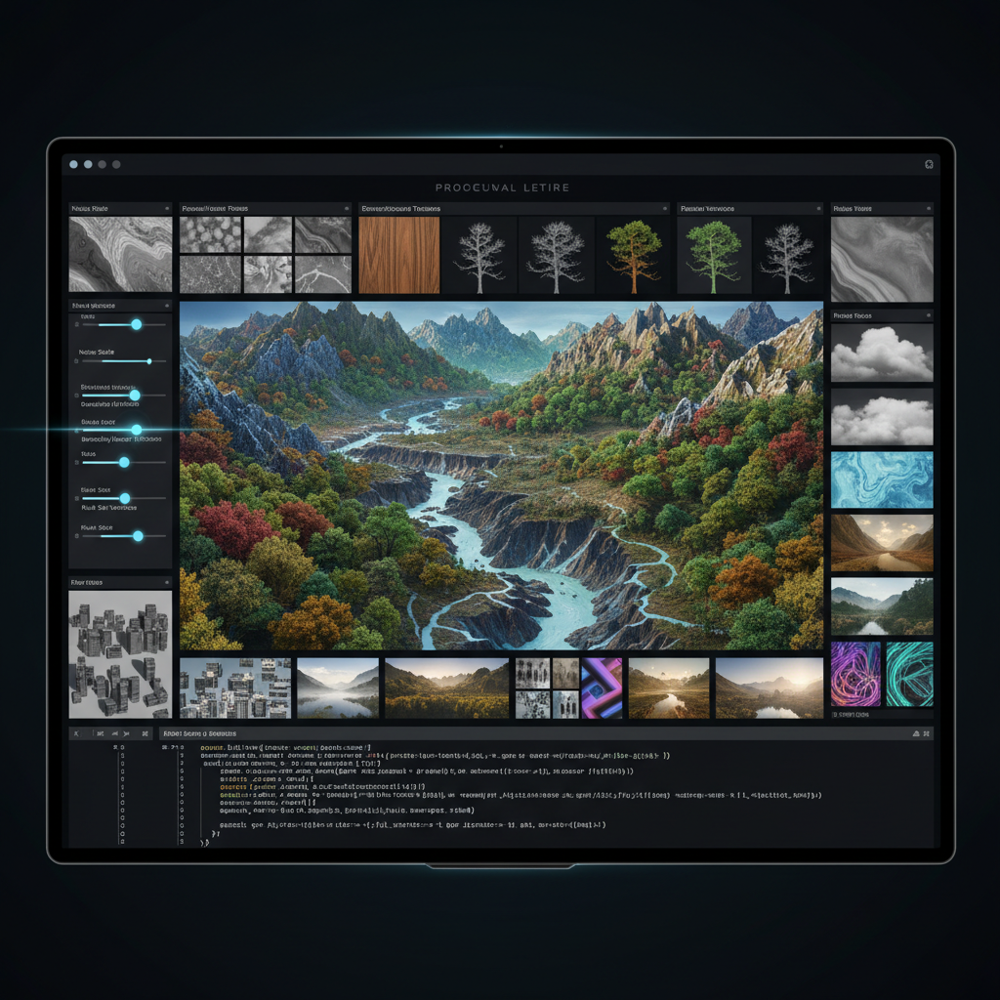

# Procedural Art 程序化艺术

> **时期：** 1960年代–至今  
> **关键词：** 规则系统、自动生成、无限变体、种子随机、世界构建

## 概述

程序化艺术使用预定义的规则系统和算法来自动生成视觉内容——从早期的计算机绘图到当代游戏中的无限地形生成。艺术家设计的不是最终图像，而是产生图像的"规则"——一个种子数字就能生成一个完整的世界，每次运行都产生独一无二但风格一致的结果。

## 风格特征

- **规则驱动**：预设规则自动产生视觉结果
- **无限变体**：同一系统可生成无穷多的变化
- **种子控制**：随机数种子决定具体输出
- **自相似性**：不同尺度上的结构重复
- **涌现性**：简单规则产生复杂的整体效果

## 代表人物与作品

- Vera Molnár 早期计算机绘画
- Georg Nees 计算机生成图形先驱
- Minecraft 程序化世界生成
- No Man's Sky 程序化宇宙
- Houdini 程序化特效工作流

## 概念图

