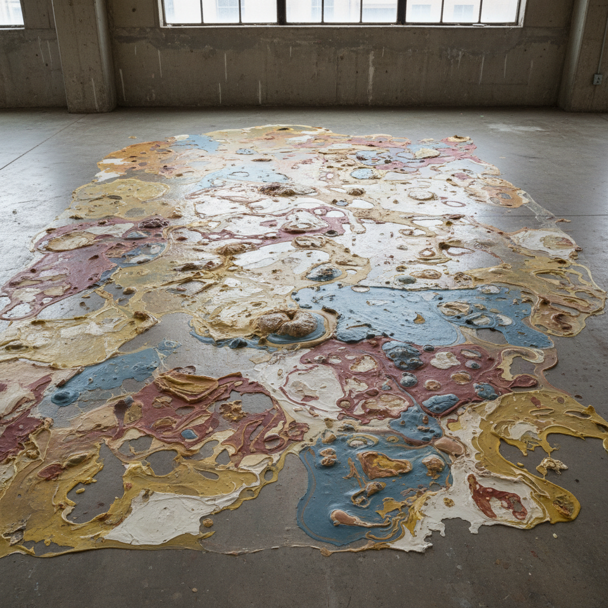

# Process Art Painting 过程艺术绘画

> **时期：** 1960年代末–1970年代  
> **关键词：** 创作过程、材料行为、时间记录、反完成、开放结局

## 概述

Process Art Painting（过程艺术绘画）将创作的过程本身——而非最终的画面——视为作品的核心。颜料的流淌、画布的氧化、材料的腐蚀和变色都被保留和展示。它记录的不是一个瞬间，而是一段时间；展示的不是一个决定，而是一系列物理事件的自然展开。

## 风格特征

- **过程可见**：创作步骤被完整保留
- **材料自主**：让材料按自身属性行动
- **时间记录**：作品展示时间的流逝
- **反完成**：没有明确的"完成"状态
- **偶然接受**：拥抱不可预测的结果

## 代表人物与作品

- 林达·本格利斯 泼洒乳胶
- 山姆·吉利亚姆 悬挂染色画布
- 艾伦·希尔德 层叠蜡画
- 杰克·惠滕 过程抽象

## 概念图

