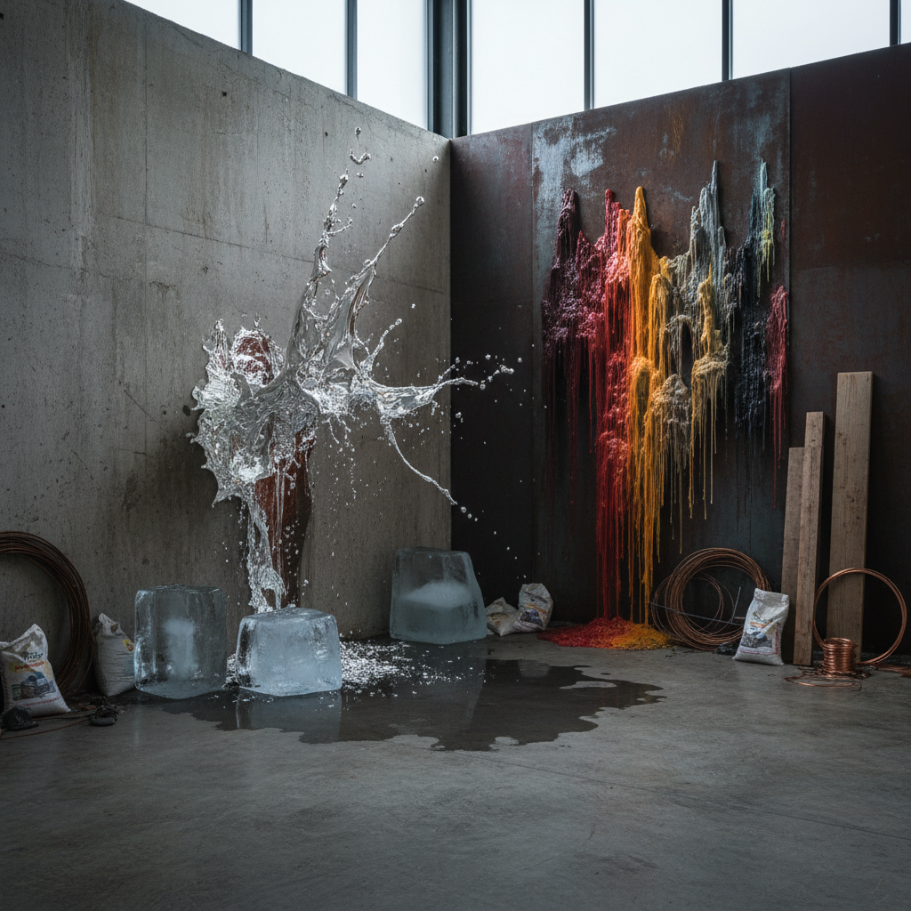

# Process Art 过程艺术

> "What is interesting is the process, not the result." — Robert Morris

## 概述

过程艺术（Process Art）是1960年代末兴起的艺术运动，强调创作过程本身而非最终产品。艺术家关注的是材料如何被改变——切割、燃烧、堆积、融化、生长、腐烂——这些变化的痕迹就是作品本身。

过程艺术挑战了艺术品作为永恒、完成的对象的传统观念，提出艺术是一个持续的、开放的、不可预测的事件。

## 核心特征

| 特征 | 描述 |
|------|------|
| 过程优先 | 创作行为比最终结果更重要 |
| 材料变化 | 关注材料的物理/化学变化过程 |
| 时间性 | 作品在时间中变化、衰败、消失 |
| 不可预测 | 接受偶然性和不可控因素 |
| 反商品化 | 难以买卖和收藏的艺术 |
| 记录性 | 照片和影像记录成为作品的延伸 |

## 视觉特征

- **材料**：蜡、冰、脂肪、毛毡、泥土、有机物
- **状态**：融化中、燃烧中、生长中、腐烂中
- **痕迹**：切割痕、烧焦痕、流淌痕、堆积痕
- **空间**：常为现场特定（site-specific）
- **时间**：作品随时间变化，没有"完成"状态
- **文档**：照片、影像、文字记录是作品的一部分

## 代表作品

| 作品 | 艺术家 | 年代 | 意义 |
|------|--------|------|------|
| *Fat Corner* | Joseph Beuys | 1963 | 脂肪作为能量和变化的隐喻 |
| *Splashing* | Richard Serra | 1968 | 熔铅泼洒——动作即作品 |
| *Sawing* | Keith Sonnier | 1968 | 切割过程的痕迹 |
| *Condensation Cube* | Hans Haacke | 1963-65 | 水的蒸发和凝结——活的系统 |
| *Ice Piece* | Rafael Ferrer | 1969 | 冰块融化——消失即作品 |
| *Ashes to Ashes* | Janine Antoni | 2000 | 身体过程的痕迹 |

## 历史时间线

| 时期 | 事件 |
|------|------|
| 1966 | "Eccentric Abstraction"展览预示过程关注 |
| 1968 | "Anti-Illusion: Procedures/Materials"展览——过程艺术正式亮相 |
| 1968 | Robert Morris发表"Anti Form"文章 |
| 1969 | "When Attitudes Become Form"展览（伯尔尼） |
| 1970s | 过程艺术与行为艺术、大地艺术融合 |
| 1980s-至今 | 过程观念渗透到当代艺术各领域 |

## 子类型

| 子类型 | 特征 |
|--------|------|
| 材料过程 | Serra、Hesse——材料的物理变化 |
| 系统过程 | Haacke——自然系统的运作 |
| 身体过程 | Antoni、Schneemann——身体作为材料 |
| 时间过程 | 冰、蜡——随时间消失的作品 |
| 生态过程 | 植物生长、微生物——生命的过程 |

## 中国语境

过程艺术的理念与中国传统美学中的"气韵生动"和"道法自然"有深层共鸣。当代中国艺术家如蔡国强的火药爆破、徐冰的蚕丝作品、梁绍基让蚕在装置上吐丝的创作，都是过程艺术的中国实践。中国书法本身就是一种过程艺术——笔墨的运动痕迹就是作品。

## 争议与遗产

- **争议**：如果过程比结果重要，那还需要"作品"吗？
- **收藏困境**：过程性作品如何被博物馆收藏和展示？
- **文档化悖论**：记录过程的照片是否成为了新的"作品"？
- **遗产**：为行为艺术、时基媒体、生态艺术奠定观念基础
- **当代回响**：直播创作、生成艺术、AI艺术中的过程可见性

## AI生成概念图

## 与其他风格的关系

- **Post-Minimalism** → 过程艺术是后极简主义的核心分支
- **Performance Art** → 行为艺术共享"过程即作品"的理念
- **Land Art** → 大地艺术中的自然过程（侵蚀、生长）
- **Fluxus** → 激浪派的事件性与过程艺术相通
- **Arte Povera** → 贫穷艺术共享材料实验精神
- **Generative Art** → 生成艺术是过程艺术的数字延伸

---

*浮光艺志 | Chronicle of Artistry*
