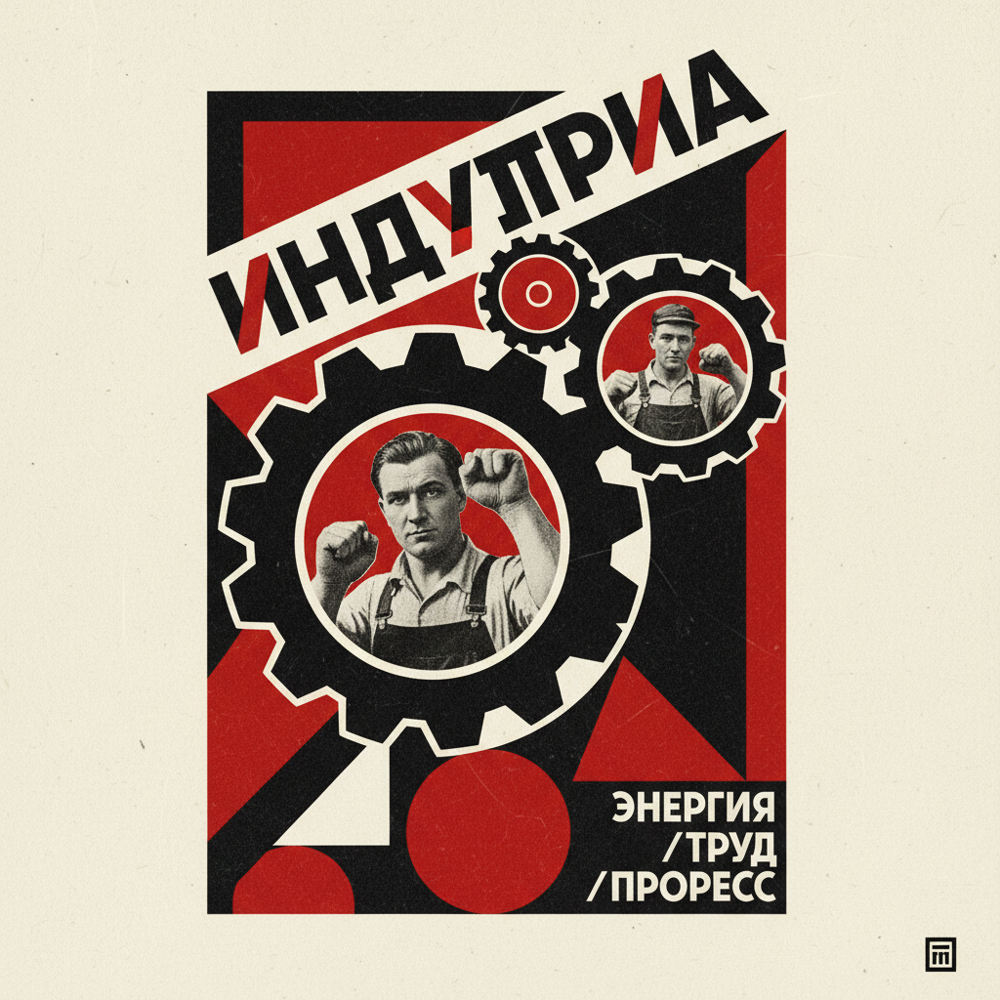

# Productivism 生产主义

> **时期：** 1920年–1930年代  
> **关键词：** 苏联、艺术为生产服务、反架上绘画、设计革命、功能主义

## 概述

Productivism（生产主义）是1920年代苏联的激进艺术理论，主张艺术家应该放弃"无用的"架上绘画，转而为工业生产和日常生活服务——设计海报、纺织品、家具、建筑。罗德钦科从绘画转向摄影和平面设计，斯捷潘诺娃设计工人服装——艺术不再是挂在墙上的奢侈品，而是改造生活的工具。

## 风格特征

- **功能优先**：一切设计服务于实用目的
- **几何构成**：简洁的几何形式
- **红与黑**：革命色彩的标志性组合
- **摄影蒙太奇**：照片拼贴取代手绘
- **字体设计**：大胆的排版作为视觉主体

## 代表人物与作品

- 亚历山大·罗德钦科 海报与摄影
- 瓦尔瓦拉·斯捷潘诺娃 纺织设计
- 柳博芙·波波娃 舞台设计
- 古斯塔夫·克鲁齐斯 政治蒙太奇

## 概念图

