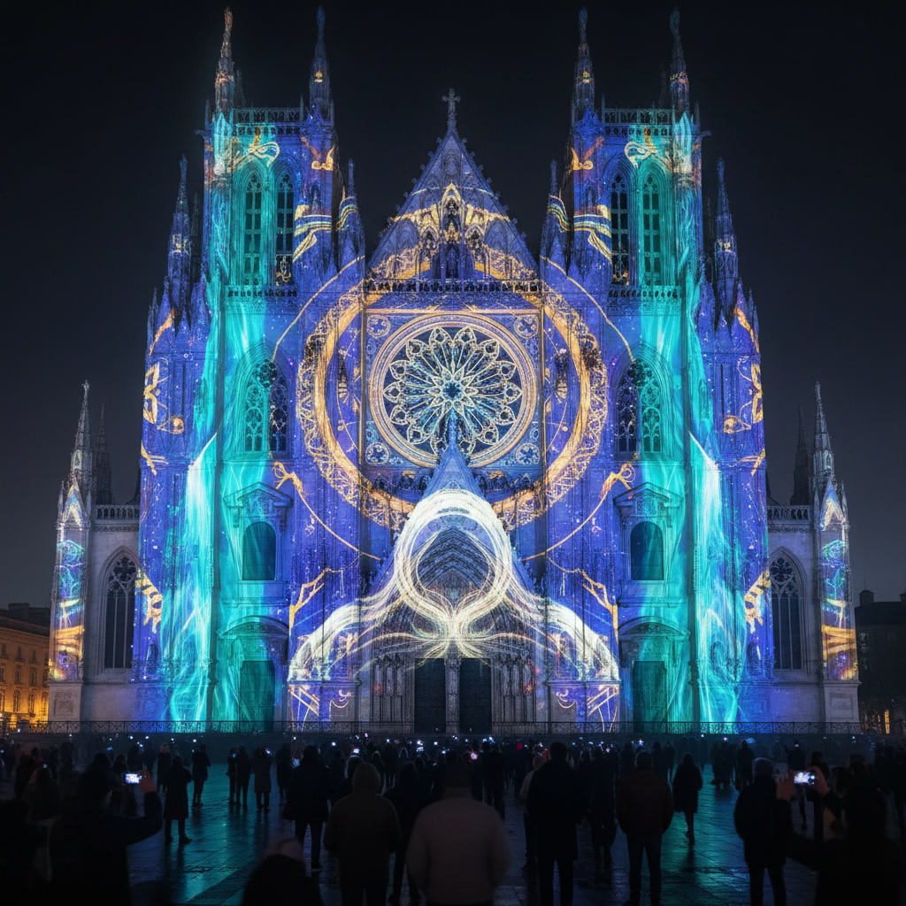

# Projection Art 投影艺术

> "Projection transforms architecture into a living canvas." — Krzysztof Wodiczko

## 概述

投影艺术（Projection Art）是利用光投影技术将图像、视频和动画投射到建筑物、雕塑、自然景观或其他表面上的艺术形式。从早期的幻灯片投影到当代的大规模建筑投影映射（Projection Mapping），投影艺术将静态空间转化为动态的视觉体验。

投影艺术的独特之处在于它的临时性和场域性——作品只存在于投影的瞬间，与特定的空间和时间不可分离。

## 核心特征

| 特征 | 描述 |
|------|------|
| 光媒介 | 以光作为主要创作媒介 |
| 场域性 | 与特定空间紧密结合 |
| 临时性 | 作品存在于投影的时间内 |
| 大尺度 | 常常覆盖整栋建筑 |
| 沉浸性 | 创造包围观众的视觉环境 |
| 技术性 | 依赖投影设备和软件 |

## 视觉特征

- **光影**：光与暗的强烈对比
- **动态**：运动的图像和动画
- **建筑**：与建筑结构精确对齐
- **色彩**：高饱和度的投影色彩
- **尺度**：从小型装置到城市级别
- **叙事**：时间性的视觉叙事

## 代表作品

| 作品 | 艺术家/团队 | 年代 | 意义 |
|------|-------------|------|------|
| *Hiroshima Projection* | Krzysztof Wodiczko | 1999 | 政治投影的先驱 |
| *Fête des Lumières* | 多位艺术家 | 1999-至今 | 里昂灯光节——城市投影的典范 |
| *Body Movies* | Rafael Lozano-Hemmer | 2001 | 互动投影——观众的影子 |
| *Blenheim Palace* | Projection Studio | 2019 | 建筑投影映射 |
| *TeamLab Borderless* | teamLab | 2018 | 沉浸式投影空间 |
| *Vivid Sydney* | 多位艺术家 | 2009-至今 | 悉尼灯光节 |

## 历史时间线

| 时期 | 事件 |
|------|------|
| 1659 | 魔术灯笼（Magic Lantern）发明 |
| 1960s | 迷幻灯光秀——液体投影 |
| 1980s | Wodiczko开始政治性建筑投影 |
| 1990s | 数字投影技术成熟 |
| 2000s | Projection Mapping技术发展 |
| 2010s | 大规模沉浸式投影体验兴起 |
| 2020s | AI生成内容与实时投影结合 |

## 中国语境

中国的投影艺术在近年来快速发展——从故宫的灯光秀到各城市的建筑投影节，从teamLab在中国的多个展览到本土的沉浸式数字艺术空间。中国的传统灯笼和皮影戏可视为投影艺术的古老先驱。当代中国的"夜经济"推动了城市投影艺术的商业化发展。

## AI生成概念图

## 与其他风格的关系

- **Light Art** → 灯光艺术是投影艺术的近亲
- **Immersive Art** → 沉浸式艺术大量使用投影技术
- **Video Art** → 视频艺术为投影提供了内容语言
- **Public Art** → 投影是公共艺术的重要形式
- **Digital Art** → 数字技术是投影艺术的基础
- **Performance Art** → 投影常与现场表演结合

---

*浮光艺志 | Chronicle of Artistry*
