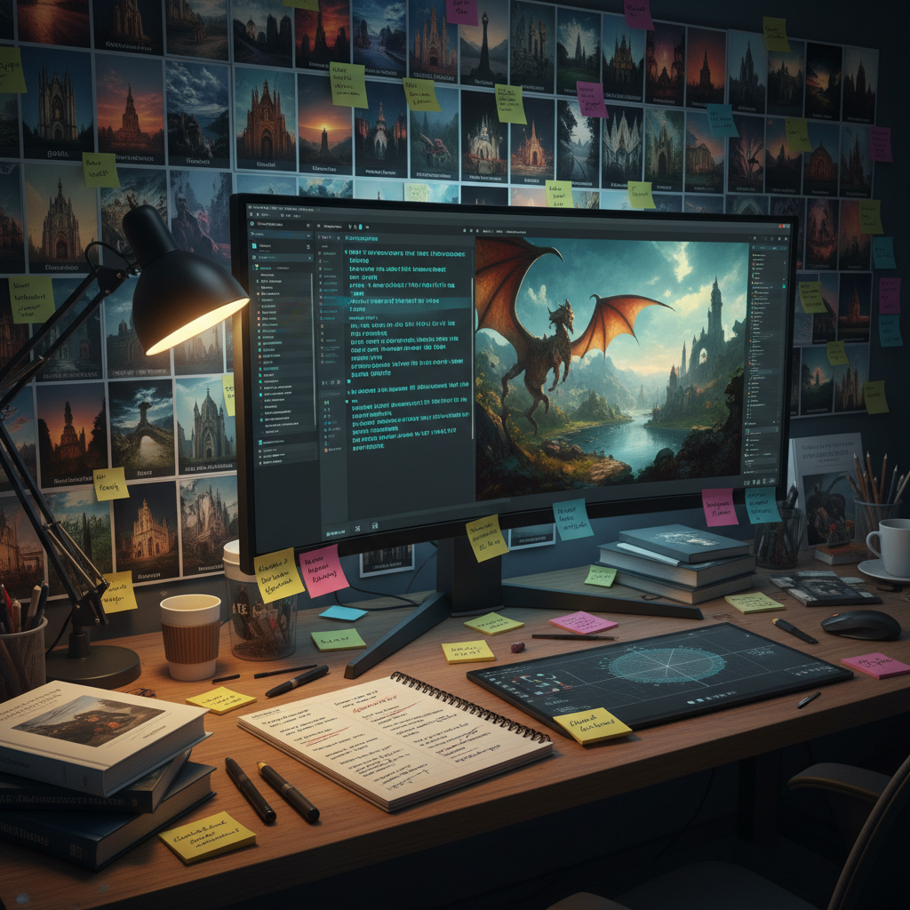

# Prompt Art 提示词艺术

> "Prompt art is the art of speaking to machines — of learning the language that makes artificial minds dream, of discovering that words are not just descriptions of images but incantations that summon them into being, that the gap between what you say and what appears is not a failure of communication but a creative space where human intention and machine interpretation dance together, producing images that neither human nor machine could have imagined alone." — Unknown

## 概述

提示词艺术（Prompt Art）是通过精心设计的文本提示词（prompts）引导AI图像生成模型创作视觉作品的艺术实践。随着DALL-E、Midjourney、Stable Diffusion等文本到图像模型的出现，"写提示词"本身成为了一种新的创作技能和艺术形式。

提示词艺术的实践包括：1）提示词工程——精心设计提示词的措辞、结构和关键词组合，以引导AI生成特定的视觉效果；2）提示词诗学——将提示词本身视为一种文学形式，探索语言与图像之间的关系；3）迭代探索——通过反复修改提示词来逐步接近理想的视觉效果；4）风格混合——在提示词中组合不同的艺术风格、媒介和美学参考；5）意外发现——利用AI对提示词的"误读"来发现意想不到的视觉可能性。

## 核心特征

| 特征 | 描述 |
|------|------|
| 语言 | 语言驱动 |
| 翻译 | 文字到图像的翻译 |
| 迭代 | 迭代探索 |
| 混合 | 风格混合 |
| 意外 | 意外发现 |
| 协作 | 人机协作 |

## 视觉特征

- **混合**：多种风格的混合
- **超现实**：超现实的组合
- **精细**：高度精细的细节
- **风格化**：强烈的风格化
- **梦幻**：梦境般的场景
- **完美**：技术上的完美

## 代表作品

| 作品 | 艺术家 | 年代 | 意义 |
|------|--------|------|------|
| *Théâtre D'opéra Spatial* | Jason Allen | 2022 | Midjourney获奖作品 |
| *Prompt engineering art* | Various | 2022至今 | 提示词工程艺术 |
| *AI art competitions* | Various | 2022至今 | AI艺术竞赛 |
| *Prompt poetry* | Various | 2023至今 | 提示词诗歌 |
| *Multi-model prompting* | Various | 当代 | 多模型提示 |

## 历史时间线

| 时期 | 事件 |
|------|------|
| 2021 | DALL-E的发布 |
| 2022 | Midjourney和Stable Diffusion |
| 2022 | Jason Allen的获奖争议 |
| 2023 | 提示词艺术的成熟 |
| 当代 | 多模态提示的发展 |

## 中国语境

提示词艺术在中国有广泛的实践者群体。中国的AI图像生成社区非常活跃——从百度文心一格到各种开源模型的中文适配，中国用户在探索中文提示词的独特可能性。中文提示词艺术有其独特的挑战和机遇：中文的意象性和多义性为提示词创作提供了丰富的可能性（如"山水"一词同时唤起自然景观和中国画传统），但也面临模型对中文理解的局限。中国的一些艺术家在探索：用古诗词作为提示词生成图像、探索中文特有的美学概念如何被AI理解和表达、以及创造融合中国传统美学与AI生成技术的新作品。

## AI生成概念图

## 与其他风格的关系

- **AI Art** → 人工智能艺术
- **Generative Art** → 生成艺术
- **Conceptual Art** → 观念艺术
- **Digital Art** → 数字艺术
- **Text Art** → 文字艺术
- **Latent Space Art** → 潜在空间艺术

---

*浮光艺志 | Chronicle of Artistry*
