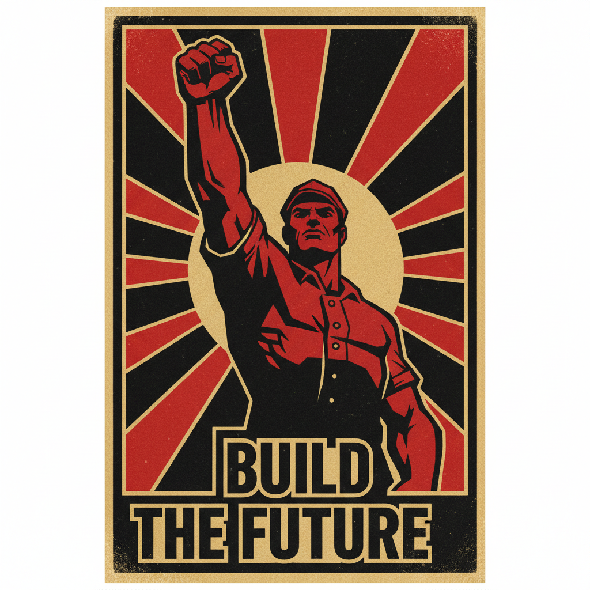

# Propaganda Art 宣传画艺术



> **"握紧拳头、仰望天空、红色旗帜——当艺术成为改变世界的武器。"**

## 概述

| 维度 | 描述 |
|------|------|
| 时期 | 1910s–1970s（经典）/影响至今 |
| 别名 | Propaganda Art, Political Poster, 宣传画, 政治海报 |
| 核心色彩 | 红色、黑色、金色、白色（高对比有限色） |
| 关键元素 | 英雄化人物、仰角构图、粗体标语、有限色彩、戏剧化光影 |
| 代表人物 | Alexander Rodchenko, Shepard Fairey, 中国宣传画艺术家群体 |
| 关联风格 | Constructivism, Social Realism, Pop Art, Street Art |

---

## 历史脉络

| 年份 | 事件 |
|------|------|
| 1917 | 俄国革命——构成主义宣传海报 |
| 1930s | 苏联社会主义现实主义——宣传画体系化 |
| 1940s | 二战宣传海报——"We Can Do It!", "Uncle Sam" |
| 1950s-70s | 中国宣传画黄金时代 |
| 1960s | 古巴革命海报——拉美宣传艺术 |
| 2008 | Shepard Fairey "HOPE"——宣传画美学的当代复兴 |
| 2020s | 社交媒体时代的"视觉宣传" |

### 核心哲学

宣传画艺术的精神是**"一张海报可以改变一个人的信念——这就是视觉的力量"**：
- 简洁 = 力量（"一个形象+一句话 = 改变世界"）
- 英雄化 = 动员（"把普通人画成英雄——他们就会成为英雄"）
- 重复 = 真理（"看一百遍——你就相信了"）
- 情感 = 行动（"不是说服理性——是点燃情感"）
- "宣传画是人类发明的最强大的视觉传播工具"

---

## 视觉语法

### 色彩系统

```
经典配色：
  红色 (#FF0000) — 革命、力量、紧迫
  黑色 (#000000) — 力量、对比
  金色 (#FFD700) — 胜利、光明
  白色 (#FFFFFF) — 纯洁、空间

规则：
  - 有限色彩（2-4色）
  - 高对比
  - 红色几乎必出现
  - 平面印刷友好

变体：
  苏联: 红+黑+金
  美国: 红+蓝+白
  中国: 红+金+绿
  古巴: 高对比+有限色

质感：
  平面 — 丝网印刷
  粗糙 — 木刻、石版
  光滑 — 喷枪、照片
  纸张 — 张贴、磨损
```

### 标志性元素

| 类别 | 元素 |
|------|------|
| 人物 | 英雄化工人/农民/士兵、仰角、握拳 |
| 构图 | 仰角、对角线、放射状、金字塔 |
| 文字 | 粗体、大字、标语、口号 |
| 符号 | 拳头、旗帜、太阳、齿轮、麦穗 |
| 光影 | 戏剧化、高对比、英雄光 |
| 态度 | 动员、鼓舞、简洁、有力、情感 |

---

## 与千禧怀旧的关系

### Shepard Fairey 与当代宣传美学
- "OBEY" + "HOPE" = 宣传画美学的当代经典
- 街头艺术中的宣传画语言
- "宣传画的视觉语言——即使脱离政治——依然有力量"
- 品牌设计中的"宣传画风格" = 力量感+复古感

### 社交媒体时代的"视觉宣传"
- Instagram/TikTok = 新的"海报墙"
- 政治运动的视觉设计
- "每个社交媒体帖子都是一张微型宣传画"

---

## 中国语境

- 中国宣传画的丰富传统和独特美学
- 中国宣传画作为收藏品和研究对象
- "国潮"设计中对宣传画元素的重新诠释
- 中国当代艺术对宣传画的反思和引用

---

## 设计应用

| 场景 | 应用方式 |
|------|----------|
| 品牌 | 力量感+复古+运动+号召+态度 |
| 社会 | 公益海报+运动+倡导+动员 |
| 潮流 | 街头品牌+T恤+贴纸+海报 |
| 艺术 | 当代艺术引用+反思+讽刺 |

---

## 相关风格

← [Constructivism 构成主义](constructivism.md) | [Pop Art 波普艺术](pop-art.md) →

↑ [返回千禧怀旧目录](README.md) | [返回总目录](../README.md)
