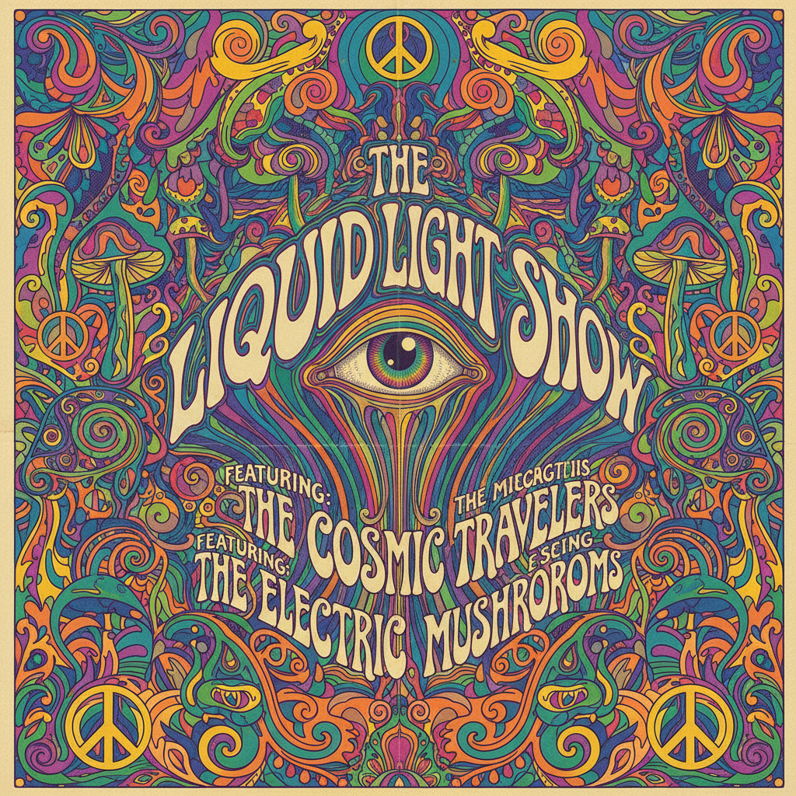

# Psychedelia 迷幻艺术（原版）



> **"万花筒色彩、液态字体、意识扩展——1967年旧金山的视觉翻译。"**

## 概述

| 维度 | 描述 |
|------|------|
| 时期 | 1965–1972 原版 |
| 别名 | Psychedelia, Psychedelic Art, Acid Art |
| 核心色彩 | 所有颜色同时出现——越多越好 |
| 关键元素 | 液态字体、万花筒图案、眼睛、蘑菇 |
| 代表人物 | Wes Wilson、Victor Moscoso、Rick Griffin |
| 关联风格 | Art Nouveau, Psychedelic Revival, Hippie, Op Art |

---

## 历史脉络

### 从 LSD 到海报艺术

| 年份 | 事件 |
|------|------|
| 1965 | Ken Kesey 的 Acid Tests |
| 1966 | Wes Wilson 为 Fillmore 设计第一张迷幻海报 |
| 1967 | Summer of Love——旧金山迷幻文化巅峰 |
| 1967 | Beatles《Sgt. Pepper's》封面 |
| 1968 | Yellow Submarine 动画电影 |
| 1969 | Woodstock 音乐节 |
| 1972 | 迷幻运动逐渐消退 |
| 2018 | Psychedelic Revival 在数字设计中复兴 |

### 核心哲学

Psychedelia 的精神是**"打开感知之门——看到现实背后的现实"**：
- LSD/致幻剂 = 灵感来源（但不是必须）
- "正常"的感知是有限的
- 色彩可以流动、字体可以呼吸
- 一切都在运动、一切都相连
- "Turn on, tune in, drop out" — Timothy Leary

---

## 视觉语法

### 色彩系统

```
规则：
  - 所有颜色都可以用
  - 越多越好
  - 互补色并置（产生振动）
  - 渐变、流动、融合
  - 没有"不搭配"的颜色

常见组合：
  紫+橙+绿 — 经典迷幻三色
  红+蓝+黄 — 高饱和
  粉+青+金 — 后期迷幻
  彩虹渐变 — 全光谱

质感：
  液态 — 流动、融化
  有机 — 藤蔓、花朵
  光学 — 莫尔条纹、振动
  手绘 — 有机线条
```

### 标志性元素

| 类别 | 元素 |
|------|------|
| 字体 | 液态字体、几乎不可读、Art Nouveau 变体 |
| 图案 | 万花筒、佩斯利、曼陀罗、分形 |
| 符号 | 眼睛、蘑菇、太阳、和平符号 |
| 构图 | 填满每一寸空间、恐惧留白 |
| 色彩 | 互补色振动、彩虹渐变 |
| 态度 | 自由、扩展、反主流、精神性 |

---

## 与千禧怀旧的关系

### 从 Fillmore 到 Instagram
- 迷幻海报 = 平面设计史的经典
- 液态字体在 2018+ 数字设计中复兴
- "Psychedelic Revival" = 当代版本
- AI 生成的迷幻图像 = 新的"意识扩展"

### 与 Art Nouveau 的关系
- 两者都使用有机曲线
- Wes Wilson 明确受 Mucha 影响
- 迷幻 = Art Nouveau + LSD + 摇滚乐
- 曲线、花朵、女性形象的共通

---

## 中国语境

- "迷幻"在中国独立音乐和视觉中的应用
- 与中国传统纹样（云纹、缠枝）的视觉相似
- 中国迷幻摇滚乐队的视觉设计
- 敦煌壁画与迷幻艺术的视觉对话

---

## 设计应用

| 场景 | 应用方式 |
|------|----------|
| 音乐 | 液态字体+万花筒+全色彩+填满 |
| 品牌 | 有机曲线+高饱和+独特字体 |
| 活动 | 音乐节主题+彩虹+自由+精神性 |
| 数字 | 渐变+流动动画+有机形态 |

---

## 相关风格

← [Op Art 欧普艺术](op-art.md) | [Psychedelic Revival 迷幻复兴](psychedelic-revival.md) →

↑ [返回千禧怀旧目录](README.md) | [返回总目录](../README.md)
