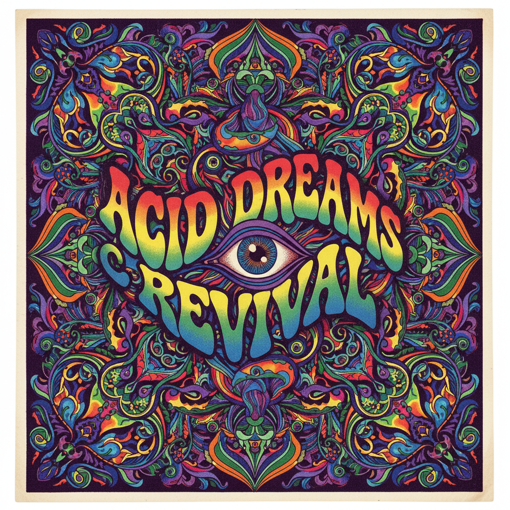

# Psychedelic Art 迷幻艺术



> **"万花筒色彩、流动的字体、意识扩展——60年代反文化运动的视觉爆炸。"**

## 概述

| 维度 | 描述 |
|------|------|
| 时期 | 1960s–1970s/影响至今 |
| 别名 | Psychedelic, Acid Art, Trippy Art, 迷幻 |
| 核心色彩 | 荧光色、彩虹渐变、高饱和对比、霓虹 |
| 关键元素 | 万花筒图案、流动变形字体、曼陀罗、分形、光学幻觉 |
| 代表人物 | Wes Wilson, Victor Moscoso, Rick Griffin, Peter Max |
| 关联风格 | Art Nouveau, Op Art, Surrealism, Rave, Acid Graphics |

---

## 历史脉络

| 年份 | 事件 |
|------|------|
| 1943 | Albert Hofmann 发现 LSD |
| 1960s | 旧金山反文化运动——迷幻海报爆发 |
| 1966 | Wes Wilson 为 Fillmore 设计海报——定义风格 |
| 1967 | "Summer of Love"——迷幻美学巅峰 |
| 1970s | 迷幻摇滚专辑封面黄金期 |
| 1990s | Rave/电子音乐——迷幻美学复兴 |
| 2020s | 数字迷幻艺术+AI生成+NFT |

### 核心哲学

迷幻艺术的精神是**"打破感知的边界——让你看到'正常'视觉之外的世界"**：
- 扩展 = 意识（"颜色不止七种——感知没有边界"）
- 流动 = 万物（"一切都在运动——静止是幻觉"）
- 对称 = 宇宙（"曼陀罗是宇宙结构的映射"）
- 过载 = 超越（"当信息超过处理能力——新的感知出现"）
- "迷幻艺术不是关于药物——是关于意识的可能性"

---

## 视觉语法

### 色彩系统

```
主色：
  荧光粉 (#FF1493) — 能量、冲击
  电光蓝 (#00FFFF) — 超自然
  酸性绿 (#7FFF00) — 化学、变异
  紫罗兰 (#8B00FF) — 神秘、意识

辅色：
  橙红 (#FF4500) — 热量、爆发
  金黄 (#FFD700) — 太阳、启示
  深黑 (#000000) — 对比、深渊

规则：
  - 高饱和+高对比
  - 互补色并置
  - 彩虹渐变
  - "越亮越好"
  - 荧光/UV反应色

质感：
  流动 — 液态、变形
  分形 — 无限重复
  光学 — 震动、闪烁
  有机 — 藤蔓、细胞
```

### 标志性元素

| 类别 | 元素 |
|------|------|
| 图案 | 万花筒、曼陀罗、分形、漩涡 |
| 字体 | 流动变形、难以辨认、Art Nouveau影响 |
| 构图 | 填满画面、无留白、horror vacui |
| 题材 | 眼睛、蘑菇、宇宙、第三只眼、自然 |
| 效果 | 光学幻觉、莫尔纹、震动色彩 |
| 态度 | 反文化、意识扩展、自由、宇宙性 |

---

## 与千禧怀旧的关系

### 永不过时的"Trippy"
- 60s迷幻 → 90s Rave → 2010s Acid Graphics → 2020s AI迷幻
- "每一代人都重新发现迷幻美学"
- Tame Impala, MGMT——当代音乐中的迷幻视觉
- AI生成中"psychedelic"是最受欢迎的风格词之一

### 与数字文化的天然亲和
- 分形 = 计算机图形学的核心
- 迷幻 = VR/AR体验的视觉语言
- "迷幻艺术预言了数字时代的视觉过载"

---

## 中国语境

- 中国迷幻摇滚/电子音乐场景的视觉
- 中国设计师的迷幻风格作品
- 与中国传统"祥云"、"万花筒"图案的对话
- 中国音乐节海报中的迷幻元素

---

## 设计应用

| 场景 | 应用方式 |
|------|----------|
| 音乐 | 专辑封面+音乐节海报+VJ视觉 |
| 时尚 | 印花+面料+配饰+荧光 |
| 数字 | AI生成+NFT+VR体验+动态壁纸 |
| 品牌 | 大麻/CBD品牌+音乐+节日+青年文化 |

---

## 相关风格

← [Op Art 欧普艺术](op-art.md) | [Acid Graphics 酸性设计](acid-graphics.md) →

↑ [返回千禧怀旧目录](README.md) | [返回总目录](../README.md)
