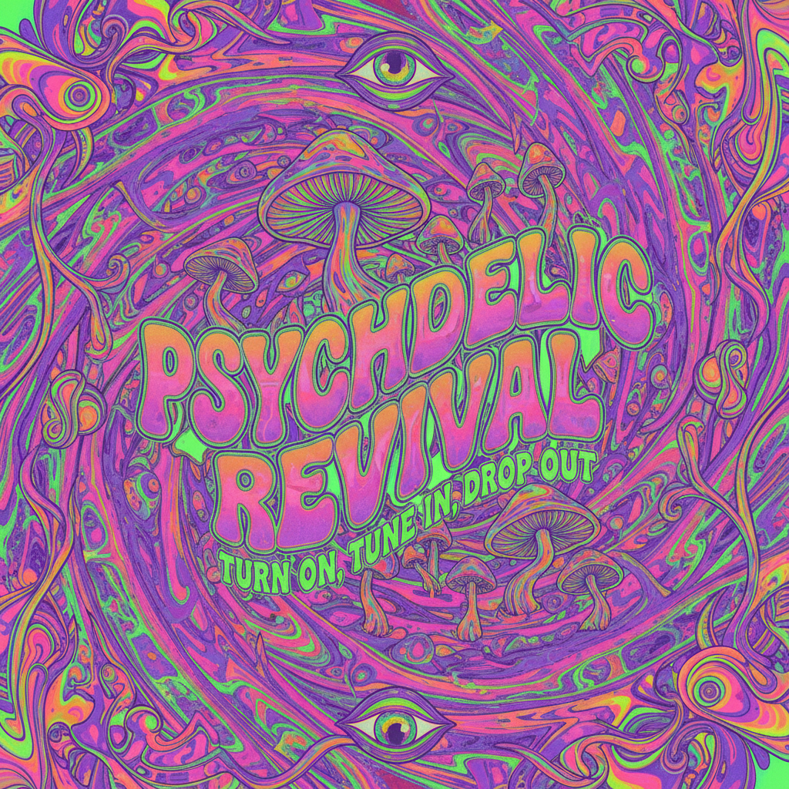

# Psychedelic Revival 迷幻复兴



> **"万花筒色彩、液态字体、意识扩展——1960年代的迷幻视觉在数字时代重生。"**

## 概述

| 维度 | 描述 |
|------|------|
| 时期 | 1960s 原始 / 2018–至今 数字复兴 |
| 别名 | Psychedelic Revival, Neo-Psychedelia, Trippy Art |
| 核心色彩 | 酸性绿、电紫、热粉、橙色、彩虹渐变 |
| 关键元素 | 液态变形、万花筒图案、彩虹渐变、蘑菇、眼睛 |
| 代表人物 | Wes Wilson (原版)、Tame Impala、Tyler the Creator |
| 关联风格 | Acid Graphics, Vaporwave, Nu-Rave, Hyperpop |

---

## 历史脉络

### 原版迷幻 (1965–1972)

| 来源 | 贡献 |
|------|------|
| LSD 文化 | 视觉体验的直接翻译 |
| Fillmore 海报 | Wes Wilson 的液态字体 |
| Beatles | 《Sgt. Pepper's》封面 |
| Art Nouveau | 有机曲线的复兴 |
| 东方神秘主义 | 曼陀罗、第三只眼 |

### 2018–至今：数字迷幻

| 驱动力 | 表现 |
|------|------|
| Tame Impala | 迷幻摇滚的视觉复兴 |
| Tyler the Creator | 《IGOR》的彩虹美学 |
| 微剂量文化 | 硅谷的迷幻复兴 |
| AI 生成艺术 | 机器的"幻觉" |
| 社交媒体 | 高饱和度内容的竞争 |

### 核心哲学

Psychedelic 美学的精神是**"打破感知的边界"**：
- 现实不是固定的——它可以流动
- 颜色可以"听到"，声音可以"看到"
- 边界是人为的——一切都是连接的
- 美在于失控和惊奇

---

## 视觉语法

### 色彩系统

```
主色：
  酸性绿 (#39FF14) — 能量、生长
  电紫 (#BF00FF) — 神秘、意识
  热粉 (#FF1493) — 感官、情感
  橙色 (#FF8C00) — 温暖、扩展
  彩虹渐变 — 全光谱

规则：
  - 高饱和度
  - 互补色碰撞
  - 渐变和流动
  - 没有"安全"的配色
  - 越多颜色越好

质感：
  液态 — 流动、变形
  万花筒 — 对称重复
  有机 — 曲线、生长
  光学 — 错觉、运动
  颗粒 — 胶片、噪点
```

### 标志性元素

| 类别 | 元素 |
|------|------|
| 图案 | 万花筒、分形、曼陀罗、波浪 |
| 字体 | 液态变形、Art Nouveau 曲线 |
| 符号 | 眼睛、蘑菇、太阳、星星、阴阳 |
| 效果 | 色彩偏移、运动模糊、光学错觉 |
| 自然 | 蘑菇、花朵、宇宙、细胞 |
| 动态 | 脉动、呼吸、流动、旋转 |

---

## 与千禧怀旧的关系

### 对"数字疲劳"的回应
- 扁平设计太理性 → 迷幻是感性的爆发
- 极简太克制 → 迷幻是放纵的
- 算法太可预测 → 迷幻是混乱的
- 这是对 2010s "干净设计"的反叛

### 与 Acid Graphics 的交叉
- Acid Graphics = 迷幻 + 当代平面设计
- 两者共享扭曲、变形、高饱和的语言
- Acid Graphics 更"设计"，Psychedelic 更"艺术"

---

## 中国语境

- "迷幻风"/"赛博迷幻"设计
- 音乐节/电子音乐的视觉文化
- 与"国潮"的交叉（敦煌壁画的迷幻重绘）
- B站/抖音上的"迷幻动画"
- 独立音乐专辑封面

---

## 设计应用

| 场景 | 应用方式 |
|------|----------|
| 音乐 | 专辑封面+MV+演出视觉+海报 |
| 品牌 | 彩虹渐变+液态字体+有机图形 |
| 数字 | 动态渐变+变形动效+万花筒 |
| 空间 | 投影+LED+镜面+沉浸式体验 |

---

## 相关风格

← [Acid Graphics 酸性设计](acid-graphics.md) | [Nu-Rave 新锐舞](nu-rave.md) →

↑ [返回千禧怀旧目录](README.md) | [返回总目录](../README.md)
