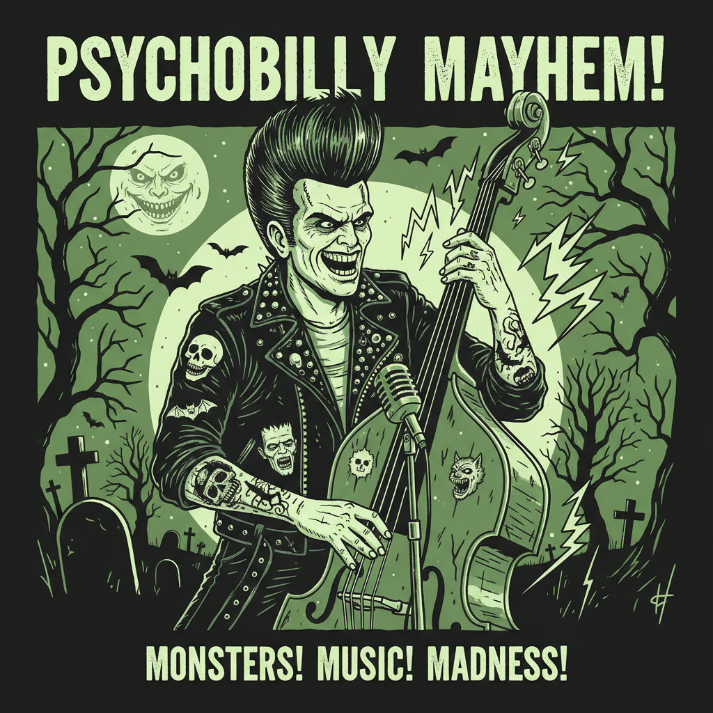

# Psychobilly 精神比利



> **"飞机头+朋克+恐怖片——Rockabilly 喝了太多怪物能量饮料。"**

## 概述

| 维度 | 描述 |
|------|------|
| 时期 | 1980–至今 |
| 别名 | Psychobilly, Psycho, Wrecking Crew |
| 核心色彩 | 黑色、红色、绿色（怪物绿）、紫色 |
| 关键元素 | 巨型飞机头、恐怖片元素、站立贝斯、纹身 |
| 代表人物 | The Cramps, The Meteors, Tiger Army, Nekromantix |
| 关联风格 | Rockabilly, Punk, Horror, Garage Rock |

---

## 历史脉络

| 年份 | 事件 |
|------|------|
| 1976 | The Cramps 成立——Psychobilly 先驱 |
| 1980 | The Meteors——"纯正" Psychobilly 诞生 |
| 1983 | Klub Foot 俱乐部——伦敦 Psychobilly 圣地 |
| 1990s | 全球扩散——日本、欧洲场景 |
| 2000s | Tiger Army——新一代 Psychobilly |
| 至今 | 作为活跃亚文化继续存在 |

### 核心哲学

Psychobilly 的精神是**"Rockabilly 太温柔了——加上朋克的速度和恐怖片的疯狂"**：
- 速度 = 必须（比 Rockabilly 快两倍）
- 恐怖 = 美学（"B级恐怖片是我们的圣经"）
- 疯狂 = 态度（"Wreck!"——在舞池里疯狂）
- 站立贝斯 = 武器（"贝斯手站在贝斯上弹"）
- "如果 Rockabilly 是 Elvis，Psychobilly 是 Elvis 从坟墓里爬出来"

---

## 视觉语法

### 色彩系统

```
主色：
  黑色 (#000000) — 基底
  红色 (#FF0000) — 血液、火焰
  怪物绿 (#00FF00) — 毒液、变异
  紫色 (#800080) — 恐怖、午夜

辅色：
  白色 (#FFFFFF) — 骷髅、骨骼
  橙色 (#FF8C00) — 火焰、南瓜
  黄色 (#FFFF00) — 闪电

质感：
  皮革 — 夹克
  发油 — 巨型飞机头
  墨水 — 纹身（恐怖主题）
  乙烯基 — 唱片
```

### 标志性元素

| 类别 | 元素 |
|------|------|
| 发型 | 巨型飞机头(Psycho-quiff)、莫霍克 |
| 服装 | 皮夹克+恐怖图案、Creepers、牛仔裤 |
| 纹身 | 骷髅、蝙蝠、棺材、恐怖片元素 |
| 音乐 | 站立贝斯(极速)、吉他、鼓 |
| 舞蹈 | Wrecking(类似Pogo但更疯狂) |
| 态度 | 疯狂、恐怖、速度、幽默、DIY |

---

## 与千禧怀旧的关系

### 永恒的地下文化
- Psychobilly = 从未主流化的亚文化（40年+）
- 全球 Psychobilly 音乐节持续活跃
- 与 Horror Punk、Garage Rock 交叉
- "太疯狂而无法主流——这正是它的魅力"

### 对纹身文化的影响
- Psychobilly 纹身 = 恐怖+复古+幽默
- 影响了现代"恐怖纹身"风格
- 与传统美式纹身的暗黑变体
- "Psychobilly 让骷髅变得有趣"

---

## 中国语境

- Psychobilly 在中国极为小众
- 与中国"恐怖美学"/"暗黑可爱"的交叉
- 中国纹身文化中的恐怖元素
- 作为"极端亚文化"的研究对象

---

## 设计应用

| 场景 | 应用方式 |
|------|----------|
| 音乐 | 恐怖+复古+海报+唱片封面+DIY |
| 时尚 | 皮夹克+恐怖图案+飞机头+Creepers |
| 品牌 | 疯狂+恐怖+幽默+地下+DIY |
| 活动 | 音乐节+恐怖主题+Wrecking+站立贝斯 |

---

## 相关风格

← [Rockabilly 摇滚比利](rockabilly.md) | [Punk 朋克美学](punk.md) →

↑ [返回千禧怀旧目录](README.md) | [返回总目录](../README.md)
