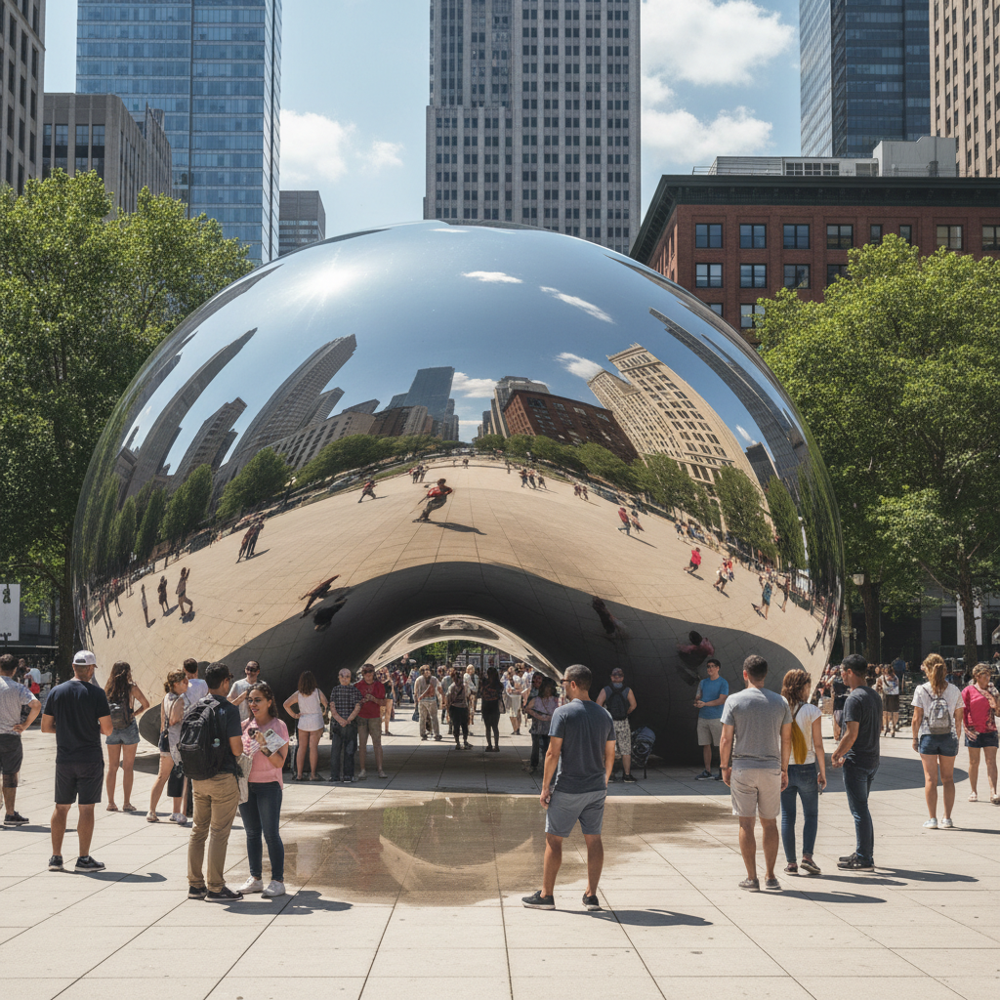

# Public Art 公共艺术

> "Public art is not art in public places. It is art that takes the public as its medium." — Vito Acconci

## 概述

公共艺术（Public Art）是为公共空间创作的、面向所有人的艺术。它不在画廊或博物馆中，而是在街道、广场、公园、地铁站、建筑外墙——任何人都可以自由接触的地方。公共艺术的观众不是选择走进美术馆的人，而是路过的所有人。

从古代的纪念碑到当代的互动装置，公共艺术始终承担着塑造公共空间、表达集体记忆、激发公共对话的功能。

## 核心特征

| 特征 | 描述 |
|------|------|
| 公共空间 | 位于所有人可以自由进入的空间 |
| 场域特定 | 为特定地点和语境而创作 |
| 公共性 | 面向所有人而非特定观众群体 |
| 持久性 | 通常是永久或长期的存在 |
| 对话性 | 与周围环境和社区产生对话 |
| 委托制 | 通常由政府或机构委托创作 |

## 视觉特征

- **尺度**：通常是大型的——需要在开放空间中有存在感
- **材料**：耐候的——不锈钢、石材、青铜、混凝土
- **位置**：广场、公园、建筑前、交通枢纽
- **互动**：越来越多的公共艺术允许触摸和互动
- **融合**：与建筑、景观、城市设计的融合
- **可见性**：从远处就能看到——地标性

## 代表作品

| 作品 | 艺术家 | 年代 | 意义 |
|------|--------|------|------|
| *Cloud Gate (The Bean)* | Anish Kapoor | 2006 | 芝加哥的镜面豆——城市地标 |
| *Tilted Arc* | Richard Serra | 1981 | 被拆除的公共雕塑——争议的标志 |
| *The Gates* | Christo & Jeanne-Claude | 2005 | 中央公园的7503个橙色门 |
| *LOVE* | Robert Indiana | 1970 | 最被复制的公共雕塑 |
| *Fearless Girl* | Kristen Visbal | 2017 | 面对华尔街铜牛的女孩 |
| *Crown Fountain* | Jaume Plensa | 2004 | 芝加哥的互动LED喷泉 |

## 历史时间线

| 时期 | 事件 |
|------|------|
| 远古 | 巨石阵、金字塔——最早的公共纪念物 |
| 古典 | 希腊罗马的公共雕塑和纪念碑 |
| 19世纪 | 城市纪念碑的黄金时代 |
| 1960s | 公共艺术项目开始制度化 |
| 1967 | 美国NEA的Art in Public Places项目 |
| 1981 | Serra的*Tilted Arc*——公共艺术的争议 |
| 1990s | "新类型公共艺术"——社区参与 |
| 2000s | 互动和数字公共艺术兴起 |
| 2010s-至今 | 临时性公共艺术、AR公共艺术 |

## 子类型

| 子类型 | 特征 |
|--------|------|
| 纪念碑 | 传统的纪念性雕塑 |
| 场域雕塑 | Serra——为特定地点创作的抽象雕塑 |
| 环境艺术 | Christo——包裹和改变环境 |
| 壁画 | 建筑外墙的大型绘画 |
| 互动公共艺术 | 允许公众参与和互动 |
| 临时公共艺术 | 有时间限制的公共艺术项目 |

## 中国语境

中国的公共艺术在城市化进程中快速发展。从城市雕塑到地铁站艺术、从公共壁画到互动装置，中国城市中的公共艺术数量急剧增长。然而，中国公共艺术也面临挑战——大量"城雕"质量参差不齐、公众参与度不足、决策过程缺乏透明度。优秀的案例如深圳的公共艺术计划、成都的社区艺术项目、以及各地的艺术乡建实践，展示了中国公共艺术的可能性。

## AI生成概念图

## 与其他风格的关系

- **Installation Art** → 装置艺术的空间性延伸到公共空间
- **Land Art** → 大地艺术是公共空间中的环境艺术
- **Social Practice Art** → 社会实践艺术在公共空间中展开
- **Street Art** → 街头艺术是非官方的公共艺术
- **Minimalism** → 极简主义雕塑大量出现在公共空间
- **Kinetic Art** → 动态雕塑是公共艺术的重要形式

---

*浮光艺志 | Chronicle of Artistry*
