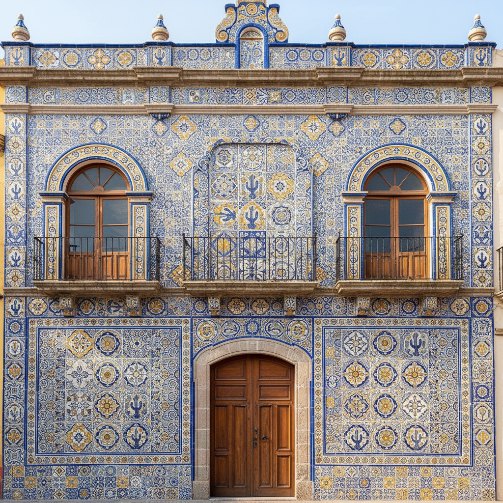

# Puebla Tile Art 普埃布拉瓷砖艺术

> "In Puebla, the colors of Spain met the soul of Mexico." — Mexican art history

## 概述

普埃布拉瓷砖艺术（Puebla Tile Art）是墨西哥普埃布拉州发展起来的锡釉陶瓷艺术传统，也被称为"墨西哥塔拉韦拉"（Talavera Poblana）。普埃布拉瓷砖是拉丁美洲最重要的陶瓷艺术传统——它将西班牙塔拉韦拉的锡釉技术与墨西哥本土的色彩感觉和装饰传统相融合，创造了一种独特的新世界陶瓷美学。

普埃布拉瓷砖的历史始于16世纪末——西班牙殖民者将塔拉韦拉制陶技术带到墨西哥，在普埃布拉建立了陶器工坊。当地丰富的陶土资源和原住民的装饰传统与西班牙技术相结合，逐渐发展出了独特的墨西哥风格。普埃布拉的建筑外墙大量使用彩色瓷砖装饰——形成了独特的城市景观，使普埃布拉被列为UNESCO世界文化遗产。2019年，普埃布拉塔拉韦拉被列入UNESCO非物质文化遗产名录。

普埃布拉瓷砖艺术的核心要素包括：1）文化融合——西班牙技术与墨西哥美学的融合；2）建筑装饰——城市建筑外墙的瓷砖装饰；3）六色传统——蓝、黄、黑、绿、橙、紫六种传统色彩；4）手工制作——严格的手工制作传统；5）宗教题材——教堂和修道院的瓷砖装饰；6）厨房瓷砖——墨西哥厨房的瓷砖传统；7）UNESCO非遗——2019年列入非物质文化遗产。

## 核心特征

| 特征 | 描述 |
|------|------|
| 文化融合 | 西班牙技术墨西哥美学融合 |
| 建筑装饰 | 城市建筑外墙瓷砖装饰 |
| 六色传统 | 蓝黄黑绿橙紫六种色彩 |
| 手工制作 | 严格手工制作传统 |
| 宗教题材 | 教堂修道院瓷砖装饰 |
| UNESCO非遗 | 2019年列入非遗 |

## 视觉特征

- **鲜艳色彩**：蓝、黄、绿的鲜艳搭配
- **花卉纹样**：大朵花卉的装饰图案
- **几何图案**：重复的几何瓷砖图案
- **建筑立面**：整面墙壁的瓷砖装饰
- **宗教图像**：圣人和宗教场景
- **厨房场景**：传统墨西哥厨房的瓷砖墙

## 代表作品

| 作品 | 年代 | 意义 |
|------|------|------|
| *普埃布拉大教堂瓷砖* | 17世纪 | 宗教建筑装饰 |
| *糖果之家* (Casa de los Munecos) | 18世纪 | 建筑瓷砖经典 |
| *圣多明各教堂罗萨里奥礼拜堂* | 17世纪 | 巴洛克瓷砖 |
| *传统厨房瓷砖* | 各时期 | 生活中的艺术 |
| *Uriarte工坊作品* | 1824至今 | 最古老的工坊 |
| *当代普埃布拉瓷砖* | 21世纪 | 传统与创新 |

## 历史时间线

| 时期 | 事件 |
|------|------|
| 1550年代 | 西班牙陶工抵达普埃布拉 |
| 17世纪 | 普埃布拉瓷砖风格确立 |
| 1653年 | 颁布陶器生产法规 |
| 18世纪 | 建筑瓷砖装饰鼎盛 |
| 1824年 | Uriarte工坊成立 |
| 1987年 | 普埃布拉历史中心列入UNESCO |
| 2019年 | 塔拉韦拉列入UNESCO非遗 |

## 中国语境

普埃布拉瓷砖艺术是全球化早期文化传播链的终端——中国青花瓷的蓝白美学经由伊斯兰世界传入西班牙，再由西班牙殖民者带到墨西哥，最终在普埃布拉与美洲本土文化融合产生了全新的艺术形式。这一跨越三大洲的文化传播链是理解全球陶瓷艺术交流的重要案例。普埃布拉瓷砖的"文化融合"模式——外来技术与本土美学的创造性结合——对中国当代陶瓷如何在全球化语境中保持民族特色同时吸收外来影响有重要的参考意义。普埃布拉2019年成功申请UNESCO非遗的经验，也为中国传统陶瓷产区的非遗保护和活态传承提供了国际比较案例。

## 概念图

## 与其他风格的关系

- **Talavera** → 塔拉韦拉（西班牙母体）
- **Islamic Ceramics** → 伊斯兰陶瓷（技术源头）
- **Azulejo** → 阿苏莱霍瓷砖
- **Mexican Folk Art** → 墨西哥民间艺术
- **Chinese Blue-and-White** → 中国青花瓷（间接影响）
- **Colonial Art** → 殖民地艺术

---

*浮光艺志 | Chronicle of Artistry*
