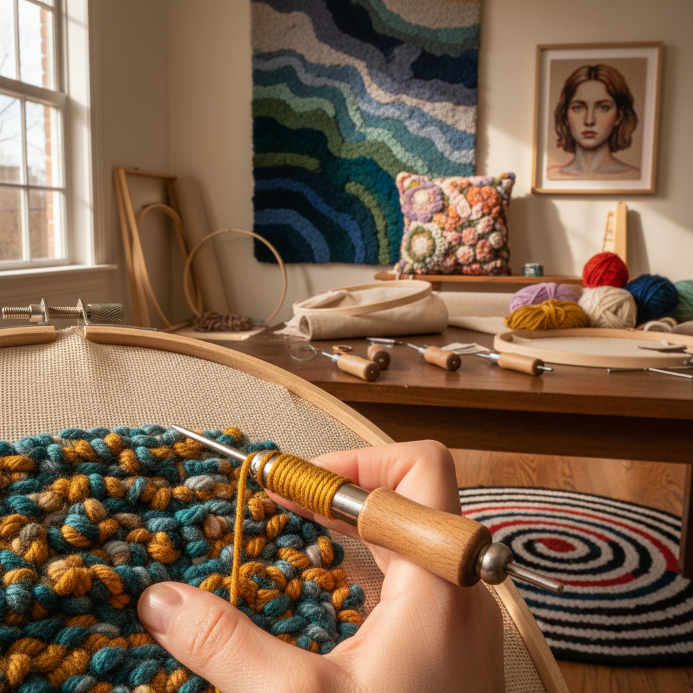

# Punch Needle 戳针绣

> "Punch needle is drawing with yarn — a hollow needle punches loops through fabric in a rhythm as natural as breathing, building texture and color with the speed that traditional embroidery can only envy." — Unknown

## 概述

戳针绣（Punch Needle）是一种使用中空的特殊针（punch needle）将纱线从织物背面戳入，在正面形成环圈（loops）的纺织技法。与传统刺绣不同，戳针绣的速度极快——每次戳入都形成一个完整的环圈，可以快速覆盖大面积。戳针绣的效果类似于地毯的绒面——密集的环圈形成柔软、有质感的表面。

戳针绣的历史可追溯到古埃及的科普特纺织品，但现代形式在20世纪的美国阿巴拉契亚地区发展成熟。当代的戳针绣经历了巨大的复兴——从传统的地毯和壁挂发展为当代纤维艺术的重要媒介，艺术家用它创作从抽象画到写实肖像的各种作品。

## 核心特征

| 特征 | 描述 |
|------|------|
| 中空针 | 使用中空的戳针 |
| 环圈 | 形成环圈质感 |
| 快速 | 比传统刺绣快得多 |
| 质感 | 丰富的表面质感 |
| 多高 | 可调节环圈高度 |
| 双面 | 正反面效果不同 |

## 视觉特征

- **环圈**：密集的环圈质感
- **柔软**：柔软的绒面
- **色彩**：丰富的色彩
- **质感**：强烈的触觉质感
- **厚实**：有厚度的表面
- **图案**：可创造复杂图案

## 代表作品

| 作品 | 艺术家 | 年代 | 意义 |
|------|--------|------|------|
| *Coptic textiles* | 匿名 | 古埃及 | 最早的戳针织物 |
| *Appalachian rugs* | 匿名 | 19-20世纪 | 美国传统戳针 |
| *Contemporary punch needle* | Various | 当代 | 当代戳针艺术 |
| *Punch needle portraits* | Various | 当代 | 戳针肖像 |
| *Large-scale punch needle* | Various | 当代 | 大型戳针作品 |

## 历史时间线

| 时期 | 事件 |
|------|------|
| 古埃及 | 科普特戳针织物 |
| 19世纪 | 俄罗斯戳针刺绣 |
| 20世纪初 | 美国阿巴拉契亚的戳针地毯 |
| 1980s | 戳针工具的改良 |
| 2010s+ | 戳针绣的全球复兴 |
| 当代 | 戳针作为当代艺术媒介 |

## 中国语境

戳针绣在中国是一个快速增长的手工爱好——受到社交媒体（小红书、抖音等）的推动，中国的戳针绣爱好者群体在近年迅速壮大。中国的电商平台上有大量的戳针绣材料包和工具。戳针绣的快速性和即时满足感使其特别受到年轻人的欢迎。一些中国的纤维艺术家将戳针绣作为创作媒介，探索当代表达。中国的手工工作坊和市集中，戳针绣体验课程非常热门。

## AI生成概念图

## 与其他风格的关系

- **Tufting** → 簇绒
- **Embroidery** → 刺绣
- **Rug Making** → 织毯
- **Textile Art** → 纺织艺术
- **Fiber Art** → 纤维艺术
- **Needlepoint** → 针绣

---

*浮光艺志 | Chronicle of Artistry*
