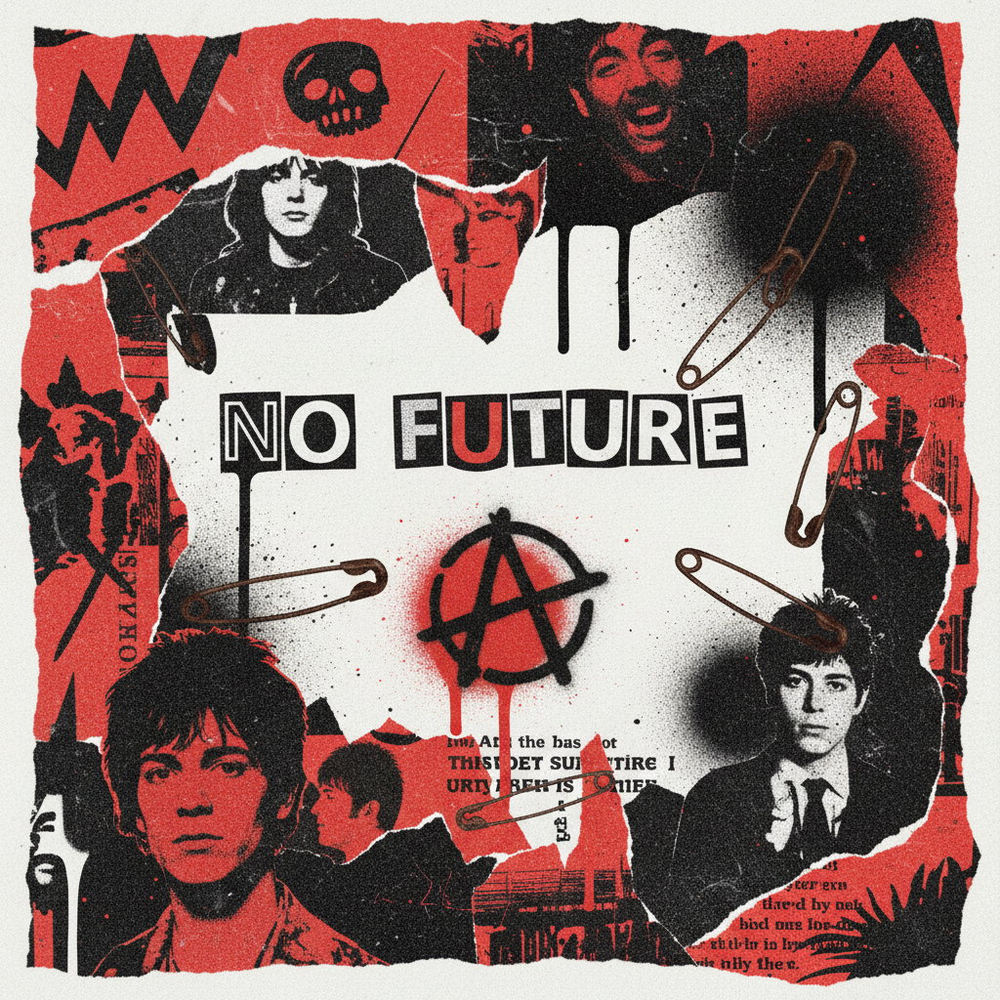

# Punk 朋克美学



> **"安全别针、手写传单、DIY一切——不需要许可，不需要技术，只需要愤怒。"**

## 概述

| 维度 | 描述 |
|------|------|
| 时期 | 1976–至今 |
| 别名 | Punk, DIY Punk, Anarcho-Punk, Punk Zine |
| 核心色彩 | 黑色、红色、白色、荧光色（手写/喷漆） |
| 关键元素 | 安全别针、手写字体、拼贴、A符号、格子 |
| 代表人物 | Sex Pistols、Jamie Reid、Vivienne Westwood |
| 关联风格 | Grunge Revival, Emo, Mall Goth, Brutalist Web |

---

## 历史脉络

### 1976–1979：原始爆发

| 年份 | 事件 |
|------|------|
| 1976 | Sex Pistols 首演，朋克运动诞生 |
| 1977 | Jamie Reid 设计《God Save the Queen》封面 |
| 1977 | 第一批朋克 Zine 出现 |
| 1978 | Vivienne Westwood 的朋克时装 |
| 1979 | 后朋克分化（Post-Punk、New Wave） |

### 视觉遗产

| 来源 | 贡献 |
|------|------|
| Jamie Reid | 剪报拼贴、赎金信字体 |
| Zine 文化 | 复印机美学、手写排版 |
| 涂鸦 | 喷漆、模板字 |
| DIY 精神 | 不需要专业技能也能创作 |
| 达达主义 | 拼贴、反艺术 |

### 核心哲学

Punk 的精神是**"DIY — Do It Yourself"**：
- 不需要唱片公司 → 自己发行
- 不需要设计师 → 自己做传单
- 不需要许可 → 自己办演出
- 不需要技术 → 三个和弦就够了
- 不需要美 → 丑陋就是态度

---

## 视觉语法

### 色彩系统

```
主色：
  黑色 (#000000) — 皮夹克、T恤
  红色 (#FF0000) — 无政府、血
  白色 (#FFFFFF) — 传单底色
  荧光粉 (#FF00FF) — 传单、海报
  荧光绿 (#00FF00) — 喷漆

规则：
  - 高对比度
  - 故意的粗糙
  - 手工感 > 精致感
  - 复印机的颗粒感

质感：
  复印纸 — Zine、传单
  喷漆 — 涂鸦、模板
  胶带 — 拼贴
  安全别针 — 固定一切
  皮革 — 夹克、靴子
```

### 标志性元素

| 类别 | 元素 |
|------|------|
| 字体 | 剪报拼贴字、手写、模板喷漆 |
| 图像 | 拼贴、复印、涂鸦、照片剪切 |
| 符号 | A圈（无政府）、安全别针、骷髅、闪电 |
| 服装 | 皮夹克、格子裤、Doc Martens、铆钉 |
| 出版 | Zine、传单、海报、贴纸 |
| 态度 | 反权威、反商业、反精致 |

---

## 与千禧怀旧的关系

### Punk 的循环复兴
- 每一代年轻人都会重新发现 Punk
- 2000s：Pop Punk (Blink-182, Green Day)
- 2010s：Tumblr Punk 美学
- 2020s：TikTok 上的 "punk outfit" 标签

### DIY 精神的数字化
- Zine → Blog → Newsletter
- 传单 → Instagram Story
- 地下演出 → Bandcamp
- 精神不变，媒介在变

---

## 中国语境

- 中国朋克音乐场景（脑浊、反光镜、新裤子早期）
- "朋克"作为态度标签的泛化
- 独立出版/Zine 文化的小众复兴
- 与"摇滚"/"地下"标签的交叉
- 淘宝上的"朋克风"服装

---

## 设计应用

| 场景 | 应用方式 |
|------|----------|
| 品牌 | 手写字体+拼贴+高对比+粗糙质感 |
| 海报 | 复印机美学+剪报字+喷漆模板 |
| 包装 | 牛皮纸+手写+贴纸+安全别针 |
| 数字 | 故意的"破碎"布局+手写元素 |

---

## 相关风格

← [Grunge Revival 垃圾摇滚复兴](grunge-revival.md) | [Emo 情绪核](emo.md) →

↑ [返回千禧怀旧目录](README.md) | [返回总目录](../README.md)
