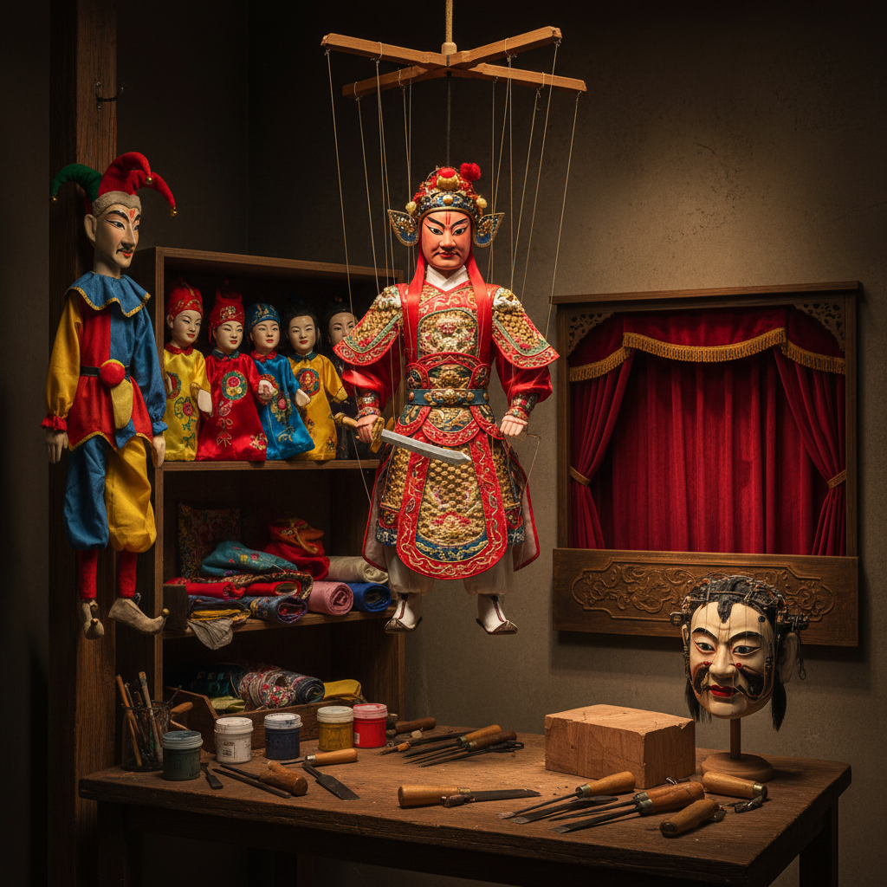

# Puppet Art 木偶艺术

> "A puppet is a paradox made physical — an inanimate object that appears to live, a thing without will that seems to choose, a construction of wood and cloth that can make an audience weep. The puppeteer gives breath to the breathless, lending their own life force through strings, rods, or hands to create the illusion of autonomous being. Puppet art is the original special effect, the first virtual reality, the oldest form of animation." — Unknown

## 概述

木偶艺术（Puppet Art）是通过操纵人偶进行表演和艺术创作的综合艺术形式——包括木偶的设计制作、操纵技法和戏剧表演。木偶艺术是世界上最古老的表演艺术之一，融合了雕塑、绘画、戏剧、音乐和文学。

木偶艺术的实践包括：1）提线木偶——用线绳从上方操纵的木偶；2）杖头木偶——用木杖从下方操纵的木偶；3）布袋木偶——套在手上操纵的手偶；4）铁枝木偶——用铁丝操纵的木偶；5）水上木偶——在水面上表演的木偶（越南）；6）当代木偶——将传统木偶与现代戏剧结合；7）木偶动画——用木偶进行定格动画创作。

## 核心特征

| 特征 | 描述 |
|------|------|
| 操纵 | 人为操纵的运动 |
| 角色 | 创造角色和故事 |
| 综合 | 多种艺术的综合 |
| 工艺 | 精细的制作工艺 |
| 表演 | 活态的表演艺术 |
| 想象 | 激发想象力 |

## 视觉特征

- **造型**：夸张的人物造型
- **色彩**：鲜艳的彩绘
- **关节**：可活动的关节
- **服饰**：精美的微缩服饰
- **表情**：富有表现力的面部
- **道具**：微缩的舞台道具

## 代表作品

| 作品 | 艺术家 | 年代 | 意义 |
|------|--------|------|------|
| *泉州提线木偶* | 传统 | 古代至今 | 中国提线木偶 |
| *布拉格木偶* | 传统 | 中世纪至今 | 捷克木偶传统 |
| *Bunraku* | 日本传统 | 17世纪至今 | 日本文乐木偶 |
| *Water puppets* | 越南传统 | 11世纪至今 | 越南水上木偶 |
| *War Horse* | Handspring | 2007 | 当代木偶戏剧 |

## 历史时间线

| 时期 | 事件 |
|------|------|
| 古代 | 世界各地的早期木偶 |
| 汉代 | 中国木偶戏的记载 |
| 中世纪 | 欧洲木偶戏的发展 |
| 17世纪 | 日本文乐的确立 |
| 当代 | 木偶艺术的现代化和国际化 |

## 中国语境

木偶艺术在中国有极其悠久的历史。中国木偶戏有超过2000年的历史——汉代就有"傀儡戏"的记载。中国的木偶流派极其丰富——福建泉州的提线木偶以其精细的操纵技艺闻名（一个木偶可有30多根线）、漳州的布袋木偶以灵活著称、广东的铁枝木偶独具特色、陕西的杖头木偶气势恢宏。中国木偶戏是国家级非物质文化遗产。中国的木偶制作工艺极其精细——从木头的选择、雕刻、彩绘到服饰的缝制，每一步都需要高超的技艺。中国当代的一些艺术家在探索木偶的现代化——将传统木偶与现代戏剧、动画和新媒体结合。

## AI生成概念图

## 与其他风格的关系

- **Shadow Puppet Art** → 皮影艺术
- **Theater Art** → 戏剧艺术
- **Sculpture** → 雕塑
- **Animation** → 动画
- **Marionette Art** → 提线木偶艺术
- **Performance Art** → 表演艺术

---

*浮光艺志 | Chronicle of Artistry*
