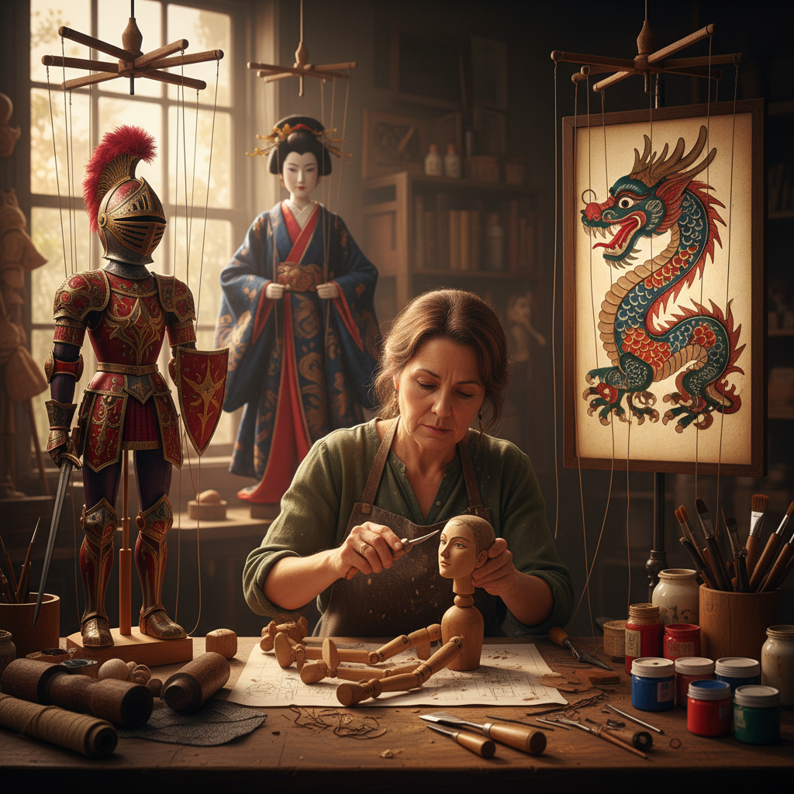

# Puppet Making 木偶制作

> "A puppet is a sculpture that breathes — carved from wood, strung with thread, it waits for the puppeteer's hand to give it life." — Unknown

## 概述

木偶制作（Puppet Making）是创造可操控的人形或动物形表演道具的工艺艺术。木偶的类型极其多样：提线木偶（marionette）、手套木偶（glove puppet）、杖头木偶（rod puppet）、皮影（shadow puppet）等。木偶制作融合了雕塑、绘画、纺织、机械等多种技艺——一个精美的木偶不仅要外形美观，还要具备灵活的关节和操控机构，能够在表演中"活"起来。

木偶制作的哲学在于：赋予无生命以生命——通过工匠的技艺和表演者的操控，一块木头变成了有情感、有性格的"人"，这是人类创造力最诗意的体现。

## 核心特征

| 特征 | 描述 |
|------|------|
| 可动 | 具有可动关节 |
| 操控 | 可被操控表演 |
| 综合 | 综合多种技艺 |
| 表演 | 服务于表演艺术 |
| 角色 | 代表特定角色 |
| 生命 | 赋予无生命以生命 |

## 视觉特征

- **表情**：生动的面部表情
- **比例**：夸张或写实的比例
- **色彩**：鲜艳的彩绘
- **服饰**：精美的服饰细节
- **关节**：可见的关节结构
- **材质**：木、布、皮等材质

## 代表作品

| 作品 | 艺术家 | 年代 | 意义 |
|------|--------|------|------|
| *Sicilian marionettes* | 匿名 | 传统 | 西西里提线木偶 |
| *Bunraku puppets* | Various | 17世纪+ | 日本文乐木偶 |
| *Wayang kulit* | 匿名 | 传统 | 印尼皮影 |
| *Chinese shadow puppets* | 匿名 | 传统 | 中国皮影戏 |
| *Jim Henson Muppets* | Jim Henson | 1955+ | 现代木偶革命 |

## 历史时间线

| 时期 | 事件 |
|------|------|
| 古代 | 最早的木偶（古埃及、古希腊） |
| 汉代 | 中国皮影戏的起源 |
| 中世纪 | 欧洲木偶戏的发展 |
| 17世纪 | 日本文乐的成熟 |
| 20世纪 | 现代木偶艺术的革新 |
| 当代 | 当代木偶艺术 |

## 中国语境

中国有极其丰富的木偶传统——皮影戏、提线木偶、布袋戏、杖头木偶等都是国家级非物质文化遗产。中国皮影戏是世界上最精美的影子木偶艺术，用驴皮或牛皮雕刻彩绘而成。福建泉州的提线木偶有数百年历史，一个木偶可有数十根线控制。广东潮州的铁枝木偶、四川的大木偶等也各具特色。当代中国的木偶艺术家正在将传统木偶与现代戏剧、动画和装置艺术结合。

## AI生成概念图

## 与其他风格的关系

- **Shadow Puppetry** → 皮影戏
- **Woodcarving** → 木雕
- **Doll Making** → 人偶制作
- **Theater** → 戏剧艺术
- **Animation** → 动画（定格动画）
- **Mechanical Art** → 机械艺术

---

*浮光艺志 | Chronicle of Artistry*
