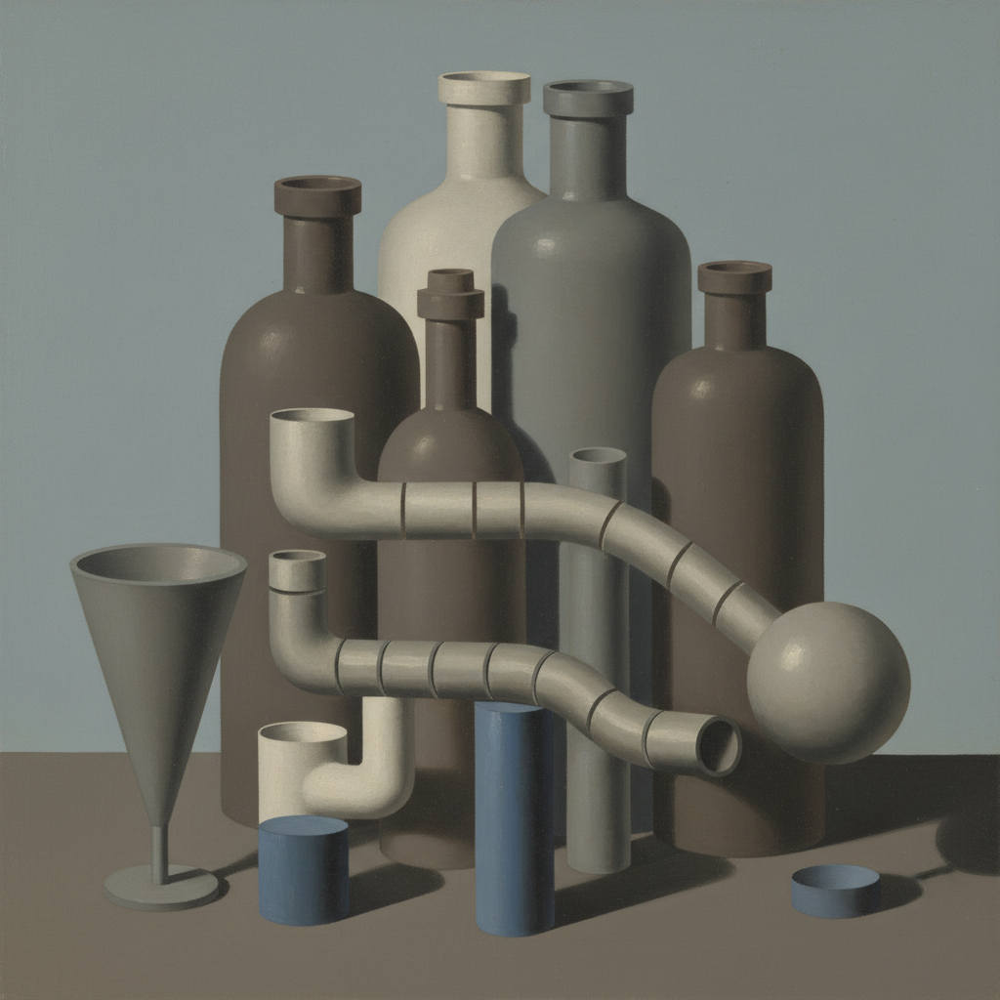

# Purism Art 纯粹主义

> **时期：** 1918年–1925年  
> **关键词：** 机器美学、几何秩序、日常物品、勒·柯布西耶、后立体主义

## 概述

Purism（纯粹主义）由画家阿梅代·奥赞方和建筑师勒·柯布西耶于1918年发起，是对立体主义"过度装饰化"的反动。他们追求一种基于机器时代精神的清晰、秩序和纯粹——用几何化的日常物品（瓶子、吉他、杯子）构建严格的构图，像工程图纸一样精确，像机器一样优美。

## 风格特征

- **几何简化**：物品被还原为基本几何形
- **机器精确**：清晰的轮廓和光滑的表面
- **日常物品**：瓶子、杯子、管道等工业品
- **正面视角**：避免透视变形的正交投影
- **和谐色彩**：克制的灰色、褐色和蓝色

## 代表人物与作品

- 阿梅代·奥赞方《静物》系列
- 勒·柯布西耶 早期绘画
- 费尔南·莱热（相关影响）
- 《新精神》杂志（理论平台）

## 概念图

