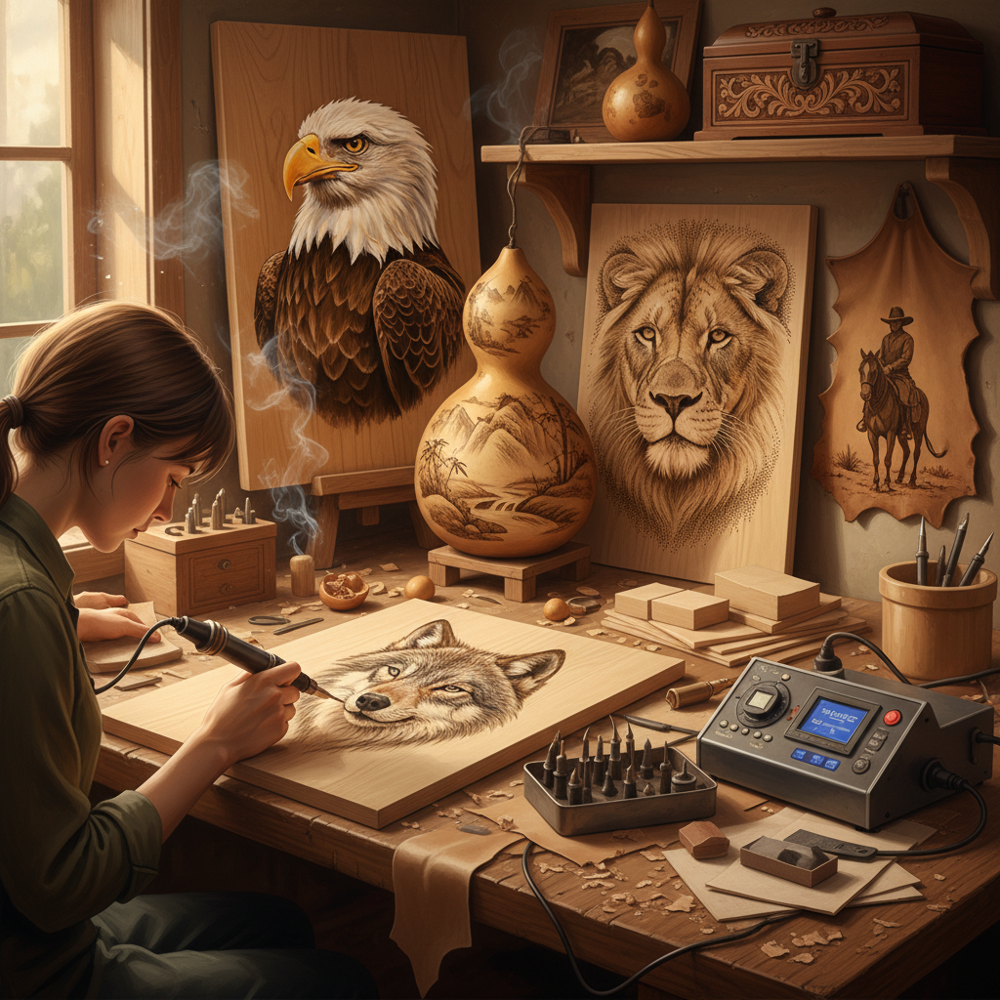

# Pyrography Art 烙画

> "Pyrography is drawing with fire — a heated point touching wood to leave marks that range from the palest whisper of gold to the deepest char of black, each burn permanent and irreversible, demanding the confidence of a calligrapher and the patience of an engraver, creating images that smell of campfire and look like sepia photographs." — Unknown

## 概述

烙画（Pyrography），也称为火笔画或烫画，是一种使用加热的金属尖端（烙铁/pyrography pen）在木材、皮革、纸张或其他有机材料表面烧灼出图案和图像的艺术技法。"Pyrography"来自希腊语"pur"（火）和"graphos"（书写）。通过控制温度、压力和接触时间，艺术家可以创造出从浅金色到深棕黑色的丰富色调变化。

烙画的历史可以追溯到史前时代——人类最早用火烧的棍子在物体上做标记。作为一种有意识的艺术形式，烙画在维多利亚时代的欧洲流行——当时称为"pokerwork"（火钳画）。现代电热烙铁的发明使烙画变得更加精确和可控。当代烙画艺术家能够创造出照片级写实的作品。

## 核心特征

| 特征 | 描述 |
|------|------|
| 火烧 | 使用热量烧灼 |
| 木材 | 主要在木材上 |
| 不可逆 | 烧灼不可逆 |
| 色调 | 温度控制色调 |
| 永久 | 极其永久的标记 |
| 自然 | 自然材料的质感 |

## 视觉特征

- **棕色**：温暖的棕色调
- **木纹**：木材纹理的融合
- **写实**：可达照片级写实
- **温暖**：温暖的自然色调
- **永久**：永久的烧灼痕迹
- **质朴**：自然材料的质朴

## 代表作品

| 作品 | 艺术家 | 年代 | 意义 |
|------|--------|------|------|
| *Victorian pokerwork* | 维多利亚工匠 | 19世纪 | 维多利亚烙画 |
| *Contemporary photorealistic pyrography* | Various | 当代 | 照片级烙画 |
| *Pyrography on leather* | Various | 传统-当代 | 皮革烙画 |
| *Large-scale pyrography* | Various | 当代 | 大型烙画 |
| *Chinese pyrography* | 中国工匠 | 传统 | 中国烙画 |

## 历史时间线

| 时期 | 事件 |
|------|------|
| 史前 | 火烧标记的起源 |
| 中世纪 | 烙画在欧洲的实践 |
| 维多利亚时代 | Pokerwork的流行 |
| 20世纪 | 电热烙铁的发明 |
| 当代 | 烙画的艺术化发展 |

## 中国语境

烙画在中国有悠久的传统——中国的烙画（火笔画/烫画）是国家级非物质文化遗产。中国烙画的历史可以追溯到汉代。中国的烙画传统以河南、河北等地最为著名。中国烙画的题材包括山水、花鸟、人物等传统中国画题材。当代中国的烙画艺术家在传统基础上不断创新——有的在宣纸上烙画，有的在葫芦上烙画。中国的烙画在工艺美术展览中经常获奖。

## AI生成概念图

## 与其他风格的关系

- **Wood Carving** → 木雕
- **Drawing** → 素描
- **Engraving** → 雕刻
- **Leather Craft** → 皮革工艺
- **Folk Art** → 民间艺术
- **Realism** → 写实主义

---

*浮光艺志 | Chronicle of Artistry*
