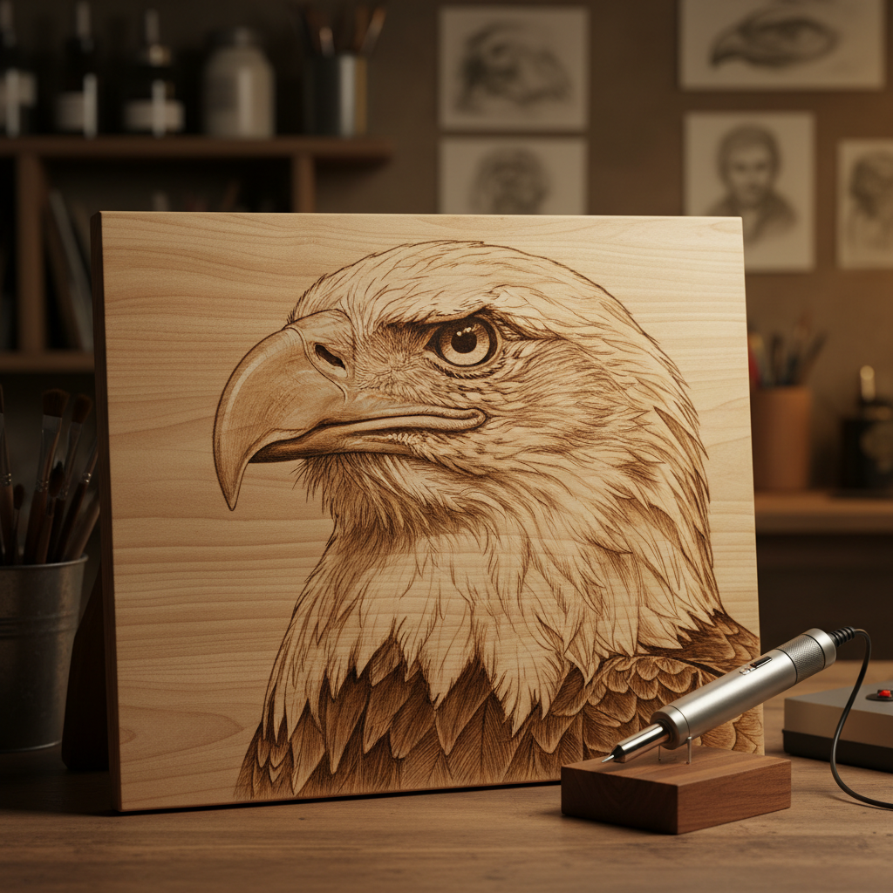

# Pyrography 烙画

> "Fire is the oldest tool of art — pyrography returns us to that primal creative act." — Unknown

## 概述

烙画（Pyrography，希腊语"用火书写"）是用加热的金属工具在木头、皮革或其他有机材料表面烧灼出图案的装饰艺术。从史前人类用火棍在木头上留下标记，到维多利亚时代的精致烙画艺术，从中国传统的烙画葫芦到当代的电烙笔创作，烙画以其温暖的棕色调、独特的焦香和永久的印记成为最古老也最持久的艺术形式之一。

烙画的本质在于它的不可逆——每一笔烧灼都是永久的，没有橡皮擦，没有撤销键，只有火与材料之间的直接对话。

## 核心特征

| 特征 | 描述 |
|------|------|
| 火烧 | 用热量烧灼材料表面 |
| 不可逆 | 烧灼是永久的 |
| 棕色调 | 自然的棕色和焦色 |
| 有机材料 | 木头、皮革、葫芦等 |
| 质感 | 烧灼产生的独特质感 |
| 持久 | 图案极其持久 |

## 视觉特征

- **棕色**：从浅棕到深焦的色调范围
- **线条**：清晰的烧灼线条
- **质感**：木纹与烧灼的结合
- **层次**：通过温度和时间控制深浅
- **温暖**：整体温暖的色调
- **自然**：与自然材料的和谐

## 代表作品

| 作品 | 艺术家 | 年代 | 意义 |
|------|--------|------|------|
| *Victorian pokerwork* | 匿名 | 1880s-1900s | 维多利亚烙画 |
| *Chinese gourd pyrography* | 民间艺人 | 传统 | 中国葫芦烙画 |
| *Contemporary pyrography* | Various | 2000s+ | 当代烙画艺术 |
| *Leather pyrography* | 匿名 | 传统 | 皮革烙画 |
| *Large-scale wood burning* | Various | 2010s+ | 大尺度烙画 |

## 历史时间线

| 时期 | 事件 |
|------|------|
| 史前 | 最早的火烧装饰 |
| 古代 | 各文明的烙画传统 |
| 中世纪 | 欧洲的烙画工艺 |
| 1880s-1900s | 维多利亚时代的烙画热潮 |
| 传统 | 中国葫芦烙画传统 |
| 当代 | 电烙笔和当代烙画艺术 |

## 中国语境

烙画在中国有悠久的传统——特别是葫芦烙画，是中国民间艺术的重要形式。中国烙画以精细的人物、山水和花鸟题材著称，被列为非物质文化遗产。河南、山东等地有深厚的烙画传统。当代中国烙画艺术家将传统技法与现代题材结合，在木板、宣纸甚至丝绸上创作烙画。

## AI生成概念图

## 与其他风格的关系

- **Woodcut** → 木刻也在木头上创作
- **Drawing** → 烙画的线条接近素描
- **Folk Art** → 烙画是民间艺术的重要形式
- **Craft** → 烙画介于艺术和工艺之间
- **Engraving** → 雕刻与烙画有方法相似
- **Calligraphy** → 烙画书法是独特的形式

---

*浮光艺志 | Chronicle of Artistry*
