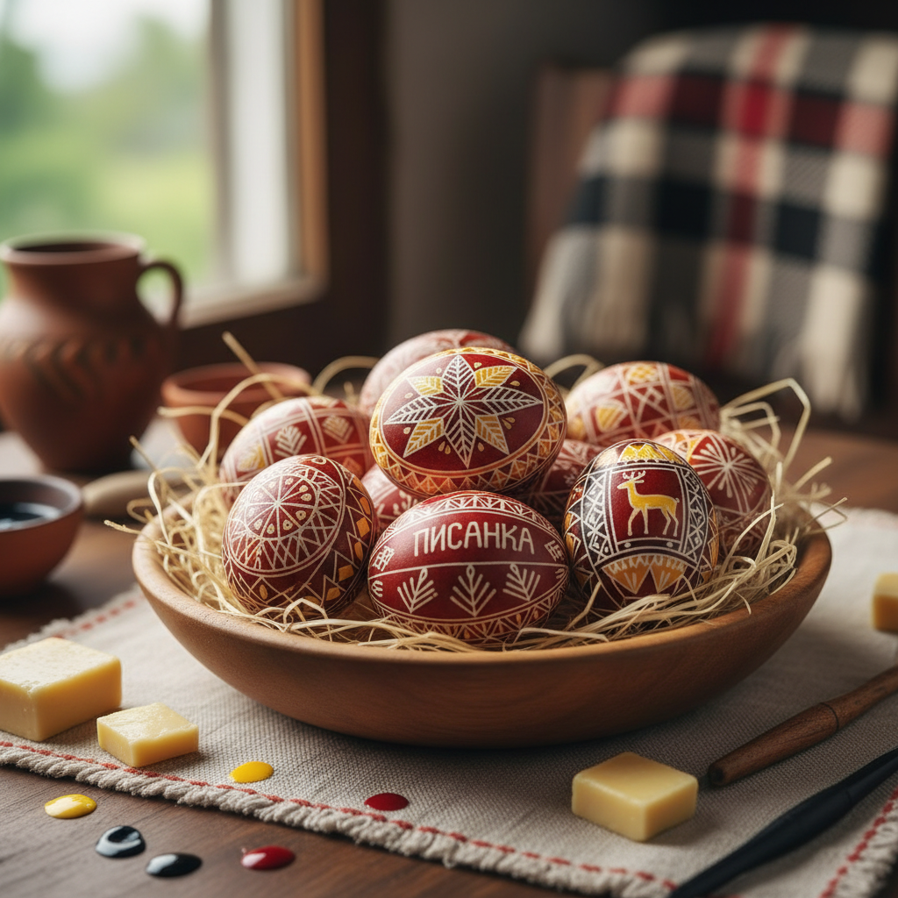

# Pysanky 乌克兰彩蛋 | Писанка

> **"蜡与火的魔法——乌克兰人在鸡蛋上书写春天的祈祷。"**

## 概述

乌克兰彩蛋（Pysanky / Писанка / Pysanka）是乌克兰传统的蜡染彩蛋艺术，使用蜡抗染法（batik technique）在鸡蛋壳上绘制精美的几何和象征图案。"Писанка"源自乌克兰语"писати"（书写），因为图案是用蜡"书写"在蛋壳上的。制作过程：用铜制书写工具（kistka/кістка）蘸取融化的蜂蜡在蛋壳上画出图案，然后浸入染料，蜡覆盖的部分不着色。重复多次蜡-染步骤后，用火焰融化所有蜡层，露出多色图案。这种艺术有数千年历史，与斯拉夫春天仪式和基督教复活节传统紧密相连。

## 核心特征

- **蜡抗染法**：蜂蜡阻止染料着色
- **多层染色**：从浅到深逐层染色
- **几何图案**：精确的对称几何
- **象征系统**：每个图案有特定含义
- **鸡蛋载体**：在完整鸡蛋壳上创作
- **春天仪式**：与复活节和春分相关

## 常见符号

| 符号 | 含义 |
|------|------|
| 太阳 | 生命、温暖 |
| 星星 | 神圣、指引 |
| 鹿 | 财富、繁荣 |
| 马 | 力量、速度 |
| 松树 | 永恒的青春 |
| 麦穗 | 丰收 |
| 无尽线 | 永恒 |

## 视觉特征

- 鲜艳的多色层叠
- 精确的几何对称
- 黑色轮廓线的强烈对比
- 蛋形曲面上的精细图案
- 传统的红黄黑白配色
- 每一颗蛋的独特性

## 与其他风格的关系

| 风格 | 关系 |
|------|------|
| Batik蜡染 | 共享蜡抗染技法 |
| Petrykivka | 共享乌克兰装饰传统 |
| Wycinanki剪纸 | 共享斯拉夫民间艺术 |
| Easter Egg | 基督教彩蛋传统 |
| 当代蛋艺 | Pysanky的现代转化 |

## 概念图

---

*浮光艺志 | Chronicle of Artistry*
