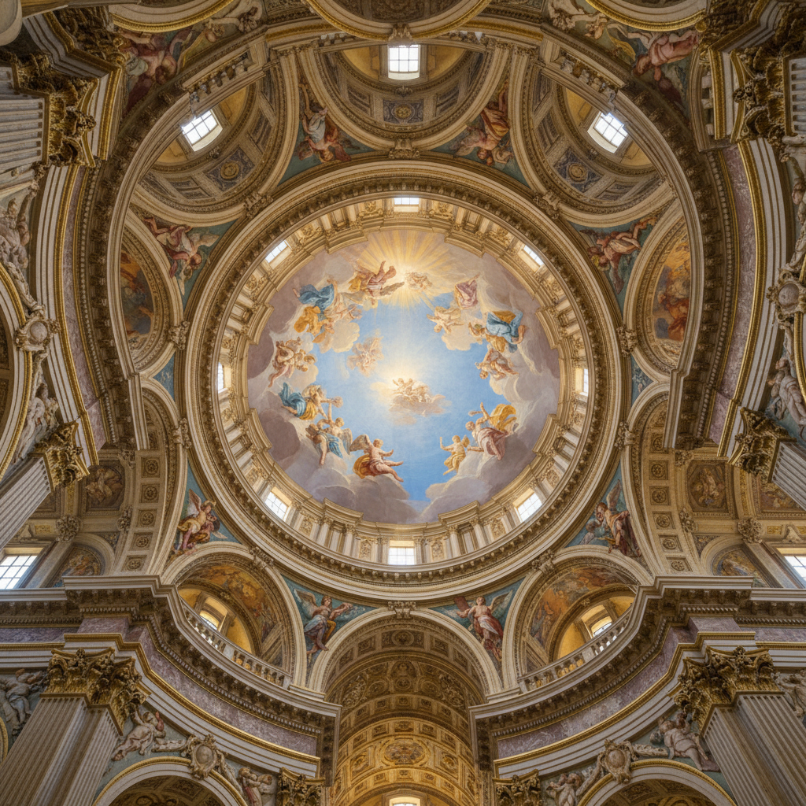

# Quadratura 建筑错觉画

> **时期：** 16世纪–18世纪  
> **关键词：** 天顶画、建筑幻觉、透视欺骗、巴洛克、空间延伸

## 概述

Quadratura（建筑错觉画）是一种在天花板或墙壁上绘制虚假建筑结构的巴洛克绘画技法——通过精确的透视法，在平面上创造出柱廊、拱顶、阳台向天空无限延伸的幻觉。观众抬头仰望时，真实建筑与绘画建筑无缝衔接，室内空间仿佛向天堂敞开。

## 风格特征

- **建筑延伸**：绘画建筑与真实建筑无缝衔接
- **极端透视**：从下往上的仰视角度（di sotto in sù）
- **空间幻觉**：平面天花板变为开放天空
- **协作创作**：建筑画师与人物画师分工
- **巴洛克华丽**：丰富的装饰和戏剧效果

## 代表人物与作品

- 安德烈亚·波佐《圣依纳爵教堂天顶画》
- 安德烈亚·曼特尼亚《婚房天顶》
- 乔瓦尼·巴蒂斯塔·提埃波罗 宫殿天顶
- 皮埃特罗·达·科尔托纳《神意的胜利》

## 概念图

