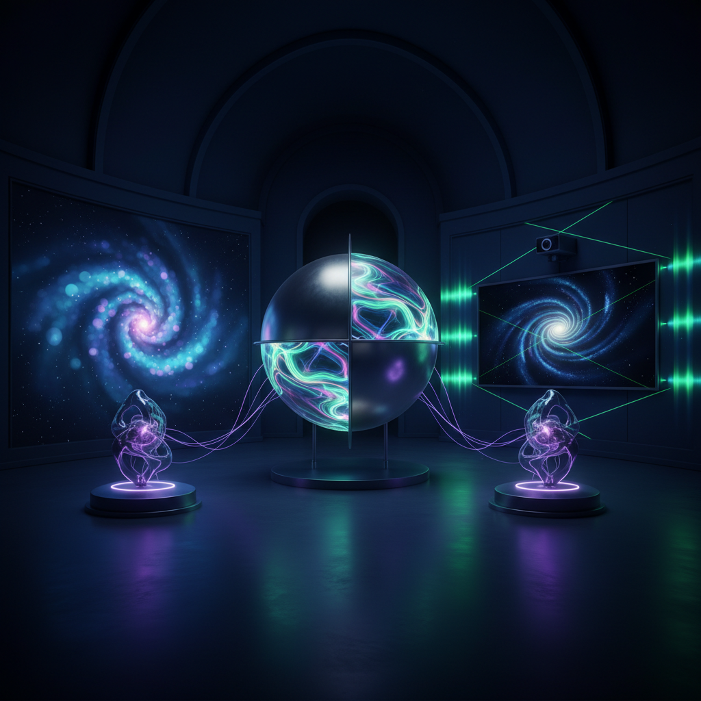

# Quantum Art 量子艺术

> "Quantum art operates in the space of superposition — where a work can be simultaneously one thing and another until the act of observation collapses it into a single state, where entanglement means that separated elements remain mysteriously connected, where uncertainty is not a limitation but a creative principle, and where the very act of looking changes what is seen, making the viewer not a passive observer but an active participant in the creation of reality." — Unknown

## 概述

量子艺术（Quantum Art）是以量子物理学的概念和现象为灵感的艺术实践。量子力学揭示了微观世界中违反日常直觉的现象——叠加态、纠缠、不确定性、波粒二象性、观察者效应——这些概念为艺术提供了全新的隐喻和创作方法。

量子艺术的实践包括：1）叠加态艺术——创造同时存在于多种状态的作品，直到观察者的介入"坍缩"为一种状态；2）纠缠艺术——创造相互关联的作品，改变一个会即时影响另一个；3）不确定性艺术——拥抱不确定性作为创作原则，让作品的最终形态不可预测；4）量子计算艺术——使用量子计算机生成艺术；5）量子可视化——将量子现象转化为可感知的视觉或听觉体验。

## 核心特征

| 特征 | 描述 |
|------|------|
| 叠加 | 多重状态共存 |
| 纠缠 | 远程关联 |
| 不确定 | 本质不确定性 |
| 观察 | 观察改变现实 |
| 概率 | 概率性 |
| 波动 | 波粒二象性 |

## 视觉特征

- **模糊**：叠加态的模糊
- **干涉**：波的干涉图案
- **概率云**：电子云般的形态
- **连接**：纠缠的视觉连接
- **闪烁**：量子跃迁的闪烁
- **多重**：多重现实的并置

## 代表作品

| 作品 | 艺术家 | 年代 | 意义 |
|------|--------|------|------|
| *Quantum paintings* | Various | 2000年代 | 量子绘画 |
| *Entanglement installations* | Various | 2010年代 | 纠缠装置 |
| *Quantum computing art* | Various | 2020年代 | 量子计算艺术 |
| *Superposition sculptures* | Various | 2010年代 | 叠加态雕塑 |
| *Observer effect art* | Various | 当代 | 观察者效应艺术 |

## 历史时间线

| 时期 | 事件 |
|------|------|
| 1920年代 | 量子力学的建立 |
| 1960年代 | 量子概念进入艺术话语 |
| 2000年代 | 量子艺术的自觉实践 |
| 2019 | 量子计算优越性的实现 |
| 当代 | 量子计算艺术的兴起 |

## 中国语境

量子艺术在中国有独特的发展背景。中国在量子科技领域处于世界前沿——从量子通信卫星"墨子号"到量子计算机"九章"，中国的量子科技成就为量子艺术提供了独特的文化自豪感和科学基础。中国传统哲学中也有与量子概念共鸣的思想——道家的"有无相生"与叠加态、"万物一体"与纠缠、"道可道非常道"与不确定性都有深层的对应。中国当代的一些艺术家在探索量子艺术：将量子物理的概念转化为视觉体验、利用中国的量子计算资源进行艺术创作、以及将中国传统哲学与量子物理的对话转化为艺术作品。

## AI生成概念图

## 与其他风格的关系

- **Science Art** → 科学艺术
- **Light Art** → 光艺术
- **Interactive Art** → 互动艺术
- **Conceptual Art** → 观念艺术
- **New Media Art** → 新媒体艺术
- **Abstract Art** → 抽象艺术

---

*浮光艺志 | Chronicle of Artistry*
