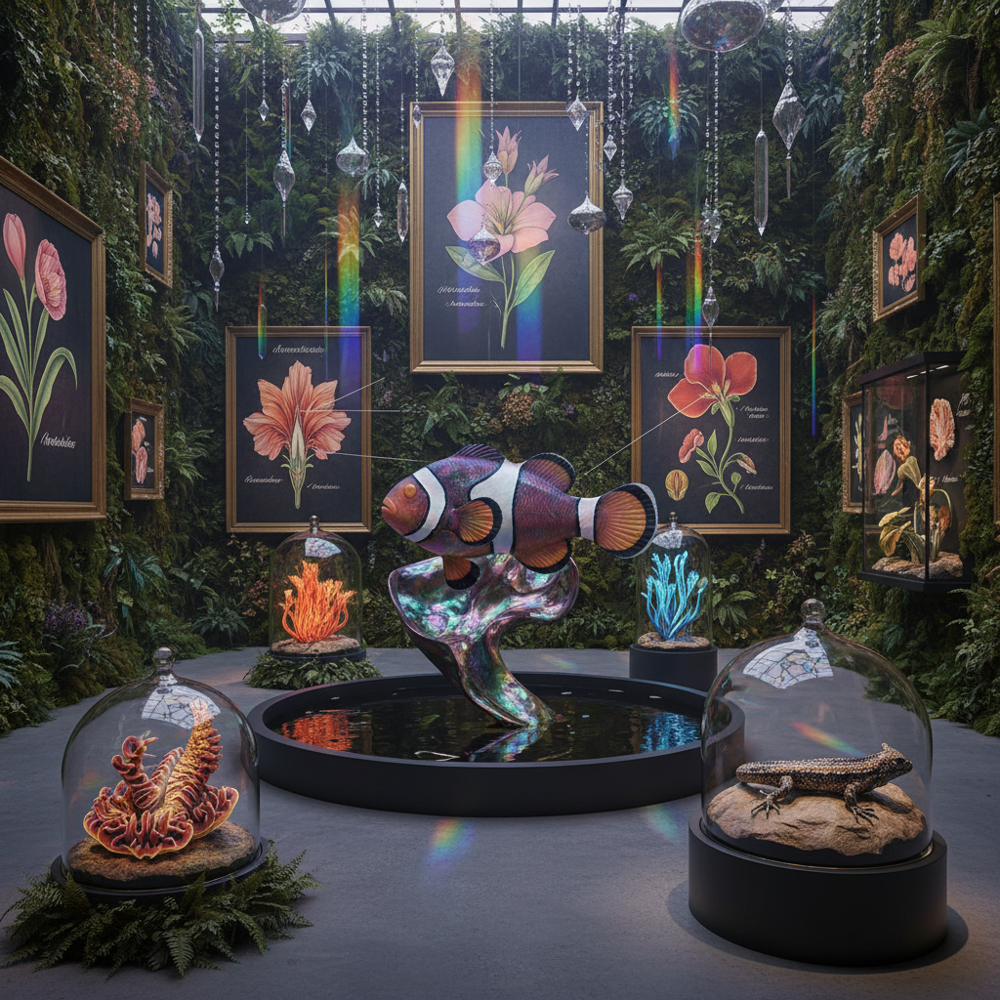

# Queer Ecology Art 酷儿生态艺术

> "Queer ecology art reveals what mainstream ecology tries to hide — that nature is not heteronormative, that biological sex is a spectrum not a binary, that reproduction is not the only purpose of life, that symbiosis and cooperation are as fundamental as competition, that the natural world is full of gender fluidity, same-sex bonding, asexual reproduction, and forms of kinship that exceed the nuclear family, and that the most radical ecological act may be to queer our understanding of nature itself, freeing it from the projections of human social norms." — Catriona Mortimer-Sandilands

## 概述

酷儿生态艺术（Queer Ecology Art）是将酷儿理论与生态学结合的艺术实践。酷儿生态学挑战了将"自然"用来规范人类性别和性行为的传统——指出自然界中充满了同性行为、性别流动、无性繁殖和超越二元性别的生物现象。酷儿生态艺术探索自然的"酷儿性"——自然界中不符合异性恋规范的多样性和流动性。

酷儿生态艺术的实践包括：1）展示自然界中的性别多样性——如雌雄同体的生物、改变性别的鱼类、同性配对的动物；2）挑战"自然=正常"的逻辑——质疑用"自然"来规范人类行为的做法；3）探索非规范性的生态关系——如共生、寄生、杂交等超越"正常"繁殖的关系；4）将酷儿身体与自然环境连接——探索酷儿身体在自然中的位置和体验。

## 核心特征

| 特征 | 描述 |
|------|------|
| 多样 | 自然的性别多样性 |
| 流动 | 性别和形态的流动 |
| 挑战 | 挑战规范性 |
| 共生 | 非规范的关系 |
| 身体 | 酷儿身体与自然 |
| 解放 | 从规范中解放 |

## 视觉特征

- **变形**：性别变形的生物
- **色彩**：彩虹和光谱色彩
- **混合**：物种和性别的混合
- **花**：花的性器官美学
- **水**：水中的流动生物
- **共生**：共生关系的展示

## 代表作品

| 作品 | 艺术家 | 年代 | 意义 |
|------|--------|------|------|
| *Queer ecology exhibitions* | Various | 2010年代 | 酷儿生态展览 |
| *Gender-fluid nature* | Various | 2010年代 | 自然的性别流动 |
| *Symbiotic art* | Various | 2020年代 | 共生艺术 |
| *Queer botany* | Various | 2020年代 | 酷儿植物学 |
| *Non-binary nature* | Various | 当代 | 非二元自然 |

## 历史时间线

| 时期 | 事件 |
|------|------|
| 1999 | Bruce Bagemihl《Biological Exuberance》 |
| 2010 | Catriona Mortimer-Sandilands的理论化 |
| 2010年代 | 酷儿生态艺术的兴起 |
| 2020年代 | 与气候正义的融合 |
| 当代 | 多物种酷儿性的探索 |

## 中国语境

酷儿生态艺术在中国是一个新兴但敏感的领域。中国传统文化中有一些与酷儿生态相关的元素——如道家的阴阳互化观念（阴中有阳、阳中有阴）、传统文学中的性别变形故事（如《聊斋志异》中的狐仙变化）、以及中国传统园林中对"奇石"（不规则、不规范的自然形态）的欣赏。中国的一些当代艺术家在以隐晦或间接的方式探索酷儿生态的主题——通过自然界的多样性来暗示人类社会的多样性，通过生物的变形来表达身份的流动性。中国的生物多样性研究也为酷儿生态提供了科学基础——中国丰富的物种多样性中包含了大量的性别多样性现象。

## AI生成概念图

## 与其他风格的关系

- **Eco-Art** → 生态艺术
- **Queer Art** → 酷儿艺术
- **Bio Art** → 生物艺术
- **Feminist Art** → 女性主义艺术
- **Deep Ecology** → 深层生态
- **Posthumanism** → 后人类主义

---

*浮光艺志 | Chronicle of Artistry*
