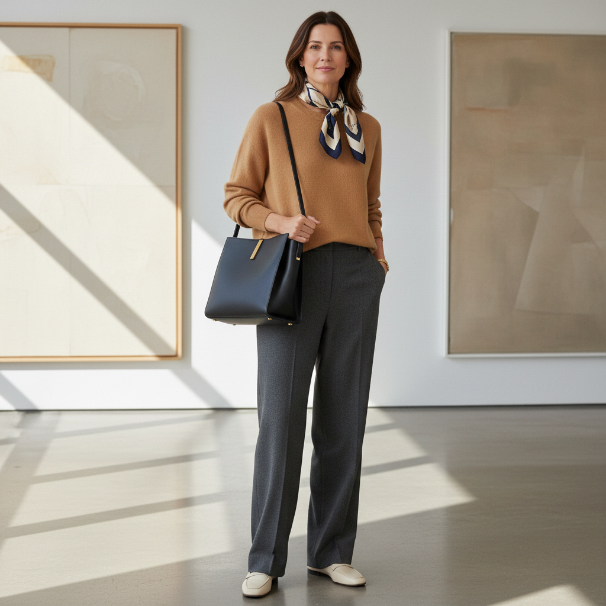

# Quiet Luxury 静奢



> **"没有logo、没有标签——真正的奢侈不需要被看见。"**

## 概述

| 维度 | 描述 |
|------|------|
| 时期 | 概念永恒 / 2022–至今 主流化 |
| 别名 | Quiet Luxury, Stealth Wealth, Silent Luxury |
| 核心色彩 | 驼色、黑色、白色、灰色、海军蓝 |
| 关键元素 | 无logo、完美剪裁、天然面料、低调配色 |
| 代表人物 | The Row、Loro Piana、《Succession》 |
| 关联风格 | Old Money, Normcore, Minimalism, Clean Girl |

---

## 历史脉络

### 从"隐形富人"到文化现象

| 年份 | 事件 |
|------|------|
| 永恒 | 真正的老钱从不炫耀 |
| 2006 | Mary-Kate & Ashley Olsen 创立 The Row |
| 2019 | 《Succession》第一季——"有钱人穿什么？" |
| 2022 | Gwyneth Paltrow 法庭穿搭走红 |
| 2023 | "Quiet Luxury" 成为年度时尚关键词 |
| 2024 | Mob Wife 作为反面出现 |

### 它代表什么？

| 元素 | 含义 |
|------|------|
| 无logo | "我不需要品牌来证明我" |
| 驼色羊绒 | "这件毛衣3万块但你看不出来" |
| 完美剪裁 | "贵在看不见的地方" |
| 天然面料 | "我穿的是材质，不是标签" |
| 低调配色 | "我不需要被注意" |

### 核心哲学

Quiet Luxury 的精神是**"真正的奢侈不需要宣告"**：
- 如果你需要logo来证明，那你还不够
- 品质 > 品牌
- 裁缝 > 设计师
- "懂的人自然懂"
- 低调是最高形式的自信
- "我不是穿不起Gucci——我选择不穿"

---

## 视觉语法

### 色彩系统

```
主色：
  驼色 (#C19A6B) — 羊绒、大衣
  黑色 (#000000) — 经典、永恒
  白色 (#FFFFFF) — 衬衫、T恤
  灰色 (#808080) — 西装、毛衣
  海军蓝 (#000080) — 正式、传统

辅色：
  奶油白 (#FFFDD0) — 柔和
  深棕 (#3D2B1F) — 皮革
  橄榄绿 (#556B2F) — 偶尔

规则：
  - 中性色为主
  - 绝对不用荧光色
  - 颜色搭配"安全"但"昂贵"
  - 同色系层叠
  - 质感差异创造层次

质感：
  羊绒 — 最核心面料
  丝绸 — 内搭
  小牛皮 — 包、鞋
  羊毛 — 大衣、西装
  棉 — 高支数衬衫
```

### 标志性元素

| 类别 | 元素 |
|------|------|
| 品牌 | The Row、Loro Piana、Brunello Cucinelli |
| 上装 | 羊绒毛衣、白衬衫、驼色大衣 |
| 下装 | 完美剪裁西裤、直筒牛仔裤 |
| 包 | 无logo皮包、Bottega Veneta |
| 鞋 | 简约乐福鞋、白色运动鞋 |
| 配饰 | 极简金饰、无logo皮带 |

---

## 与千禧怀旧的关系

### 对 Logo Mania 的反叛
- 2010s = Gucci、LV、Balenciaga logo 满天飞
- 2022 = "我受够了logo"
- 时尚钟摆：从"看得见的贵"到"看不见的贵"
- 但本质上仍然是阶级区分——只是更隐蔽

### 《Succession》效应
- Logan Roy 穿 Loro Piana 棒球帽
- Kendall 穿无logo灰色T恤
- "有钱人不需要让你知道他有钱"
- 电视剧让"隐形富人"穿搭成为话题

---

## 中国语境

- "静奢"/"无logo"在小红书的爆火
- 与"高级感"/"松弛感"的高度重合
- 中国版：The Row 平替、无logo羊绒
- 对"大logo"/"暴发户"审美的反叛
- 但也被批评为"另一种形式的炫富"

---

## 设计应用

| 场景 | 应用方式 |
|------|----------|
| 品牌 | 极简+无装饰+高品质材质+留白 |
| 包装 | 纯色+触感纸+无logo+极简 |
| 空间 | 中性色+天然材质+极简家具+留白 |
| 数字 | 大量留白+细衬线字体+低对比度 |

---

## 相关风格

← [Old Money 老钱风](old-money.md) | [Mob Wife 黑帮妻子](mob-wife.md) (反面) →

↑ [返回千禧怀旧目录](README.md) | [返回总目录](../README.md)
