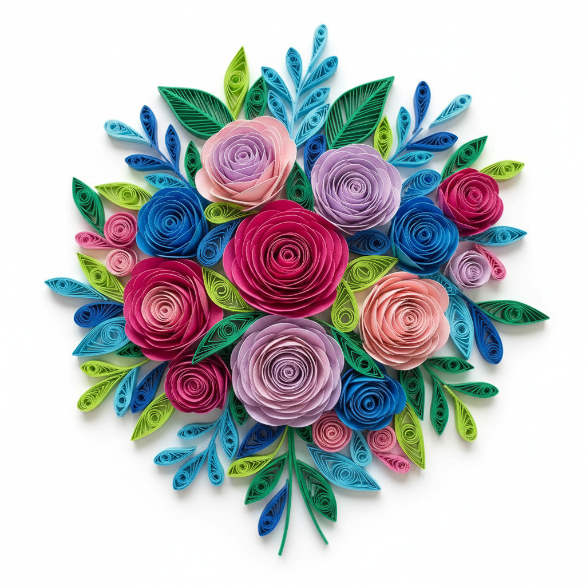

# Quilling Art 衍纸艺术

> "Quilling is drawing with paper — thin strips are rolled, shaped, and glued into coils, scrolls, and teardrops that are assembled into intricate designs of astonishing delicacy. What begins as a flat ribbon becomes a three-dimensional world of texture and shadow, where every curl holds its shape through nothing more than the memory of the paper and a touch of adhesive. It is patience made visible, meditation made tangible." — Unknown

## 概述

衍纸艺术（Quilling Art）是一种将细长纸条卷曲、塑形并粘贴组合成装饰图案的纸艺技法——通过将纸条缠绕在工具上形成各种基本形状（圆形、泪滴形、菱形等），然后将这些形状组合成花卉、动物、文字等复杂图案。衍纸艺术起源于文艺复兴时期的欧洲修道院，修女们用镀金书页的边角料创作宗教装饰。

衍纸艺术的实践包括：1）基础卷——紧卷、松卷、泪滴卷等基本形状；2）梳卷——使用梳子创造的环形图案；3）蜂巢卷——折叠纸条形成的蜂巢纹理；4）立体衍纸——三维立体的衍纸造型；5）边缘衍纸——在卡片或画框边缘的装饰；6）微型衍纸——极其精细的微型作品；7）当代衍纸——将传统技法与现代设计结合的创作。

## 核心特征

| 特征 | 描述 |
|------|------|
| 纸条 | 使用细长纸条 |
| 卷曲 | 卷曲塑形的技法 |
| 精细 | 极其精细的细节 |
| 耐心 | 需要极大的耐心 |
| 组合 | 基本形状的组合 |
| 装饰 | 高度装饰性 |

## 视觉特征

- **卷曲**：优美的卷曲线条
- **层次**：多层次的纸条组合
- **阴影**：纸条边缘的阴影效果
- **色彩**：丰富的纸条色彩
- **精致**：极其精致的细节
- **立体**：纸条的立体质感

## 代表作品

| 作品 | 艺术家/文化 | 年代 | 意义 |
|------|-------------|------|------|
| *Monastery quilling* | 欧洲修道院 | 15-17世纪 | 修道院衍纸装饰 |
| *Georgian quilling* | 英国 | 18世纪 | 乔治时代衍纸 |
| *Yulia Brodskaya works* | 俄裔英国 | 当代 | 当代衍纸大师 |
| *Sena Runa works* | 土耳其 | 当代 | 彩虹衍纸艺术 |
| *Contemporary quilling* | 国际 | 当代 | 当代衍纸发展 |

## 历史时间线

| 时期 | 事件 |
|------|------|
| 15世纪 | 欧洲修道院的衍纸起源 |
| 18世纪 | 英国上流社会的流行 |
| 19世纪 | 维多利亚时代的衍纸热潮 |
| 20世纪 | 衍纸的衰落与复兴 |
| 当代 | 衍纸的艺术化和全球化 |

## 中国语境

衍纸艺术在中国近年来获得了广泛的关注和发展。中国的手工爱好者群体中，衍纸是最受欢迎的纸艺之一——各种衍纸教程和材料包在电商平台热销。中国的传统纸艺（剪纸、折纸）与衍纸有互补关系——一些艺术家将中国传统图案与衍纸技法结合。中国的美术教育中，衍纸作为一种培养耐心和精细动手能力的课程——在中小学和社区教育中广泛开展。中国的一些衍纸艺术家在国际比赛中获奖——展示了中国衍纸创作的水平。中国的文创产业中，衍纸作为一种独特的装饰元素——被应用于贺卡、相框和室内装饰。中国的一些博物馆和文化机构举办衍纸展览和工作坊——推广这一精致的纸艺形式。

## AI生成概念图

## 与其他风格的关系

- **Paper Art** → 纸艺
- **Origami** → 折纸
- **Paper Cutting** → 剪纸
- **Filigree** → 金银丝工艺
- **Decorative Art** → 装饰艺术
- **Miniature Art** → 微型艺术

---

*浮光艺志 | Chronicle of Artistry*
