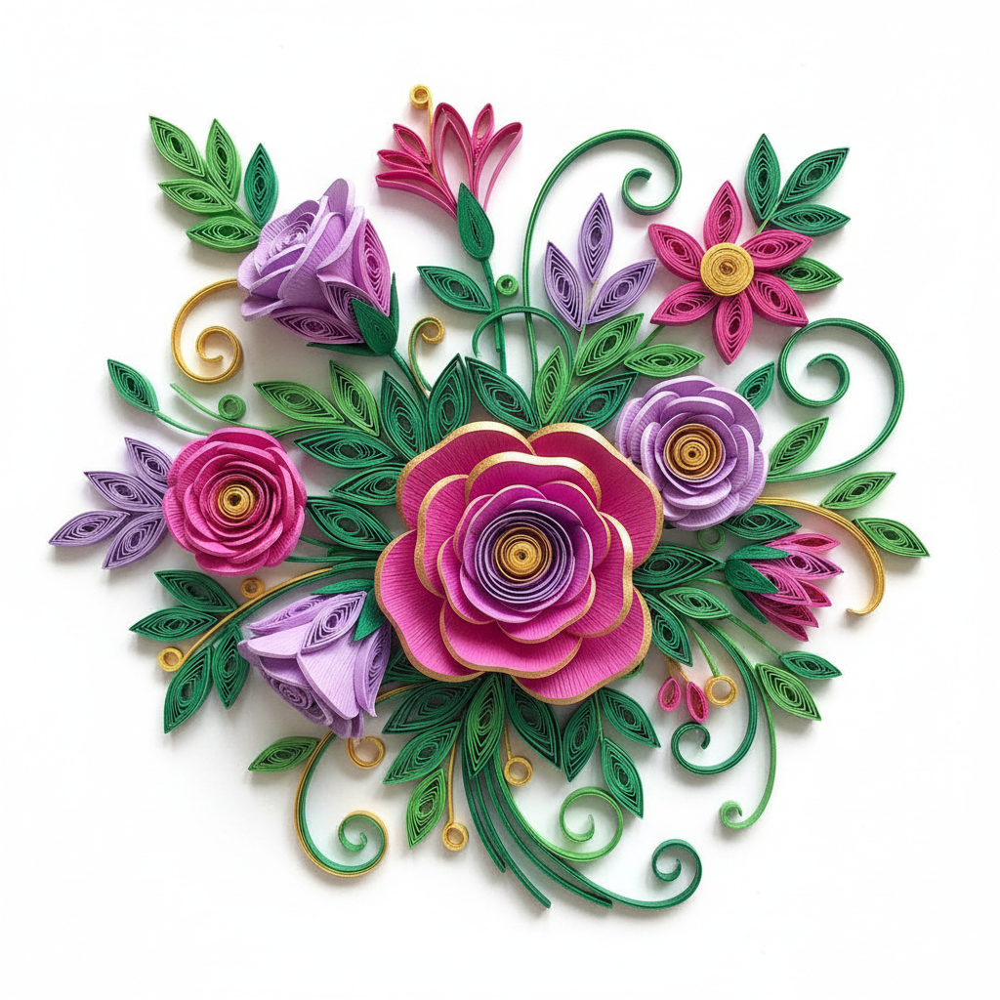

# Quilling 衍纸艺术

> "Quilling proves that the simplest material — a strip of paper — can become infinitely complex." — Unknown

## 概述

衍纸艺术（Quilling/Paper filigree）是将细长的纸条卷曲、折叠、粘合成各种形状，再组合成精美图案和立体造型的纸艺术。从文艺复兴时期修女用金边书页条装饰圣物盒，到18世纪英国贵族的消遣手工，从维多利亚时代的精致装饰到当代的大型纸艺装置，衍纸以其将简单纸条转化为精美艺术的魔力持续吸引着创作者。

衍纸的哲学在于：极简的材料可以创造极繁的美——一条纸，通过卷曲和组合，可以变成花朵、蝴蝶、建筑，甚至整个宇宙。

## 核心特征

| 特征 | 描述 |
|------|------|
| 纸条 | 使用细长的纸条 |
| 卷曲 | 将纸条卷成各种形状 |
| 组合 | 将卷曲的形状组合成图案 |
| 精细 | 极其精细的手工操作 |
| 立体 | 可以创造立体效果 |
| 装饰 | 强烈的装饰性 |

## 视觉特征

- **螺旋**：纸条的螺旋和卷曲
- **精细**：极其精细的细节
- **层次**：纸条叠加的层次感
- **阴影**：立体纸条产生的阴影
- **色彩**：彩色纸条的色彩搭配
- **韵律**：重复形状的视觉韵律

## 代表作品

| 作品 | 艺术家 | 年代 | 意义 |
|------|--------|------|------|
| *Reliquary decorations* | 修女们 | 15-17世纪 | 早期衍纸装饰 |
| *Georgian tea caddies* | 匿名 | 1700s | 英国贵族衍纸 |
| *Victorian quilling* | 匿名 | 1850s-1900s | 维多利亚衍纸 |
| *Contemporary quilling* | Yulia Brodskaya | 2000s+ | 当代衍纸艺术 |
| *Paper sculptures* | Various | 2010s+ | 大型衍纸装置 |

## 历史时间线

| 时期 | 事件 |
|------|------|
| 15世纪 | 修道院中的早期衍纸 |
| 18世纪 | 英国贵族的消遣手工 |
| 1850s-1900s | 维多利亚时代的衍纸热潮 |
| 20世纪中 | 衍纸的衰落 |
| 1980s-90s | 衍纸的复兴 |
| 2000s+ | 当代衍纸艺术的繁荣 |
| 当代 | 社交媒体推动的衍纸热潮 |

## 中国语境

衍纸在中国近年来非常流行——特别是在手工爱好者和美术教育中。中国的衍纸创作者将传统中国元素（如龙凤、牡丹、山水）融入衍纸设计，创造出具有中国特色的衍纸艺术。中国的剪纸传统为衍纸提供了丰富的图案灵感。当代中国的衍纸艺术在社交媒体上有大量关注。

## AI生成概念图

## 与其他风格的关系

- **Paper Cutting** → 剪纸与衍纸都是纸艺术
- **Origami** → 折纸与衍纸是纸艺的姐妹
- **Filigree** → 金属丝细工与衍纸有形式相似
- **Decorative Arts** → 装饰艺术包含衍纸
- **Craft** → 衍纸介于艺术和工艺之间
- **Relief** → 衍纸创造浮雕般的效果

---

*浮光艺志 | Chronicle of Artistry*
