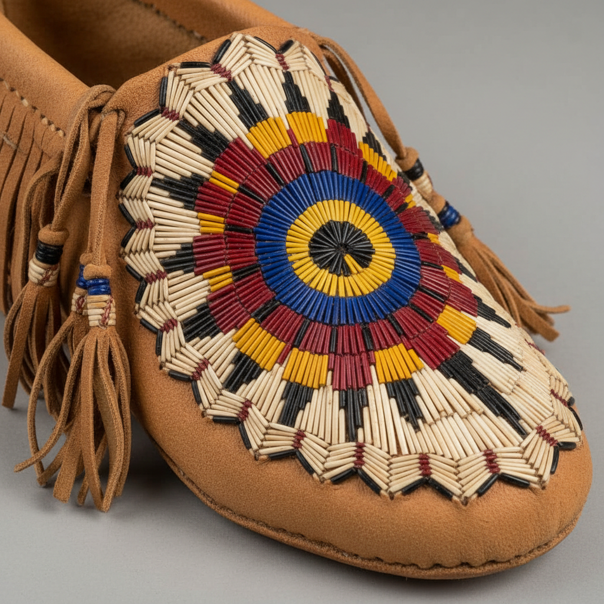

# Quillwork 豪猪刺绣 | Porcupine Quillwork

> **"刺猬的礼物——北美原住民用染色的豪猪刺在鹿皮上编织出太阳的光芒。"**

## 概述

Quillwork（豪猪刺绣 / Porcupine Quillwork）是北美原住民（特别是平原印第安人和林地部落）的传统装饰艺术，使用北美豪猪（Porcupine）的刺（quill）作为材料，经过染色、软化后编织或缝制在鹿皮、桦树皮等载体上。这是欧洲人带来玻璃珠之前北美原住民最重要的装饰技法，有数千年历史。豪猪刺经过植物染料染色后呈现鲜艳的红、黄、蓝、黑等色彩，编织出精美的几何图案。

## 核心特征

- **豪猪刺材料**：天然豪猪刺
- **植物染色**：用植物和矿物染料着色
- **软化处理**：口中含软或水泡软化
- **编织/缝制**：多种编织和缝制技法
- **鹿皮载体**：缝在鹿皮衣物上
- **几何图案**：精确的几何设计

## 主要技法

| 技法 | 特征 |
|------|------|
| 包裹法 | 刺包裹在皮条上 |
| 编织法 | 刺编织成带状 |
| 缝制法 | 刺缝在皮面上 |
| 桦皮咬花 | 在桦树皮上咬出图案 |

## 常见应用

| 物品 | 特征 |
|------|------|
| 莫卡辛鞋 | 鞋面装饰 |
| 烟袋 | 仪式用品 |
| 摇篮板 | 婴儿用品 |
| 衣物边饰 | 衣领袖口 |
| 首饰 | 耳环胸饰 |

## 视觉特征

- 豪猪刺的天然光泽
- 鲜艳的植物染色
- 精确的几何图案
- 放射状的太阳图案
- 鹿皮的柔软质感
- 细密的编织纹理

## 与其他风格的关系

| 风格 | 关系 |
|------|------|
| Beadwork珠绣 | 珠绣取代了Quillwork |
| Birch Bark Art | 共享林地部落传统 |
| 当代原住民艺术 | Quillwork的复兴 |
| 纤维艺术 | 共享编织技法 |
| Huichol Beadwork | 共享美洲原住民装饰 |

## 概念图

---

*浮光艺志 | Chronicle of Artistry*
