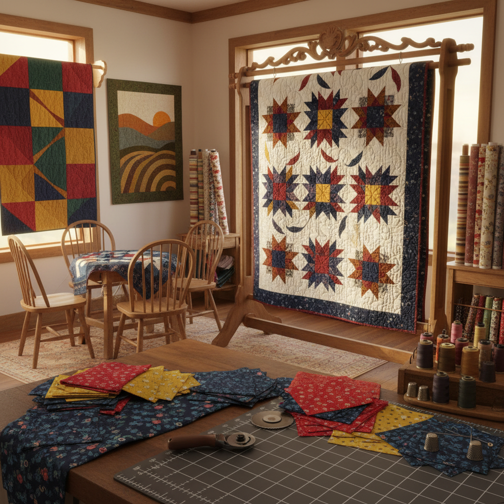

# Quilting Art 拼布艺术

> "A quilt is a conversation between fabrics — scraps of old dresses, worn shirts, and leftover curtains brought together into a new whole that is greater than the sum of its parts. Each piece carries memory: this was grandmother's apron, that was a child's first blanket. Quilting transforms these fragments into geometry, into warmth, into art that wraps around you like a story told in cloth." — Unknown

## 概述

拼布艺术（Quilting Art）是将多块织物拼接缝合，并在表面进行绗缝（quilting）的纺织艺术形式——通过将不同颜色、图案和质地的布料按设计拼接成面，再与填充物和底布缝合在一起，创造出既有实用功能又具艺术价值的作品。拼布艺术是美国最重要的民间艺术传统之一。

拼布艺术的实践包括：1）传统拼布——经典几何图案的拼布被；2）艺术拼布——以艺术表达为目的的拼布创作；3）疯狂拼布——不规则形状的自由拼布；4）贴布绣——将布片贴缝在底布上的技法；5）绗缝艺术——强调绗缝线条本身的艺术性；6）现代拼布——简约现代风格的拼布设计；7）拼布装置——将拼布作为当代艺术装置的创作。

## 核心特征

| 特征 | 描述 |
|------|------|
| 拼接 | 多块织物的拼接 |
| 几何 | 几何图案的组合 |
| 层次 | 面料、填充、底布三层 |
| 记忆 | 承载记忆和故事 |
| 温暖 | 实用的保暖功能 |
| 社区 | 社区协作传统 |

## 视觉特征

- **几何**：精确的几何图案
- **色彩**：丰富的色彩组合
- **纹理**：不同织物的纹理对比
- **绗缝**：绗缝线条的图案
- **重复**：图案单元的重复
- **对比**：明暗和色彩的对比

## 代表作品

| 作品 | 艺术家/传统 | 年代 | 意义 |
|------|-------------|------|------|
| *Gee's Bend quilts* | 阿拉巴马社区 | 20世纪 | 非裔美国拼布 |
| *Amish quilts* | 阿米什社区 | 19世纪至今 | 阿米什极简拼布 |
| *Art quilts* | Various | 当代 | 当代艺术拼布 |
| *AIDS Memorial Quilt* | NAMES Project | 1987至今 | 纪念拼布 |
| *Modern quilts* | Various | 当代 | 现代拼布运动 |

## 历史时间线

| 时期 | 事件 |
|------|------|
| 古代 | 早期的拼布和绗缝技术 |
| 18-19世纪 | 美国拼布传统的形成 |
| 19世纪 | 拼布蜂（quilting bee）社区传统 |
| 1970年代 | 拼布的艺术化运动 |
| 当代 | 现代拼布运动和艺术拼布 |

## 中国语境

拼布艺术在中国有独特的传统和当代发展。中国传统的"百衲衣"——用多块布料拼缝而成的衣服——是中国最早的拼布形式，在佛教文化中有特殊意义。中国民间的"百家被"传统——收集百家布料为新生儿缝制被子——体现了拼布的社区和祝福意义。中国当代的拼布艺术在近年来快速发展——受到日本和美国拼布文化的影响，中国出现了大量拼布爱好者和专业创作者。中国的一些设计师将传统中国织物（如蓝印花布、扎染布）融入拼布设计——创造具有中国特色的拼布作品。中国的拼布教育和社区活动越来越活跃——各地都有拼布工作室和学习班。

## AI生成概念图

## 与其他风格的关系

- **Textile Art** → 纺织艺术
- **Patchwork** → 拼缝工艺
- **Fiber Art** → 纤维艺术
- **Folk Art** → 民间艺术
- **Embroidery** → 刺绣艺术
- **Community Art** → 社区艺术

---

*浮光艺志 | Chronicle of Artistry*
