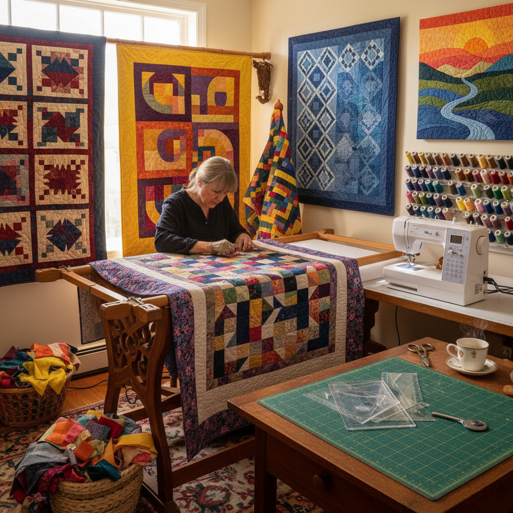

# Quilting 拼布

> "Quilting is storytelling in fabric — scraps of worn shirts, wedding dresses, and baby blankets stitched together into a blanket that wraps the sleeper in memory." — Unknown

## 概述

拼布（Quilting）是将多层织物缝合在一起的纺织艺术——通常由三层组成：装饰性的拼布面（quilt top，由多块布料拼接而成）、中间的填充层（batting，提供保暖和厚度）、和背面的衬布（backing）。这三层通过缝线（quilting stitches）固定在一起，缝线本身也形成装饰性的图案。

拼布的两大传统是：拼接（piecing，将几何形状的布块拼接成图案）和贴布（appliqué，将布块缝贴在底布上）。拼布在美国有着特别深厚的传统——从殖民时代的实用拼布到当代的艺术拼布（art quilt），拼布承载着社区记忆、家族故事和艺术表达。当代的拼布艺术已超越传统的几何图案，融入了即兴、抽象和叙事性的表达。

## 核心特征

| 特征 | 描述 |
|------|------|
| 三层 | 面、填充、背三层 |
| 拼接 | 布块的拼接 |
| 缝线 | 装饰性的缝线 |
| 图案 | 丰富的图案传统 |
| 记忆 | 承载记忆和故事 |
| 社区 | 社区性的创作 |

## 视觉特征

- **几何**：几何图案的拼接
- **色彩**：丰富的色彩组合
- **质感**：缝线的质感
- **重复**：重复的图案单元
- **对比**：布料的对比
- **温暖**：温暖的质感

## 代表作品

| 作品 | 艺术家 | 年代 | 意义 |
|------|--------|------|------|
| *Gee's Bend quilts* | Gee's Bend women | 20世纪 | 非裔美国拼布 |
| *Amish quilts* | Amish社区 | 19世纪+ | 阿米什拼布 |
| *Hawaiian quilts* | 匿名 | 19世纪+ | 夏威夷拼布 |
| *Art quilts* | Various | 当代 | 当代艺术拼布 |
| *Japanese quilts* | Various | 当代 | 日本拼布 |

## 历史时间线

| 时期 | 事件 |
|------|------|
| 古代 | 早期的多层缝合织物 |
| 中世纪 | 欧洲的拼布传统 |
| 17-18世纪 | 美国殖民地拼布 |
| 19世纪 | 美国拼布的黄金时代 |
| 1970s+ | 拼布复兴运动 |
| 当代 | 当代艺术拼布的繁荣 |

## 中国语境

拼布在中国有着对应的传统——中国民间的"百衲衣"（用碎布拼接的衣服）和"百家被"（收集百家布料拼成的被子）都是拼布的形式，承载着祈福和社区互助的意义。当代中国的拼布爱好者群体非常活跃——受到日本拼布（特别是先染布拼布）和美国拼布传统的影响。中国有多个拼布协会和社团，定期举办展览和比赛。一些中国的拼布艺术家将传统中国元素（如蓝印花布、刺绣）融入拼布创作。

## AI生成概念图

## 与其他风格的关系

- **Patchwork** → 拼接
- **Appliqué** → 贴布
- **Sashiko** → 刺子绣
- **Embroidery** → 刺绣
- **Textile Art** → 纺织艺术
- **Folk Art** → 民间艺术

---

*浮光艺志 | Chronicle of Artistry*
