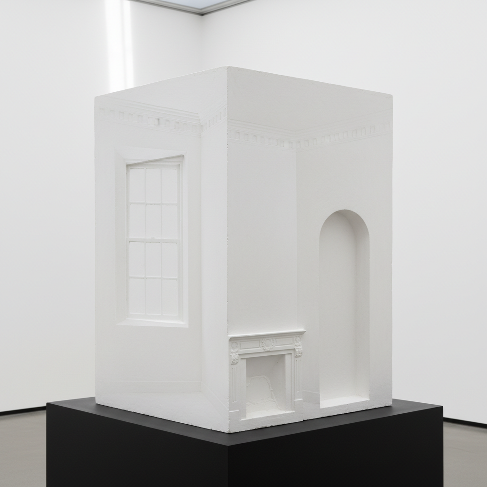

# Rachel Whiteread 瑞秋·怀特里德

> **时期：** 1963–至今  
> **关键词：** 负空间铸造、记忆建筑、混凝土诗学、YBA

## 概述

Rachel Whiteread 是英国雕塑家，以铸造日常物品和建筑空间的"负空间"而闻名。她将桌子下方的空间、房间内部的空气用混凝土、树脂或石膏铸造为实体，将不可见的空间转化为可触摸的物质。

## 风格特征

- **负空间铸造**：铸造物体周围或内部的空间，而非物体本身
- **日常物品**：桌子、椅子、浴缸等家庭物品的空间印记
- **建筑尺度**：从单个物品扩展到整栋房屋的内部空间铸造
- **材料的沉默**：混凝土、石膏和树脂的哑光表面传达安静和缺席
- **记忆的物质化**：作品如同已消失事物留下的物质痕迹

## 代表作品

- *House*（1993）
- *Untitled (One Hundred Spaces)*（1995）
- *Holocaust Memorial, Vienna*（2000）
- *Embankment*（2005）

## 概念图

