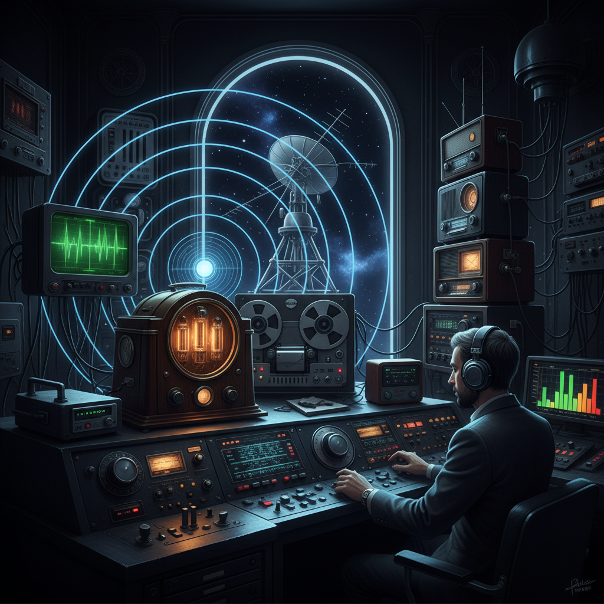

# Radio Art 无线电艺术

> "Radio art is sculpture in time — invisible waves carrying sound, meaning, and imagination across distances that no physical object can bridge. It is art that exists nowhere and everywhere simultaneously, transmitted from one antenna and received by millions, each listener creating their own private theater of the mind. Radio proves that art does not need to be seen to be experienced." — Unknown

## 概述

无线电艺术（Radio Art）是利用无线电波、广播技术和电磁频谱进行艺术创作的艺术形式——包括广播艺术、声音传输实验、电磁波可视化和利用无线电技术的互动装置。无线电艺术探索了声音、距离、传播和不可见能量的艺术可能性。

无线电艺术的实践包括：1）广播艺术——为广播媒介创作的声音艺术；2）无线电装置——利用无线电信号的艺术装置；3）电磁波可视化——将电磁波转化为可见形式；4）短波艺术——利用短波广播的实验性创作；5）无线电表演——利用无线电传输的现场表演；6）静电和噪音艺术——利用无线电静电和噪音的创作；7）无线电考古——收集和再利用历史无线电信号的创作。

## 核心特征

| 特征 | 描述 |
|------|------|
| 不可见 | 利用不可见的电磁波 |
| 传播 | 远距离传播能力 |
| 时间 | 基于时间的艺术 |
| 声音 | 以声音为主要媒介 |
| 技术 | 依赖电子技术 |
| 公共 | 公共广播的特性 |

## 视觉特征

- **天线**：无线电天线的造型
- **波形**：电磁波的可视化
- **设备**：复古无线电设备美学
- **频谱**：频率频谱的图形
- **静电**：静电噪音的视觉化
- **发光**：真空管的发光效果

## 代表作品

| 作品 | 艺术家 | 年代 | 意义 |
|------|--------|------|------|
| *Radio art pieces* | John Cage | 1951 | 偶然音乐与广播 |
| *Imaginary Landscape No. 4* | John Cage | 1951 | 12台收音机的作品 |
| *Radio works* | Bill Fontana | 1980s至今 | 声音雕塑与广播 |
| *Electromagnetic walks* | Christina Kubisch | 2003至今 | 电磁波散步 |
| *Radio astronomy art* | Various | 当代 | 射电天文艺术 |

## 历史时间线

| 时期 | 事件 |
|------|------|
| 1890年代 | 无线电的发明 |
| 1920年代 | 广播艺术的萌芽 |
| 1951 | John Cage的收音机作品 |
| 1970-80年代 | 无线电艺术运动 |
| 当代 | 电磁波艺术和无线电考古 |

## 中国语境

无线电艺术在中国有独特的文化记忆和当代实践。中国的广播在20世纪有着重要的文化和政治意义——从延安时期的广播到改革开放后的广播文化，无线电在中国社会中扮演了重要角色。中国的一些声音艺术家将无线电作为创作媒介——探索广播、传播和公共空间的主题。中国的一些当代艺术家利用电磁波和无线电信号创作装置——将不可见的电磁环境转化为可感知的艺术体验。中国的业余无线电爱好者社区也有一定的艺术创作活动——将无线电通信本身视为一种创造性实践。中国的一些媒体艺术节展出过无线电相关的艺术作品——探索技术、传播和社会的关系。

## AI生成概念图

## 与其他风格的关系

- **Sound Art** → 声音艺术
- **Media Art** → 媒体艺术
- **Electronic Art** → 电子艺术
- **Transmission Art** → 传输艺术
- **Noise Art** → 噪音艺术
- **Conceptual Art** → 概念艺术

---

*浮光艺志 | Chronicle of Artistry*
