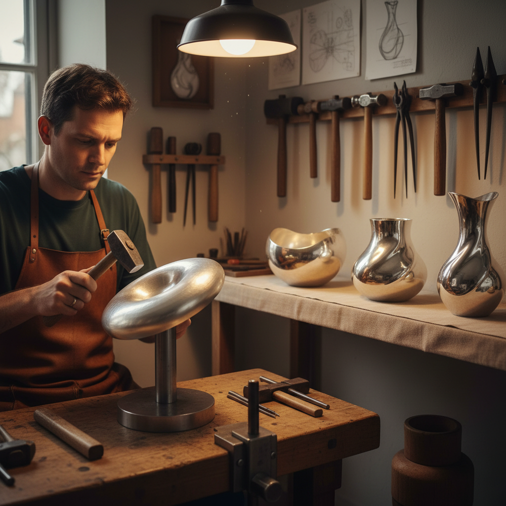

# Raising 手工起形

> "Raising is the slowest way to make a vessel — and the most beautiful, because every curve is earned by hand." — Unknown

## 概述

手工起形（Raising）是从一片平坦的金属圆盘出发，仅通过锤打将其逐渐"升起"成三维容器形态的传统金属成形技法。与旋压使用车床不同，起形完全依靠锤子和铁砧（stake），通过数百甚至数千次精确的锤击，将金属一圈一圈地向上"提升"。这是制作高品质金属器物最传统、最纯粹的方法——每一件起形作品都凝聚了工匠数小时甚至数天的耐心劳动。

手工起形的哲学在于：耐心的累积——没有捷径，每一锤都只能移动金属一点点，但数千锤之后，平板变成了器物。

## 核心特征

| 特征 | 描述 |
|------|------|
| 手工 | 完全手工锤打 |
| 起形 | 从平板升起为容器 |
| 锤击 | 数千次精确锤击 |
| 耐心 | 需要极大的耐心 |
| 纯粹 | 最纯粹的成形方法 |
| 品质 | 最高品质的器物 |

## 视觉特征

- **锤痕**：均匀的锤打痕迹
- **曲线**：优美的手工曲线
- **厚度**：均匀的壁厚
- **光泽**：锤打后的金属光泽
- **有机**：手工的有机感
- **品质**：高品质的整体感

## 代表作品

| 作品 | 艺术家 | 年代 | 意义 |
|------|--------|------|------|
| *Silver holloware* | 匿名 | 传统 | 传统银器起形 |
| *Copper vessels* | 匿名 | 传统 | 铜器起形 |
| *Michael Lloyd vessels* | Michael Lloyd | 当代 | 当代起形艺术 |
| *Japanese tetsubin* | 匿名 | 传统 | 日本铁壶 |
| *Contemporary raised forms* | Various | 当代 | 当代起形器物 |

## 历史时间线

| 时期 | 事件 |
|------|------|
| 青铜时代 | 最早的金属起形 |
| 古代 | 各文明的起形传统 |
| 中世纪 | 行会制度下的银匠起形 |
| 18-19世纪 | 银器起形的黄金时代 |
| 工业革命 | 机械化的冲击 |
| 当代 | 作为艺术工艺的传承 |

## 中国语境

中国传统的金属器物制作中广泛使用起形技法——称为"打胎"或"锤打成形"。中国传统的铜壶、银碗等器物多采用手工起形。云南的新华村（白族银器）和贵州的苗族银匠至今仍使用传统的手工起形技法制作银器。这种技法在中国被列入各级非物质文化遗产保护名录。

## AI生成概念图

## 与其他风格的关系

- **Metal Spinning** → 旋压是起形的机械化版本
- **Silversmithing** → 银器起形
- **Coppersmithing** → 铜器起形
- **Repoussé** → 锤揲是装饰性锤打
- **Planishing** → 起形后的平整
- **Metalwork** → 金属成形工艺

---

*浮光艺志 | Chronicle of Artistry*
