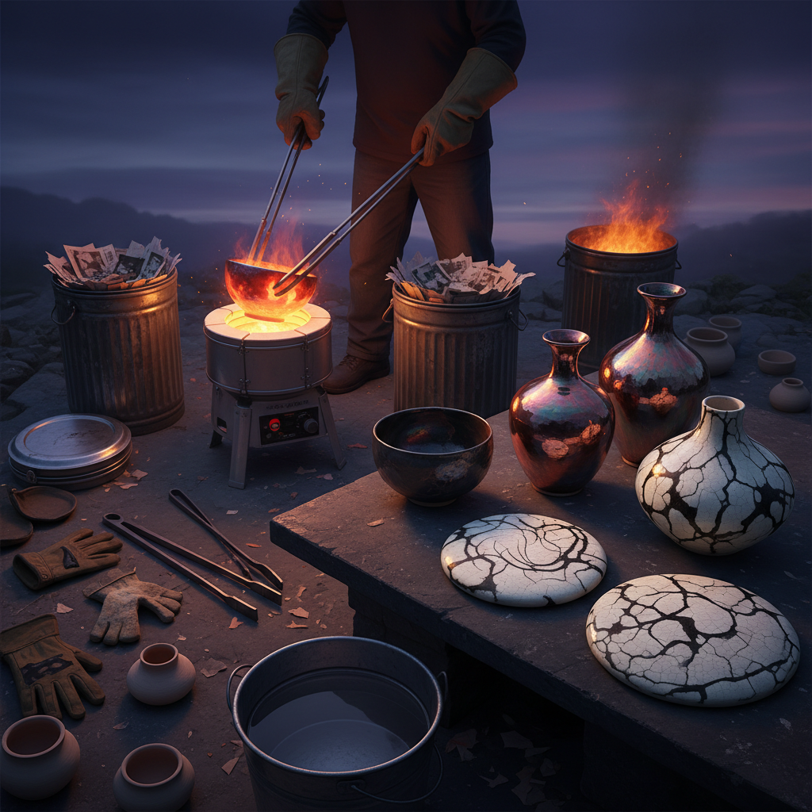

# Raku Art 乐烧艺术

> "Raku is ceramics at its most dramatic and unpredictable — pieces pulled glowing from the kiln with long tongs, plunged into combustible materials that burst into flame, then quenched in water with a violent hiss of steam. In those few minutes of controlled chaos, the glaze crackles, carbon penetrates the clay body turning it jet black, and metallic lusters flash across the surface. No two raku pieces are ever alike; the fire decides the final result." — Unknown

## 概述

乐烧艺术（Raku Art）是一种源自16世纪日本的特殊陶瓷烧制技法——将陶器在窑中烧至釉料熔化后立即取出，放入可燃材料（如锯末、报纸）中进行还原，然后淬水冷却。这种急剧的温度变化和还原气氛产生独特的裂纹、金属光泽和碳化效果，每件作品都是独一无二的。

乐烧艺术的实践包括：1）传统乐烧——日本茶道用的乐茶碗；2）西方乐烧——20世纪发展的西方乐烧技法；3）裸烧乐——不施釉的碳化乐烧；4）马毛乐烧——用马毛在热陶上创造线条；5）彩虹乐烧——产生金属虹彩效果的乐烧；6）当代乐烧——将传统技法与现代艺术结合的创作。

## 核心特征

| 特征 | 描述 |
|------|------|
| 即兴 | 高度即兴和不可预测 |
| 戏剧 | 戏剧性的烧制过程 |
| 独特 | 每件作品独一无二 |
| 裂纹 | 特征性的釉面裂纹 |
| 碳化 | 碳渗透的黑色效果 |
| 金属 | 金属光泽的釉面 |

## 视觉特征

- **裂纹**：釉面的网状裂纹
- **碳化**：黑色碳化的坯体
- **金属**：金属虹彩的光泽
- **对比**：黑白的强烈对比
- **质感**：粗犷的表面质感
- **偶然**：偶然性的美感

## 代表作品

| 作品 | 艺术家/文化 | 年代 | 意义 |
|------|-------------|------|------|
| *长次郎茶碗* | 長次郎 | 1580s | 乐烧的创始 |
| *本阿弥光悦茶碗* | 光悦 | 17世纪 | 乐烧艺术的巅峰 |
| *Paul Soldner works* | Paul Soldner | 1960s | 西方乐烧的先驱 |
| *Raku family works* | 乐家 | 16世纪至今 | 乐家十五代传承 |
| *Contemporary raku* | 当代 | 当代 | 当代乐烧创作 |

## 历史时间线

| 时期 | 事件 |
|------|------|
| 1580年代 | 長次郎创制乐烧茶碗 |
| 江户时代 | 乐家的传承和发展 |
| 1960年代 | Paul Soldner发展西方乐烧 |
| 1970-80年代 | 西方乐烧的全球传播 |
| 当代 | 乐烧的多元发展 |

## 中国语境

乐烧艺术虽然源自日本，但与中国茶文化和陶瓷传统有深厚的渊源。中国宋代的建盏（天目茶碗）是日本茶道陶瓷的重要灵感来源——乐烧的美学追求与宋代"侘寂"审美有相通之处。中国当代的陶艺家开始实践乐烧技法——将其作为探索陶瓷偶然性美学的手段。中国的一些陶艺工作室和艺术院校开设乐烧课程——因为乐烧过程的戏剧性和即时反馈非常适合教学。中国的柴烧传统与乐烧有精神上的相通——都追求火与土的自然互动。中国当代的一些陶艺家将乐烧与中国传统陶瓷美学结合——创造具有东方韵味的乐烧作品。中国的陶艺市场中，乐烧作品因其独特性和不可复制性而受到收藏者的关注。

## AI生成概念图

## 与其他风格的关系

- **Pit Firing** → 坑烧艺术
- **Saggar Firing** → 匣钵烧艺术
- **Japanese Tea Ceremony** → 日本茶道
- **Ceramics** → 陶瓷艺术
- **Wabi-sabi** → 侘寂美学
- **Wood Firing** → 柴烧艺术

---

*浮光艺志 | Chronicle of Artistry*
