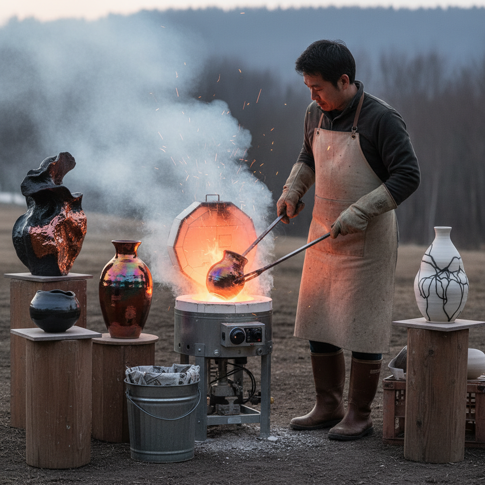

# Raku Ceramics 乐烧陶瓷

> "Raku is ceramics at its most dramatic — a glowing pot pulled from the kiln with metal tongs, plunged into combustible materials that burst into flame, the thermal shock and smoke creating unpredictable crackle patterns and metallic lusters that no two firings can ever repeat, each piece a collaboration between the potter's intention and the fire's wild will." — Unknown

## 概述

乐烧（Raku）是一种独特的陶瓷烧制技法，其特点是将陶器在高温状态下（约1000°C）从窑中取出，然后立即放入可燃材料（如报纸、木屑、树叶）中进行"还原"处理——可燃材料燃烧消耗氧气，产生的烟雾和碳渗入釉面的裂纹中，创造出独特的裂纹图案（crackle）和金属光泽效果。

Raku起源于16世纪日本的茶道文化——乐烧茶碗是日本茶道中最受尊崇的器物之一。日本的乐烧传统由乐家（Raku family）创立，至今已传承15代。西方的Raku（American Raku）在1960年代由Paul Soldner发展出来，与日本传统乐烧有显著不同——西方Raku强调戏剧性的还原效果和不可预测的表面效果，而日本传统乐烧更注重简朴、内敛的侘寂美学。

## 核心特征

| 特征 | 描述 |
|------|------|
| 热取 | 高温下从窑中取出 |
| 还原 | 在可燃材料中还原 |
| 裂纹 | 热冲击产生裂纹 |
| 不可预测 | 结果不可预测 |
| 金属光泽 | 还原产生金属光泽 |
| 茶道 | 源于日本茶道 |

## 视觉特征

- **裂纹**：釉面的裂纹网络
- **黑色**：碳渗入的黑色裂纹
- **金属**：金属光泽的釉面
- **不规则**：不规则的表面效果
- **质朴**：质朴的手工质感
- **戏剧性**：戏剧性的色彩对比

## 代表作品

| 作品 | 艺术家 | 年代 | 意义 |
|------|--------|------|------|
| *乐茶碗* | 乐长次郎 | 16世纪 | 乐烧的创始 |
| *American Raku vessels* | Paul Soldner | 1960年代 | 西方乐烧的开创 |
| *Raku sculpture* | Various | 当代 | 乐烧雕塑 |
| *Horsehair raku* | Various | 当代 | 马毛乐烧 |
| *Naked raku* | Various | 当代 | 裸烧乐烧 |

## 历史时间线

| 时期 | 事件 |
|------|------|
| 16世纪 | 日本乐烧的创始 |
| 16-20世纪 | 乐家15代传承 |
| 1960年代 | Paul Soldner发展西方Raku |
| 1970-80年代 | 西方Raku的普及 |
| 当代 | 乐烧的全球化发展 |

## 中国语境

乐烧在中国有一定的影响——中国的陶艺教育中教授Raku技法。中国的一些当代陶艺家在创作中使用乐烧技法。中国的陶瓷传统中虽然没有直接对应的技法，但中国的建窑（建盏）在烧制过程中也有类似的"窑变"效果——不可预测的釉面变化。中国的一些陶艺工作室开设乐烧体验课程。乐烧的侘寂美学与中国传统的"拙朴"审美有相通之处。

## AI生成概念图

## 与其他风格的关系

- **Ceramics** → 陶瓷
- **Japanese Tea Ceremony** → 日本茶道
- **Wabi-Sabi** → 侘寂美学
- **Pit Firing** → 坑烧
- **Smoke Firing** → 烟熏烧
- **Pottery** → 陶艺

---

*浮光艺志 | Chronicle of Artistry*
