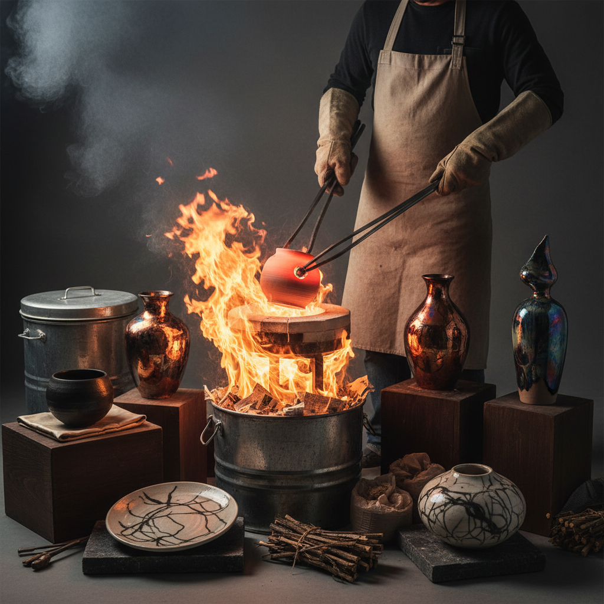

# Raku Firing 乐烧

> "Raku is fire and smoke made permanent — the glowing pot pulled from the kiln, plunged into combustibles, sealed in smoke, emerges wearing a skin of crackled glaze and carbon that no other firing can replicate." — Unknown

## 概述

乐烧（Raku Firing）是一种源自日本的特殊陶瓷烧制技法——将施釉的陶器在窑中快速加热到约1000°C，当釉面熔融发亮时，用长钳将炽热的陶器从窑中取出，立即放入可燃物（如报纸、木屑、树叶）中。可燃物瞬间着火，产生的烟和碳渗入釉面的裂纹中，形成独特的碳化效果和金属光泽。

日本传统的乐烧（Raku-yaki）由乐家族在16世纪创立——专为茶道制作茶碗。传统乐烧强调手捏成型、低温烧制和朴素的美学。西方的Raku（American Raku）则在1960年代由Paul Soldner等人发展——加入了还原冷却（reduction cooling）的步骤，产生了更戏剧性的金属光泽和碳化效果。

## 核心特征

| 特征 | 描述 |
|------|------|
| 快速 | 快速加热和冷却 |
| 还原 | 还原气氛碳化 |
| 裂纹 | 独特的裂纹效果 |
| 金属 | 金属光泽 |
| 不可预测 | 结果不可完全预测 |
| 茶道 | 源自日本茶道 |

## 视觉特征

- **裂纹**：釉面的裂纹网络
- **碳化**：黑色的碳化痕迹
- **金属**：铜红、金色的金属光泽
- **对比**：黑白的强烈对比
- **质朴**：质朴的美感
- **独特**：每件都独一无二

## 代表作品

| 作品 | 艺术家 | 年代 | 意义 |
|------|--------|------|------|
| *Raku tea bowls* | 乐家族 | 16世纪起 | 乐家茶碗 |
| *Paul Soldner raku* | Paul Soldner | 1960s | 美国乐烧先驱 |
| *Wayne Higby landscapes* | Wayne Higby | 当代 | 乐烧风景器 |
| *Contemporary raku vessels* | Various | 当代 | 当代乐烧器皿 |
| *Raku sculpture* | Various | 当代 | 乐烧雕塑 |

## 历史时间线

| 时期 | 事件 |
|------|------|
| 1580s | 乐长次郎创立乐烧 |
| 16-20世纪 | 乐家族的传承（十五代） |
| 1960s | Paul Soldner发展美国乐烧 |
| 1970s | 西方乐烧的普及 |
| 1980s | 裸烧乐（Naked Raku）的出现 |
| 当代 | 乐烧作为全球性的陶艺技法 |

## 中国语境

乐烧在中国的陶艺爱好者群体中有一定的知名度——中国的一些陶艺工作室和学校教授乐烧课程。乐烧的戏剧性过程（从窑中取出炽热的陶器、火焰和烟雾）使其成为受欢迎的陶艺体验活动。中国的一些当代陶艺家使用乐烧技法创作。中国传统的柴烧和窑变釉与乐烧有一些相似的"不可预测"美学——都强调火与釉的自然互动。中国的陶艺社区中有活跃的乐烧爱好者。

## AI生成概念图

## 与其他风格的关系

- **Tea Ceremony** → 茶道
- **Pit Firing** → 坑烧
- **Wood Firing** → 柴烧
- **Saggar Firing** → 匣钵烧
- **Ceramics** → 陶瓷
- **Wabi-sabi** → 侘寂

---

*浮光艺志 | Chronicle of Artistry*
