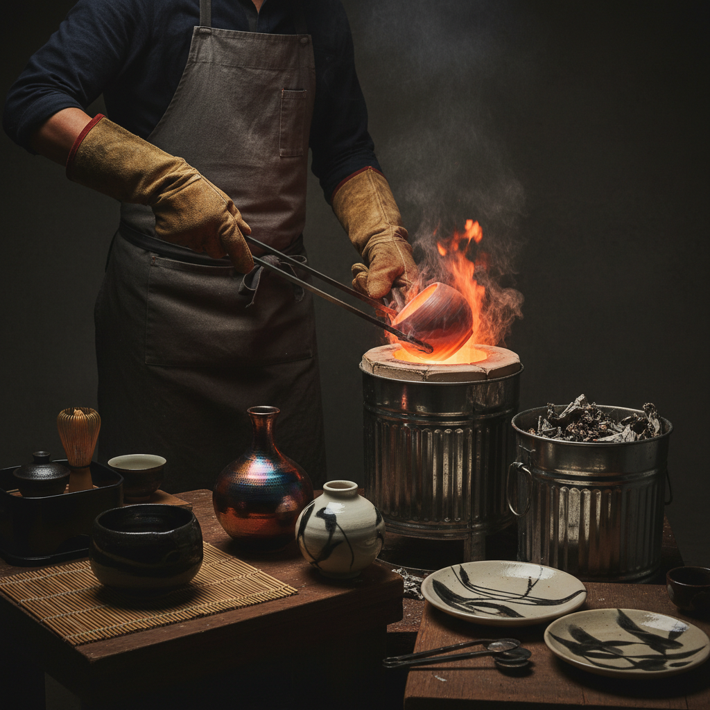

# Raku Pottery 乐烧陶艺

> "Raku is the art of embracing the unexpected — pulling glowing vessels from the kiln into smoke and flame, surrendering control to fire and chance, and finding beauty in the unpredictable patterns that emerge from chaos." — Unknown

## 概述

乐烧陶艺（Raku Pottery）是一种源自16世纪日本的特殊陶瓷烧制技法——将施釉的陶器在窑中快速加热至约1000°C，然后在红热状态下用长钳从窑中取出，立即放入可燃材料（如报纸、木屑、树叶）中进行还原冷却。高温陶器接触可燃物后产生剧烈的烟熏和还原反应，在釉面上形成独特的金属光泽、裂纹和不可预测的色彩变化。

乐烧的名字来源于日本京都的乐家（Raku family），由初代乐长次郎在千利休的指导下创立。乐烧茶碗是日本茶道中最珍贵的器物之一——其不规则的形态、朴素的釉色和手工的温度完美体现了侘寂（wabi-sabi）美学。西方乐烧（Western Raku）在20世纪由Paul Soldner等人发展，加入了后还原（post-firing reduction）技术，产生了更戏剧性的金属光泽和烟熏效果。

## 核心特征

| 特征 | 描述 |
|------|------|
| 快速 | 快速烧制和冷却 |
| 还原 | 还原气氛烧制 |
| 不可预测 | 结果不可预测 |
| 裂纹 | 独特的裂纹纹理 |
| 金属 | 金属光泽效果 |
| 侘寂 | 侘寂美学 |

## 视觉特征

- **裂纹**：釉面的裂纹网络
- **金属**：铜、金、银的金属光泽
- **烟熏**：黑色烟熏痕迹
- **不规则**：不规则的形态
- **对比**：黑白的强烈对比
- **原始**：原始的力量感

## 代表作品

| 作品 | 艺术家 | 年代 | 意义 |
|------|--------|------|------|
| *Black Raku tea bowls* | 乐长次郎 | 16世纪 | 乐烧的创始 |
| *Red Raku bowls* | 乐家历代 | 16世纪起 | 红乐传统 |
| *Western Raku vessels* | Paul Soldner | 20世纪 | 西方乐烧的开创 |
| *Copper matte Raku* | Various | 当代 | 铜光泽乐烧 |
| *Naked Raku* | Various | 当代 | 裸乐烧技法 |

## 历史时间线

| 时期 | 事件 |
|------|------|
| 1580s | 乐长次郎创立乐烧 |
| 16-17世纪 | 乐烧在茶道中的确立 |
| 乐家历代 | 乐家15代的传承 |
| 1960s | Paul Soldner发展西方乐烧 |
| 1970s-80s | 西方乐烧的全球传播 |
| 当代 | 乐烧在当代陶艺中的创新 |

## 中国语境

乐烧陶艺在中国的当代陶艺圈中有一定的影响力。中国的一些陶艺工作室和陶艺教育机构开设乐烧课程和体验活动——乐烧因其"戏剧性的烧制过程"和"即时出结果"的特点而受到欢迎。中国的陶艺爱好者和学生对乐烧的不可预测性和偶然美感有浓厚兴趣。中国的一些当代陶艺家将乐烧技法与中国传统陶瓷美学结合，创作出独特的作品。

## AI生成概念图

## 与其他风格的关系

- **Pinch Pottery** → 捏塑陶艺
- **Wabi-sabi** → 侘寂美学
- **Tea Ceremony** → 茶道
- **Pit Firing** → 坑烧
- **Smoke Firing** → 烟熏烧制
- **Ceramic Glazing** → 陶瓷施釉

---

*浮光艺志 | Chronicle of Artistry*
