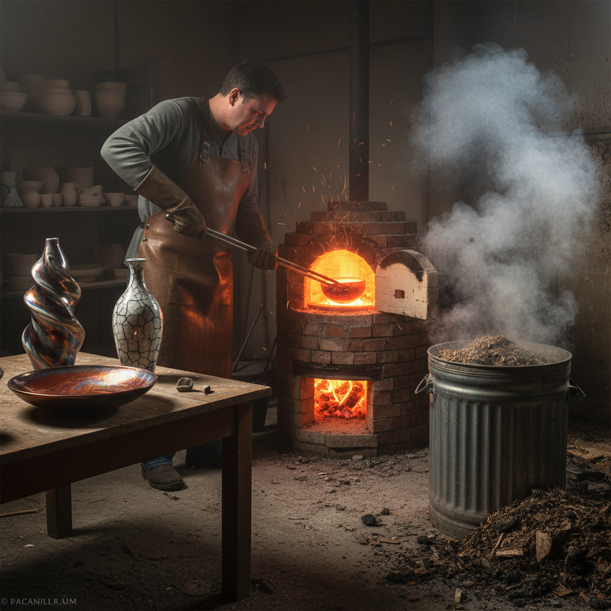

# Raku 乐烧

> "Raku is fire and chance in conversation — the potter surrenders control to the kiln, and the kiln responds with unrepeatable beauty." — Unknown

## 概述

乐烧（Raku）是一种特殊的陶瓷烧制技法——将器物在窑中快速加热至约1000°C后，用长钳从炽热的窑中取出，立即放入可燃材料（如锯末、报纸）中进行还原，或直接在空气中快速冷却。这种极端的热冲击和还原气氛创造出独特的效果：金属光泽、裂纹（crackle）、碳化黑色和不可预测的色彩变化。每一件乐烧作品都是独一无二的——同样的釉料在不同的烧制条件下会产生完全不同的效果。

乐烧的哲学在于：拥抱偶然——放弃对结果的完全控制，接受火与材料的对话所产生的任何结果，这与禅宗的"无心"理念相通。

## 核心特征

| 特征 | 描述 |
|------|------|
| 快速 | 快速加热和冷却 |
| 还原 | 还原气氛处理 |
| 偶然 | 结果不可预测 |
| 热冲击 | 极端的热冲击 |
| 唯一 | 每件都独一无二 |
| 禅意 | 与禅宗美学相关 |

## 视觉特征

- **金属**：金属光泽的釉面
- **裂纹**：美丽的裂纹图案
- **碳化**：碳化的黑色区域
- **虹彩**：虹彩般的色彩
- **对比**：光泽与哑光的对比
- **不规则**：不规则的效果

## 代表作品

| 作品 | 艺术家 | 年代 | 意义 |
|------|--------|------|------|
| *Chōjirō tea bowls* | 長次郎 | 16世纪 | 乐烧的创始 |
| *Raku family works* | 乐家 | 16世纪+ | 乐家十五代 |
| *Paul Soldner raku* | Paul Soldner | 1960s+ | 美国乐烧先驱 |
| *Wayne Higby landscapes* | Wayne Higby | 1970s+ | 乐烧风景 |
| *Contemporary raku* | Various | 当代 | 当代乐烧艺术 |

## 历史时间线

| 时期 | 事件 |
|------|------|
| 1580s | 長次郎创立乐烧 |
| 16-20世纪 | 乐家十五代的传承 |
| 1960s | Paul Soldner发展美国乐烧 |
| 1970s+ | 西方乐烧的多样化 |
| 当代 | 全球乐烧艺术的繁荣 |
| 当代 | 与当代艺术的融合 |

## 中国语境

乐烧源自日本，但其精神与中国禅宗美学有深厚渊源——乐烧茶碗是为茶道而生的，而茶道深受中国禅宗影响。当代中国的陶艺家也在实践乐烧技法，将其与中国传统陶瓷美学结合。中国的一些陶艺工作室和艺术院校开设乐烧课程和工作坊。乐烧的"偶然之美"与中国传统窑变（如钧窑的窑变）有异曲同工之妙——都是在烧制过程中拥抱不可控的变化。

## AI生成概念图

## 与其他风格的关系

- **Pottery** → 陶艺
- **Tea Ceremony** → 茶道
- **Wabi-sabi** → 侘寂美学
- **Ceramics** → 陶瓷
- **Kintsugi** → 金缮（修复乐烧）
- **Zen Art** → 禅宗艺术

---

*浮光艺志 | Chronicle of Artistry*
