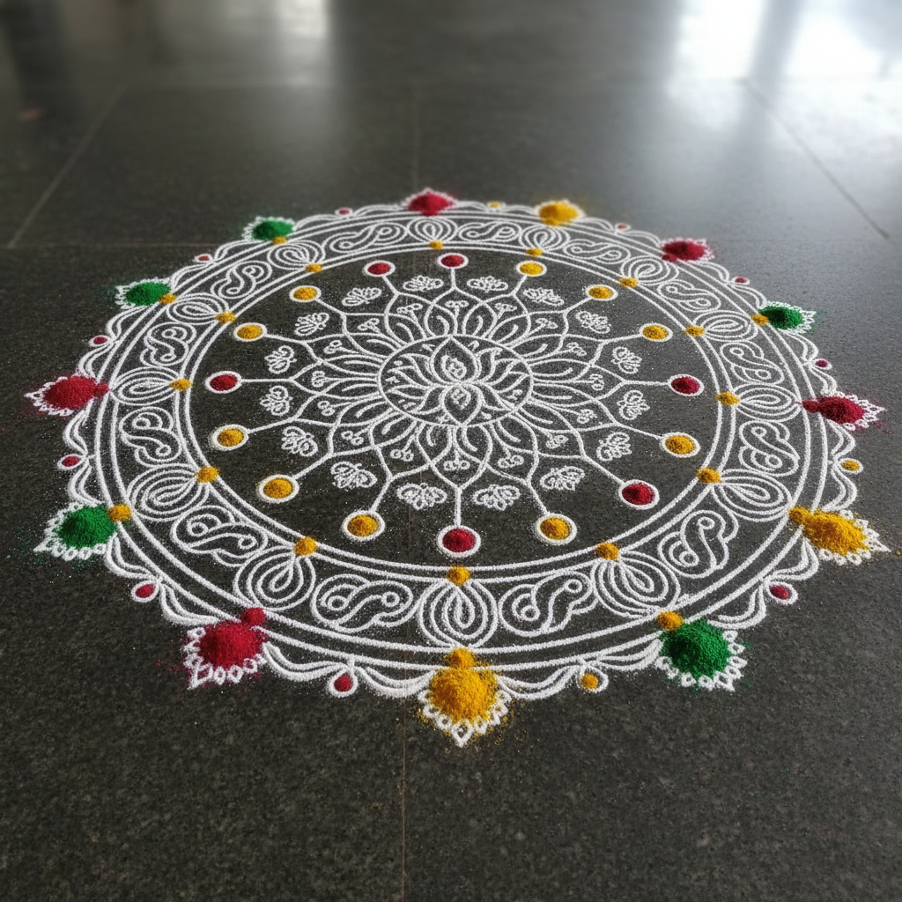

# Rangoli & Kolam 兰戈丽与科拉姆 | 印度地画艺术

> **"每天清晨，用米粉在门前画出一个小宇宙——欢迎吉祥女神的脚步。"**

## 概述

Rangoli（兰戈丽）和 Kolam（科拉姆）是印度最古老的民间视觉艺术传统之一，指在家门口地面上用彩色粉末、米粉、花瓣等材料绘制的装饰性图案。这一传统可追溯至公元3世纪《爱经》（Kamasutra）中记载的"tandula-kusuma-vali-vikara"（米粉与花的线条艺术）。在印度各地有不同名称：北方称Rangoli，泰米尔纳德称Kolam，安得拉邦称Muggu，孟加拉称Alpana，拉贾斯坦称Mandana。

## 地域名称

| 名称 | 地区 |
|------|------|
| Rangoli | 马哈拉施特拉、拉贾斯坦、北方邦、卡纳塔克 |
| Kolam | 泰米尔纳德 |
| Muggu | 安得拉邦、特伦甘纳 |
| Alpana / Alpona | 西孟加拉 |
| Mandana / Madna | 拉贾斯坦 |
| Aripana | 比哈尔 |
| Chowkpurana | 旁遮普、哈里亚纳 |
| Sathaya | 古吉拉特 |

## 核心特征

- **短暂性**：设计为短暂存在，被脚步磨损或被生物食用
- **每日仪式**：南印度妇女每天清晨在门前绘制
- **吉祥功能**：欢迎拉克什米女神（财富女神）
- **数学之美**：对称、分形、斐波那契数列的直觉运用
- **女性传统**：主要由女性创作和传承
- **材料**：米粉、彩色粉末、花瓣、白垩、彩砂

## 图案类型

### 点阵型 (Kolam)
- 先画出规则的点阵（矩形或等距）
- 用连续曲线环绕点阵形成图案
- 类似欧拉路径的数学结构
- 泰米尔纳德的日常传统

### 自由手绘型
- 徒手绘制几何或具象图案
- 莲花、孔雀、吉祥符号（卍）
- 拉克什米女神的脚印
- 节日时更加华丽复杂

### 花卉型
- 用鲜花花瓣拼贴
- 排灯节（Diwali）时最为壮观
- 色彩鲜艳，芳香四溢

## 视觉特征

- 严格的几何对称（放射对称为主）
- 白色米粉在深色地面上的高对比
- 节日时的鲜艳多色
- 从简单到极复杂的迷宫式图案
- 点与线的精确组合
- 短暂性——设计为被时间消解

## 与其他风格的关系

| 风格 | 关系 |
|------|------|
| 伊斯兰几何 | 共享数学对称和无限延展 |
| 凯尔特结 | 共享连续线条的迷宫逻辑 |
| 曼陀罗 | 共享放射对称和冥想功能 |
| 分形艺术 | Kolam图案展现自相似结构 |
| 沙画 | 共享短暂性和仪式功能 |
| 计算机科学 | Kolam图案启发了图片语言研究 |

## 概念图

---

*浮光艺志 | Chronicle of Artistry*
