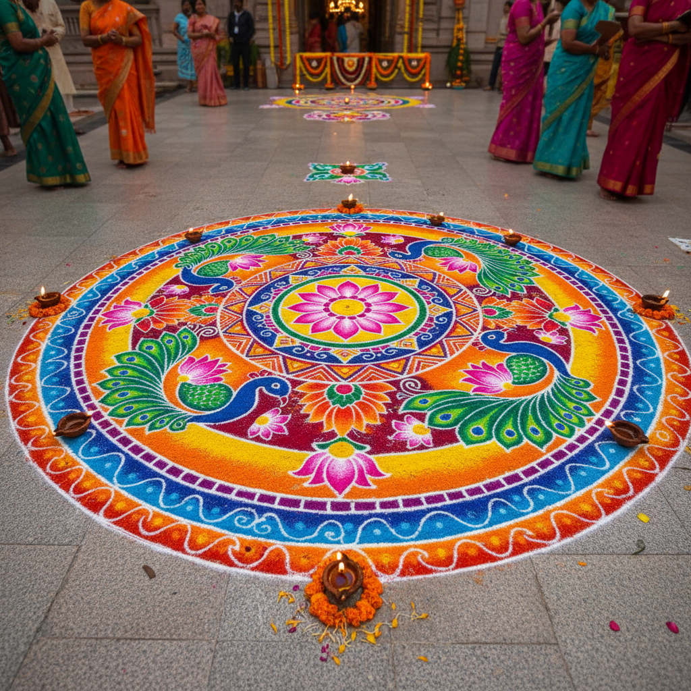

# Rangoli 兰戈利 | रंगोली

> **"门前的彩色祈祷——印度女性每天清晨用米粉和花瓣画出欢迎神灵的地图。"**

## 概述

兰戈利（Rangoli / रंगोली）是印度传统的地面装饰艺术，在节日和日常生活中，女性在家门前的地面上用彩色粉末、米粉、花瓣或彩砂绘制精美的几何和花卉图案。"Rangoli"源自梵语"rangavalli"（色彩的蔓藤）。这种艺术在印度各地有不同的名称——南印度称Kolam（கோலம்），孟加拉称Alpona（আল্পনা），拉贾斯坦称Mandana。Rangoli被认为能带来好运、欢迎神灵（特别是吉祥天女Lakshmi），并驱除邪灵。

## 地区变体

| 地区 | 名称 | 特征 |
|------|------|------|
| 南印度 | Kolam கோலம் | 米粉点阵连线，每日绘制 |
| 马哈拉施特拉 | Rangoli रंगोली | 彩色粉末，节日 |
| 孟加拉 | Alpona আল্পনা | 米糊，白色为主 |
| 拉贾斯坦 | Mandana | 红白色，墙壁和地面 |
| 比哈尔 | Aripan | 米糊，仪式性 |

## 核心特征

- **地面绘制**：在门前地面上创作
- **临时性**：每天或每个节日重新绘制
- **对称构图**：严格的几何对称
- **点阵系统**：Kolam基于点阵连线
- **自然材料**：米粉、花瓣、彩砂
- **女性传统**：主要由女性创作和传承

## 常见图案

| 图案 | 含义 |
|------|------|
| 莲花 | 吉祥天女、纯洁 |
| 孔雀 | 美丽、吉祥 |
| 万字符 | 好运、太阳 |
| 同心圆 | 宇宙、完整 |
| 脚印 | 神灵到来 |
| 鱼 | 丰饶、繁荣 |

## 视觉特征

- 鲜艳的多色粉末
- 严格的几何对称
- 精细的点阵连线
- 花瓣的自然色彩
- 地面的质朴质感
- 临时性的美丽

## 与其他风格的关系

| 风格 | 关系 |
|------|------|
| Aboriginal Dot Painting | 共享地面图案和点阵 |
| 纳瓦霍沙画 | 共享仪式性地面艺术 |
| 曼陀罗 Mandala | 共享对称几何传统 |
| 伊斯兰几何 | 共享几何对称美学 |
| 当代街头艺术 | Rangoli影响公共艺术 |

## 概念图

---

*浮光艺志 | Chronicle of Artistry*
