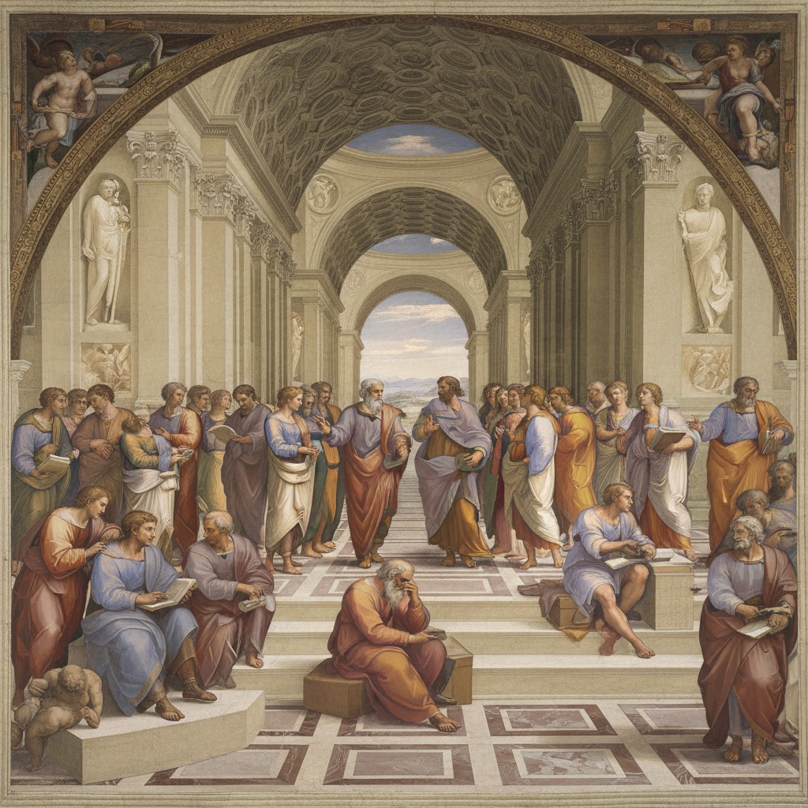

# Raphael 拉斐尔

> "When one is painting one does not think." — Raphael

## 概述

拉斐尔·桑西（Raffaello Sanzio da Urbino，1483–1520）是意大利盛期文艺复兴三杰之一（与达·芬奇、米开朗基罗并列），被视为西方绘画中"完美"的化身。他以无与伦比的构图和谐、优雅的人物造型和理想化的美感创造了文艺复兴古典主义的最高标准——此后三百年的学院派教育都以拉斐尔为终极典范。

拉斐尔仅活了37岁，却留下了大量杰作，其中《雅典学院》被视为文艺复兴精神的最完美视觉化。

## 核心特征

| 特征 | 描述 |
|------|------|
| 完美和谐 | 构图、色彩、人物的绝对平衡 |
| 理想化美 | 将现实提升为理想——"比自然更美" |
| 优雅从容 | sprezzatura——毫不费力的优雅 |
| 圣母形象 | 创造了西方最经典的圣母形象 |
| 空间秩序 | 完美的建筑透视和人物安排 |
| 综合大成 | 融合达·芬奇的柔和与米开朗基罗的力量 |

## 视觉特征

- **构图**：金字塔形、圆形的稳定构图
- **人物**：优雅的、理想化的面容和姿态
- **色彩**：和谐的、饱满的色彩——蓝、红、金
- **空间**：精确的建筑透视创造深远空间
- **光线**：柔和均匀的光线，无极端明暗
- **表情**：宁静的、内省的面部表情

## 代表作品

| 作品 | 年代 | 意义 |
|------|------|------|
| *The School of Athens* | 1509-11 | 文艺复兴精神的最完美视觉化 |
| *Sistine Madonna* | 1512 | 最著名的圣母像——底部的小天使 |
| *The Transfiguration* | 1516-20 | 最后的杰作——被认为是世界上最伟大的画 |
| *Madonna of the Meadow* | 1505 | 金字塔构图的圣母子典范 |
| *Portrait of Baldassare Castiglione* | 1514-15 | 文艺复兴肖像画的巅峰 |

## 真实作品（公共领域）

| 作品 | 来源 |
|------|------|
| *The School of Athens* | [Vatican Museums](https://www.museivaticani.va/) / [Wikimedia](https://commons.wikimedia.org/wiki/File:Sanzio_01.jpg) |
| *Sistine Madonna* | [Wikimedia](https://commons.wikimedia.org/wiki/File:RAFAEL_-_Madonna_Sixtina.jpg) |

> ⚠️ 本条目优先使用真实作品。

## AI生成概念图

## 与其他风格的关系

- **High Renaissance** → 盛期文艺复兴的完美代表
- **Academic Art** → 三百年学院派的终极典范
- **Mannerism** → 拉斐尔之后的矫饰主义是对其完美的反叛
- **Pre-Raphaelite** → PRB 主张回到拉斐尔"之前"
- **Neoclassicism** → 新古典主义重新崇拜拉斐尔

---

*浮光艺志 | Chronicle of Artistry*
