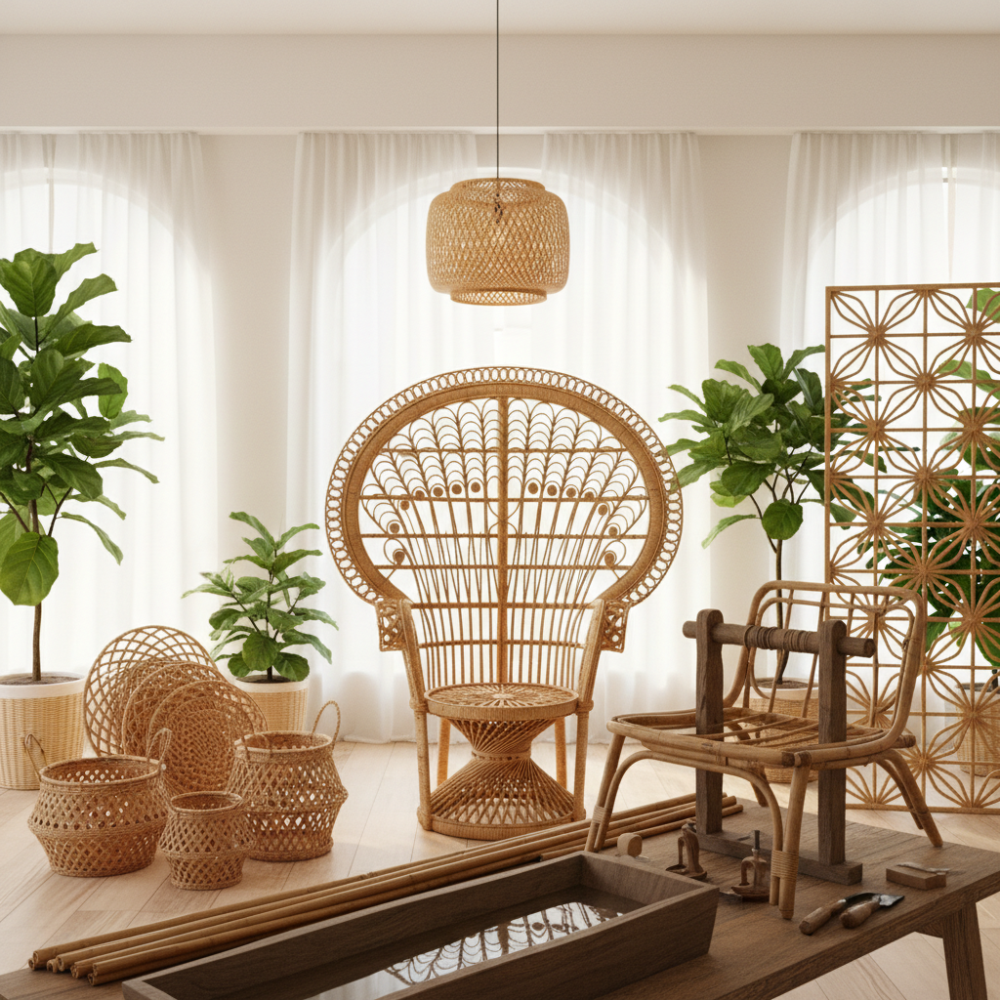

# Rattan Art 藤编艺术

> "Rattan is the jungle's gift to the craftsman — a climbing palm that grows hundreds of meters long, flexible as a whip when fresh, strong as steel when dried. Unlike wood, it bends without breaking; unlike metal, it breathes and ages gracefully. Rattan furniture and sculpture carry the warmth of the tropics in every curve, the patience of the weaver in every wrap." — Unknown

## 概述

藤编艺术（Rattan Art）是以藤条为主要材料进行编织和造型创作的艺术形式——利用藤条天然的柔韧性、强度和优美的曲线特性，通过弯曲、编织、缠绕等技法创造家具、器物和艺术品。藤编是热带和亚热带地区最重要的传统工艺之一。

藤编艺术的实践包括：1）藤编家具——椅子、桌子、床等藤制家具；2）藤编篮筐——用藤条编织的容器；3）藤编灯具——藤编的灯罩和灯具设计；4）藤编雕塑——用藤条创造的艺术雕塑；5）藤编建筑——用藤条作为建筑材料的结构；6）藤编装饰——墙面装饰、屏风等藤编装饰品；7）当代藤编设计——将传统藤编与现代设计理念结合。

## 核心特征

| 特征 | 描述 |
|------|------|
| 柔韧 | 极好的柔韧性 |
| 曲线 | 优美的曲线造型 |
| 天然 | 天然的热带材料 |
| 轻盈 | 轻盈但坚固 |
| 透气 | 编织结构的透气性 |
| 温暖 | 温暖的视觉感受 |

## 视觉特征

- **曲线**：流畅的弯曲线条
- **编织**：紧密的编织纹理
- **色彩**：天然的蜜色到深棕
- **光影**：编织间隙的光影
- **有机**：有机的自然形态
- **质感**：丰富的触觉质感

## 代表作品

| 作品 | 艺术家 | 年代 | 意义 |
|------|--------|------|------|
| *Thonet chairs* | Michael Thonet | 19世纪 | 弯木藤面椅 |
| *Peacock chair* | 传统 | 20世纪 | 孔雀藤椅 |
| *Contemporary rattan* | Various | 当代 | 当代藤编设计 |
| *Indonesian rattan* | 传统 | 古代至今 | 印尼藤编传统 |
| *Rattan sculptures* | Various | 当代 | 藤编雕塑 |

## 历史时间线

| 时期 | 事件 |
|------|------|
| 古代 | 东南亚的藤编传统 |
| 19世纪 | 藤编家具传入欧洲 |
| 20世纪初 | 藤编家具的黄金时代 |
| 1970年代 | 孔雀椅等标志性设计 |
| 当代 | 藤编的可持续设计复兴 |

## 中国语境

藤编艺术在中国有悠久的历史。中国南方（特别是广东、广西、云南、海南）是重要的藤编产区——中国的藤编工艺有数千年历史。广东的藤编家具在清代就已经出口到欧洲和东南亚。中国的藤编技艺极其精细——从粗犷的藤椅到精细的藤编提篮，展示了藤编的广泛可能性。中国当代的一些设计师在探索藤编的现代化——将传统藤编技法与当代家具设计结合，创造出既有东方韵味又符合现代生活方式的产品。中国的藤编产业在国际市场上占有重要地位——中国是世界上重要的藤编产品出口国之一。中国的一些藤编技艺被列入非物质文化遗产名录。

## AI生成概念图

## 与其他风格的关系

- **Basket Weaving** → 编篮艺术
- **Bamboo Weaving** → 竹编艺术
- **Furniture Design** → 家具设计
- **Tropical Design** → 热带设计
- **Sustainable Design** → 可持续设计
- **Folk Art** → 民间艺术

---

*浮光艺志 | Chronicle of Artistry*
