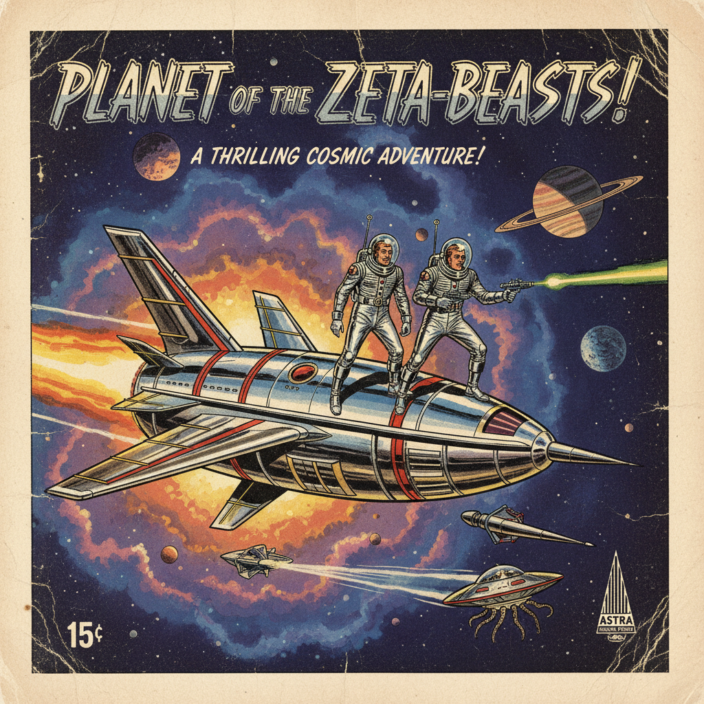

# Raygun Gothic 射线枪哥特



> **"如果Art Deco设计了太空飞船——那就是Raygun Gothic。"**

## 概述

| 维度 | 描述 |
|------|------|
| 时期 | 1930s–1960s（原始）/ 当代复兴 |
| 别名 | Raygun Gothic, 射线枪哥特, Retro-Futurism子类 |
| 核心色彩 | 铬银、火箭红、太空黑、星云紫、原子绿 |
| 关键元素 | Art Deco太空飞船、射线枪、尖塔火箭、鳍翼 |
| 代表人物 | 概念来自William Gibson小说；视觉参考：Flash Gordon, Buck Rogers |
| 关联风格 | Art Deco, Atompunk, Dieselpunk, Googie, Retro-Futurism |

---

## 历史脉络

| 年份 | 事件 |
|------|------|
| 1930s | Flash Gordon连环画——Art Deco太空美学诞生 |
| 1940s | Buck Rogers——射线枪和银色太空服 |
| 1950s | 科幻B级片——飞碟、射线枪、银色紧身衣 |
| 1960s | 《星际迷航》早期——Raygun Gothic的电视化 |
| 1981 | William Gibson在《The Gernsback Continuum》中描述这种美学 |
| 1988 | Gibson正式使用"Raygun Gothic"一词 |
| 2000s | Fallout系列游戏——Raygun Gothic的当代复兴 |
| 2009 | 旧金山Raygun Gothic Rocket雕塑 |

### 核心哲学

Raygun Gothic的精神是**"用1930年代的优雅想象太空——Art Deco的宇宙版"**：
- "如果Fritz Lang设计了NASA——那就是Raygun Gothic"
- "火箭应该有鳍翼——因为那样更美"
- "太空服应该是银色紧身衣——因为未来是闪亮的"
- "射线枪应该有Art Deco的线条——因为暴力也可以优雅"
- "这是一个从未存在的未来——但我们希望它存在"

---

## 视觉语法

### 色彩系统

```
主色：
  铬银 (#C0C0C0) — 太空船、未来
  火箭红 (#FF2400) — 危险、能量
  太空黑 (#0D0D0D) — 宇宙、深邃
  星云紫 (#7B2D8B) — 神秘、外星

辅色：
  原子绿 (#39FF14) — 射线、辐射
  Art Deco金 (#DAA520) — 装饰、奢华
  月球灰 (#808080) — 金属、工业

造型语言：
  鳍翼 — 火箭和汽车的标志
  尖塔 — 向上、向太空
  圆形舷窗 — 太空船窗户
  射线图案 — 能量、武器
  Art Deco几何 — 装饰性线条

规则：
  - Art Deco的装饰性 + 太空的主题
  - 银色/铬是基础色
  - 火箭必须有鳍翼
  - 技术是优雅的——不是粗糙的
  - 复古的未来 > 真实的未来
```

### 标志性元素

| 类别 | 元素 |
|------|------|
| 载具 | 鳍翼火箭、飞碟、流线太空船 |
| 武器 | 射线枪、死亡射线、能量武器 |
| 服装 | 银色紧身衣、玻璃头盔、斗篷 |
| 建筑 | Art Deco尖塔、圆顶、铬装饰 |
| 字体 | Art Deco + 未来感 |
| 态度 | 乐观、优雅、冒险、浪漫 |

---

## 与千禧怀旧/当代的关系

### Fallout系列 = Raygun Gothic的当代经典
- Fallout的"50年代想象的核未来" = Raygun Gothic精神
- 游戏中的射线枪、鳍翼汽车、原子装饰 = 完美的Raygun Gothic
- BioShock Infinite的Columbia = Raygun Gothic + 美国例外论

### 与其他-punk的关系
- Raygun Gothic ≈ Atompunk的视觉面
- Dieselpunk = 1920s-40s的暗黑版
- Steampunk = 维多利亚时代版
- Raygun Gothic = 1930s-60s的乐观版

---

## 设计应用

| 场景 | 应用方式 |
|------|----------|
| 游戏 | 复古科幻+Art Deco太空 |
| 影视 | 复古未来+B级片致敬 |
| 品牌 | 复古+科幻+乐观+冒险 |
| 玩具 | 射线枪+火箭+复古机器人 |

---

## 相关风格

← [Art Deco 装饰艺术](art-deco.md) | [Atompunk 原子朋克](atompunk.md) →

↑ [返回千禧怀旧目录](README.md) | [返回总目录](../README.md)
